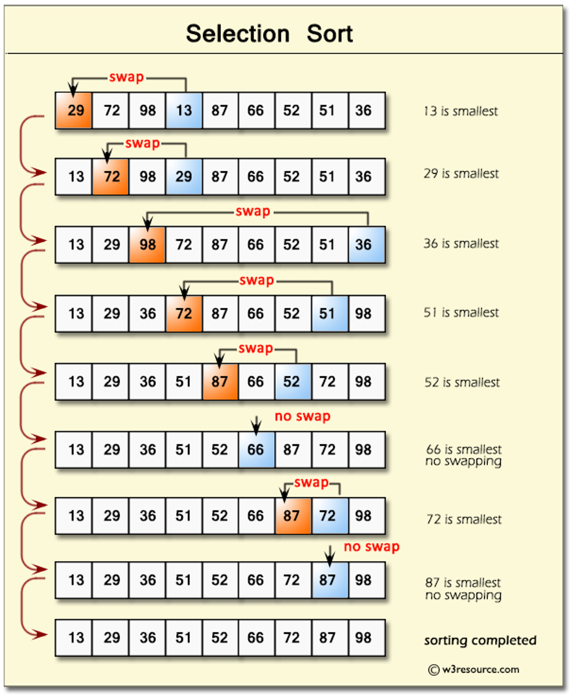

# Сортировка выбором
\
- Перебираем элементы обычным `for`-ом
- Находя минимальный элемент от текущего `i` до конца массива, меняем его значение со значением `i`-го элемента
- Так идем до конца
```java
public class SelectionSorter<T extends Comparable<T>> {

    public T[] sort(T[] elements) {
        for (int i = 0; i < elements.length; i++) {
            // Нашли индекс минимального элемента от i до конца массива
            int smallestElementIndex = findIndexOfSmallestElement(elements, i);

            // Поменяли местами значение с i-ым элементом
            T smallestElement = elements[smallestElementIndex];
            elements[smallestElementIndex] = elements[i];
            elements[i] = smallestElement;
        }
        return elements;
    }

    /** Находим следующий минимальный элемент */
    private int findIndexOfSmallestElement(T[] elements, int fromIndex) {
        T smallest = elements[fromIndex];
        int smallestElementIndex = fromIndex;
        for (int i = fromIndex; i < elements.length; i++) {
            if (elements[i].compareTo(smallest) < 0) {
                smallest = elements[i];
                smallestElementIndex = i;
            }
        }
        return smallestElementIndex;
    }
}
```
[Исходник](examples/java/sort/selection/SelectionSorter.java)\
_Бхаргава А. Грокаем алгоритмы. 2-е изд. Стр. 64-69_

## Время работы