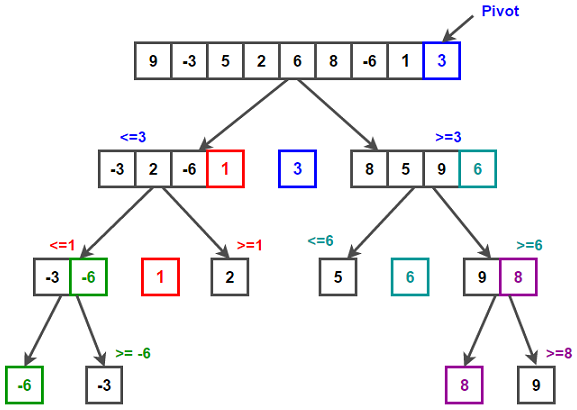

# Быстрая сортировка
Идея в том, что выбирается опорный элемент. Те элементы, которые меньше его переносим налево, а который больше - направо.\
После этого идем рекурсивно по левой и правой части, пока не упремся в базовый случай: 0 элементов, 1 элемент, 2 элемента (их просто меняем местами)\
\
```java
public class QuickSorter <T extends Comparable<T>> {
    public List<T> sort(List<T> input) {
        return sortRecursively(input);
    }

    private List<T> sortRecursively(List<T> input) {
        if (input.size() < 1) {
            return input;
        }
        T pivotalElement = input.get(0);
        List<T> leftPart = new ArrayList<>();
        List<T> rightPart = new ArrayList<>();
        for (int i = 1; i < input.size(); i++) {
            T currentElement = input.get(i);
            if (currentElement.compareTo(pivotalElement) <= 0){
                leftPart.add(currentElement);
            } else {
                rightPart.add(currentElement);
            }
        }
        List<T> sortedList = new ArrayList<>(sortRecursively(leftPart));
        sortedList.add(pivotalElement);
        sortedList.addAll(sortRecursively(rightPart));
        return sortedList;
    }

}
```
[Исходник](examples/java/quick_sort/QuickSorter.java)\
_Бхаргава А. Грокаем алгоритмы. 2-е изд. Стр. 96-103_

## Быстродействие
В среднем алгоритм отрабатывает за **O(n*logn)**, а в худшем, за **O(n^2)**\
_Бхаргава А. Грокаем алгоритмы. 2-е изд. Стр. 106-109_