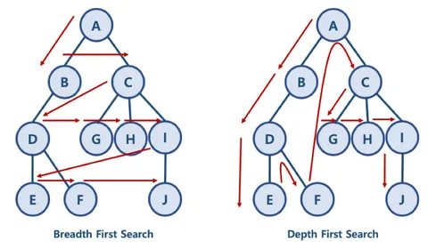

# Поиск в глубину (Depth First Search)
Алгоритм обхода графа.\
Поиск в глубину не может использоваться для поиска кратчайшего пути.\

```java
public class DfsSearcher {
    public boolean search(Map<String, List<String>> tree, String initNode, String targetNode) {
        if (initNode.equals(targetNode)) {
            return true;
        }
        if (tree.containsKey(initNode)) {
            List<String> children = tree.get(initNode);
            for (String child : children) {
                if (search(tree, child, targetNode)) {
                    return true;
                }
            }
        }
        return false;
    }
}
```
[Исходник](examples/java/depth_first_search/DfsSearcher.java)
```java
public class Application {
    public static void main(String[] args) {
        Map<String, List<String>> starSystems = Map.of(
                "Земля", List.of("Проксима", "Бета Дюрани"),
                "Бета Дюрани", List.of("Вега", "Тау Кита"),
                "Проксима", List.of("Эпсилон Эридани", "Альфа Центавр")
        );
        System.out.println(new DfsSearcher().search(starSystems, "Земля", "Эпсилон Эридани"));
    }
}
```
[Исходник](examples/java/depth_first_search/Application.java)\
_Бхаргава А. Грокаем алгоритмы. 2-е изд. Стр. 168-171_
