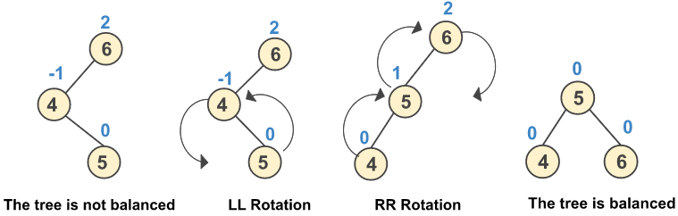

# АВЛ деревья
АВЛ (AVL) деревья являются разновидностью сбалансированных бинарных деревьев поиска.\
АВЛ-дерево балансируется поворотом.\
Поворот осуществляется в том случае, если разность высоты между дочерними узлами превышает **1**.\
Один из вариантов это определить, отслеживать **BF** - коэфициент балансировки.\
Второй - отслеживать высоту - **H**\

```java
public class Node {
    private final int value;
    /**
     * -1, если левый дочерний узел на 1 выше
     * 0, если оба узла сбалансированы
     * 1, если правый дочерний узел на 1 выше
     *
     * [-1, 0, 1] - нормальная ситуация.
     * если < -1 или > 1, пора перебалансировать
     */
    private int bf;
    private Optional<Node> leftChild;
    private Optional<Node> rightChild;
    private Optional<Node> parent;

    public Node(Node parent, int value) {
        this.value = value;
        this.parent = Optional.ofNullable(parent);
        rightChild = Optional.empty();
        leftChild = Optional.empty();
        bf = 0;
    }

    public void addValue(int value) {
        if (value < this.value) {
            if (leftChild.isEmpty()) {
                leftChild = Optional.of(new Node(this, value));
            } else {
                leftChild.get().addValue(value);
            }
        } else {
            if (rightChild.isEmpty()) {
                rightChild = Optional.of(new Node(this, value));
            } else {
                rightChild.get().addValue(value);
            }
        }
        bf = calculateBf();
        rebalance();
        bf = calculateBf();
    }

    private int calculateBf() {
        int updatedBf = 0;
        if (leftChild.isPresent()) {
            updatedBf -= 1;
            updatedBf += leftChild.get().calculateBf();
        }
        if (rightChild.isPresent()) {
            updatedBf += 1;
            updatedBf += rightChild.get().calculateBf();
        }
        return updatedBf;
    }

    private void rebalance() {
        if (bf < -1) {
            leftChild.get().setParent(parent.get());
            parent.get().setLeftChild(leftChild.get());
            leftChild.get().setRightChild(this);
            this.setParent(leftChild.get());
            setLeftChild(null);
        } else if (bf > 1) {
            rightChild.get().setParent(parent.get());
            parent.get().setRightChild(rightChild.get());
            leftChild.get().setLeftChild(this);
            this.setParent(rightChild.get());
            setRightChild(null);
        }
    }
    ...
}
```
[Исходник](examples/java/avl_tree/Node.java)
_Бхаргава А. Грокаем алгоритмы. 2-е изд. Стр. 191-200_