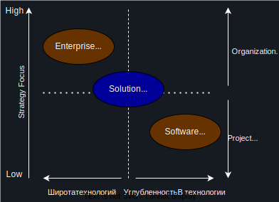
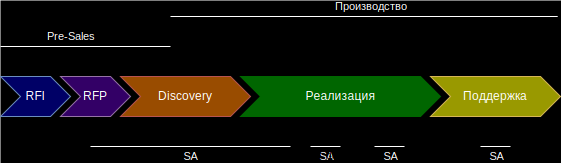
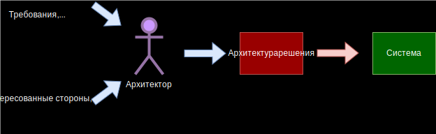

# Архитектуры
## Определения архитектуры
**Архитектура (системы):** Основные понятия или свойства системы в окружающей среде, воплощенной в ее элементах, отношениях и конкретных принципах ее проекта и развития\
_[ГОСТ Р 57100-2016/ISO/IEC/IEEE 42010:2011](https://docs.cntd.ru/document/1200139542)_

**Software application architecture** is the _process_ of defining a structured solution that meets all of the technical and operational requirements, while optimizing common quality attributes such as performance, security and manageability.\
It involves a series of decisions based on a wide range of factors and each of these decisions can have considerable impact on the quality, performance, maintainability and overall success of the application.\
_[Microsoft Application Architecture Guide, 2ND Edition](https://www.amazon.com/Microsoft®-Application-Architecture-Patterns-Practices/dp/073562710X?asin=073562710X&revisionId=&format=4&depth=1)_

### Основные тезисы определения
- Архитектура состоит из элементов и их взаимосвязей
- Элементы архитектуры имеют атрибуты (или свойства)
- Элементы взаимодействуют друг с другом через интерфейсы
- Архитектура опускает внутренние детали реализации и концентрируется на интерфейсах взаимодействия
- Архитектура строится на различных требованиях (бизнеса, участников, решений)

## Виды архитектуры
- Архитектура предприятия\
Enterprise Architecture
- Архитектура решения (системы)\
Solution (System) Architecture
- Архитектура приложения (техническая)\
Software (Technical) Architecture
- Архитектура инфраструктуры\
Infrastructure Architecture

# Enterprise Architecture
**Enterprise architecture (EA)**
- is a business function concerned with the structures and behaviours of a business, especially business roles and processes that create and use business data.
- The international definition according to the Federation of Enterprise Architecture Professional Organizations is "a well-defined practice for conducting enterprise analysis, design, planning, and implementation, using a comprehensive approach at all times, for the successful development and execution of strategy.
- Enterprise architecture applies architecture principles and practices to guide organizations through the business, information, process, and technology changes necessary to execute their strategies.
- These practices utilize the various aspects of an enterprise to identify, motivate, and achieve these changes.\
_[Wikipedia](https://en.wikipedia.org/wiki/Enterprise_architecture)_

# Архитектор решений
### С точки зрения менеджмента
- Хорошо разбирается в технологиях
- Имеет архитектурные навыки\
(концептуальная визуализация, виденье и понимание составляющих частей)
- Широкий кругозор, T-shape
- Коммуникационные навыки, уверенность в себе и способность влиять на людей
- Лидерство, способность вести совещания, команды и прокладывать курс в части архитектуры

## Основные активности архитектора решений
- Pre-Sales
  - Встречи с заказчиками 
  - Встречи по RFI & RFP
  - Участие в получении и анализе требований
  - Оценки и планирование ресурсов
  - [Проектирование архитектуры](#проектирование-архитектуры)
  - Планы миграции
  - Диаграммы развертывания
  - Roadmap-ы проекта
  - Технические секции в RFP
  - Презентации
- Производство
  - [Проектирование архитектуры](#проектирование-архитектуры) и [управление](#управление-архитектурой)
  - Этап Discovery и старт проекта
  - [Review архитектуры](#review-архитектуры) и кода
  - Прочие активности, нужные для успешного завершения проекта

**RFI (Request for Information)** - запрос информации со стороны компании, которой требуется какой-то товар или услуга от поставщика\
**RFP (Request for Proposal)** - запрос предложения, документированный запрос организации, заинтересованной в приобретении каких-либо товаров или услуг

### Проектирование архитектуры
- Анализ
  - основных участников
  - целей
  - заинтересованных сторон и их потребностей/обеспокоенностей
  - сбор и приоретизация требований (ASR)\
ASR (Architecture Significant Requirement) — это специфические требования (как функциональные, так и нефункциональные), которые напрямую влияют на дизайн архитектуры
  - Определение основных атрибутов качества и выбор конкретных тактик их достижения
  - Описание текущей архитектуры (as-is или baseline)
  - Проектирование целевой архитектуры
  - Документирование целевой архитектуры

### Review архитектуры
Процесс, в ходе которого оцениваются архитектурные решения.\
Позволяют ли они системе достигать ASR

#### Цель
- Проверка того, что архитектура поддерживает текущие и будущие цели бизнеса
- Проверка того, что архитектура отвечает атрибутам качества
- Определение ошибок проектирования на ранней стадии SDLC
- Определение потенциальных рисков в проекте

### Управление архитектурой
Это практика в ходе которой архитектура управляеется и контролируется на уровне предприятия.\
Включает в себя
- Контроль\
Реализация системы контроля над созданием и мониторингом архитектурных компонентов и активностей для обеспечения эффективного внедрения, реализации и развития архитектуры внутри организации
- Согласование\
Реализация системы, согласующейся с внутренними и внешними стандартами и обязательствами перед регуляторами
- Управление\
Установка процесса, поддерживающего эффективное управление процессами
- Подотчетность\
Разработка практик, которые обеспечивают подотчетность перед заинтересованными сторонами

## Контекст архитектуры

