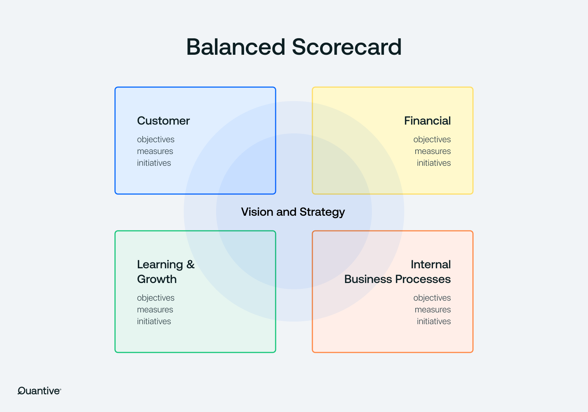
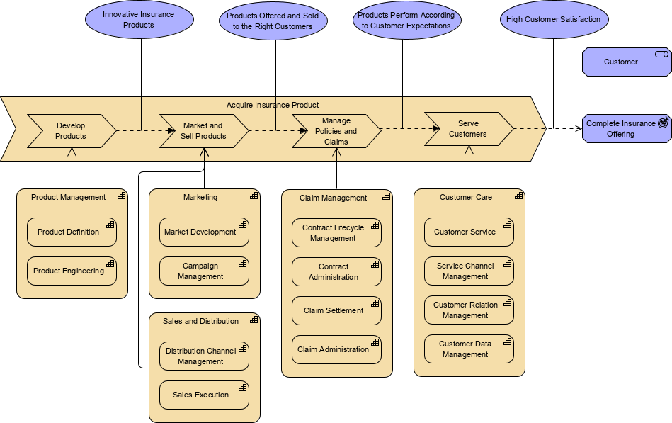
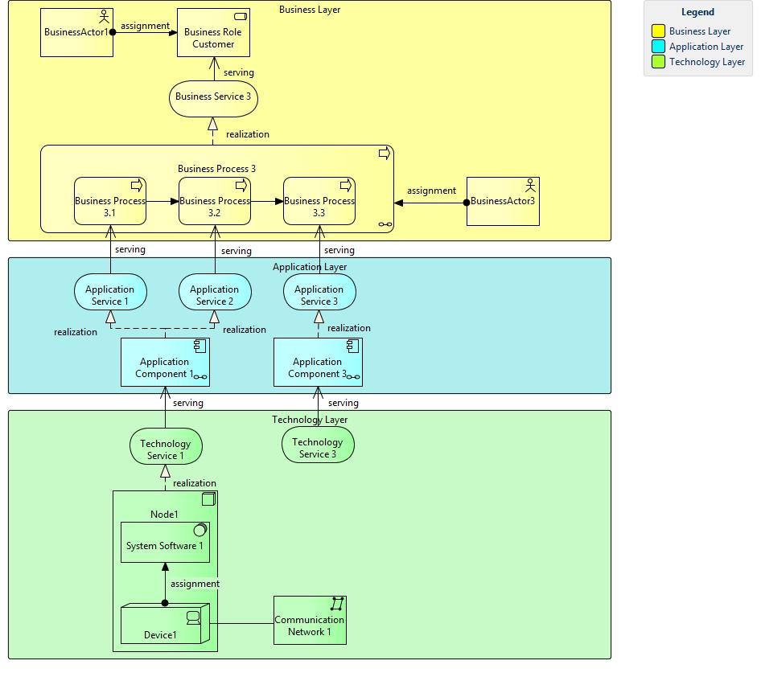
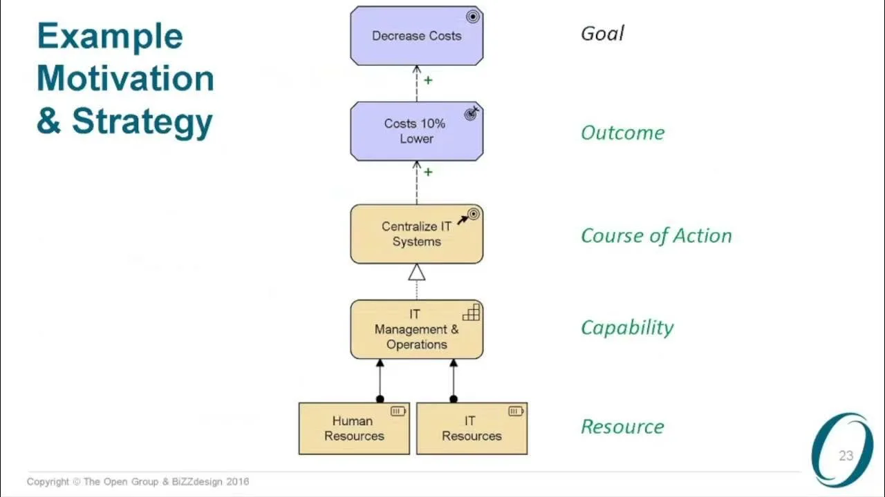
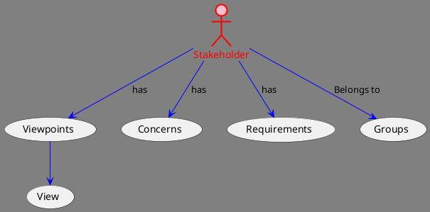
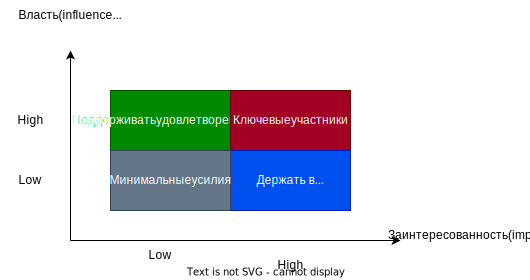
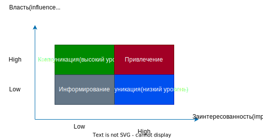
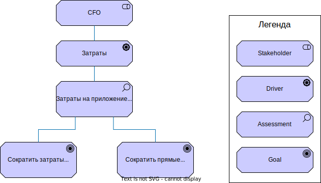
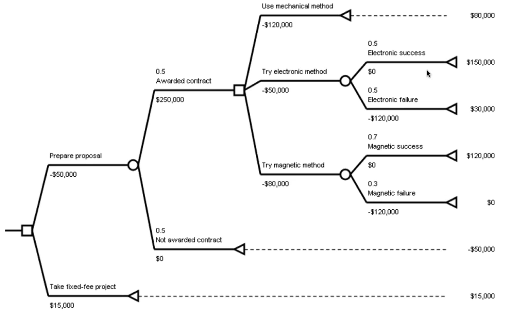
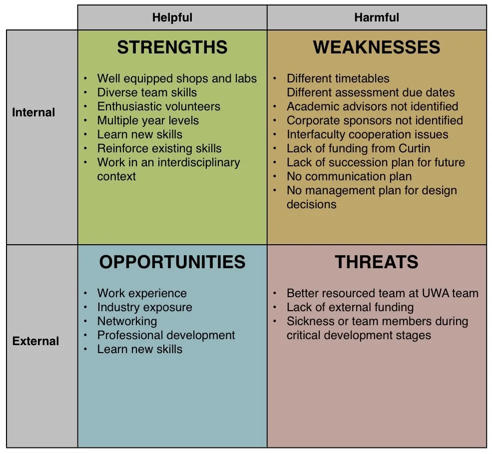

# Business Architecture
Это часть `Enterprise Architecture`.\
Она очень важна и содержит модуль бизнес-мотивации, стратегий, целей, задач.\
`Business Architecture` предоставляет контекст для технологий, согласовывая области технической архитектуры с долгосрочными потребностями бизнеса.\
Какие то аспекты из `Business Architecture` могут закрываться бизнес-аналитиками.

## Категории, входящие в Business Architecture
- Стратегия\
<small>Создание стратегии, планирование и выполнение инициатив</small>
  - [Balanced Scorecard (Сбалансированная система показателей)](#сбалансированная-система-показателей-ссп-balanced-scorecard-bsc)
  - [Hoshin Kanri](https://www.lean-consult.ru/blog/what_is_hoshin_kanri/)
- Возможность/Способность\
<small>Что бизнес делает</small>
  - [Capability Map](#capability-map)
  - Бизнес сервисы
  - Бизнес функции
- Ценность\
<small>Как доставляем ценность стейкхолдерам</small>
  - Value Map
  - Value Proposition
  - [Value Stream with Capabilities Mapping](#value-stream-with-capabilities-mapping)
- Информация\
<small>Концепты, представленные данными</small>
  - Information Map
- Организация
  - ОргСтруктура
  - Organization Map

### Сбалансированная система показателей (ССП, Balanced Scorecard, BSC)
\
Метод преобразование стратегии в понятные, измеримые и управляемые элементы для каждого сотрудника, выходя за рамки простой отчетности к стратегическому управлению.\
Подробнее можно прочитать [тут](https://sbercrm.com/blog/business/tpost/byd69jlch1-sistema-sbalansirovannih-pokazatelei-cht)

### Capability Map
Что бизнес делает и как это работает.\
Видим орг. юниты, разнесенные по разным линиям.\
Могут быть добавлены какие то базовые их взаимоотношения, потоки.\
\
Подробнее можно посмотреть [тут](https://www.runn.io/blog/capability-map) и [тут](https://habr.com/en/companies/otus/articles/968098/)

### Value Stream with Capabilities Mapping
Наглядно изображается, как доставляется ценность до заказчиков/стейкхолдеров\
И как каждый шаг этого потока соотносится с другими функциональными блокми.\

## Business Architecture с точки зрения TOGAF
- Есть `Business Architecture`, в которой определены
  - бизнес-стратегия
  - организация
  - ключевые бизнес-процессы организации
 
Ниже следуют еще 3 типа архитектуры
- `Application Architecture`, которая содержит
  - схемы и конкретной системы
  - взаимодействия и взаимоотношения между системами
- `Data Architecture`, которая содержит
  - логические и физические модели данных
  - потоки данных
- `Technology Architecture`, которая описывает
  - железо
  - софт
  - инфраструктуру
  - развертывание

Это все предоставляет контекст и вводные для `Solution Architecture`
 

## От Business Layer к Technology Layer
На бизнес уровне используются
- участники
- роли
- бизнес-сервисы
- бизнес-процессы

На уровне приложений используются
- сервисы
- приложения
- их взаимоотношение и взаимодействие

На технологическом уровне говорим о
- технологиях
- инфраструктуре
- инструментах

## Обработка бизнес-целей
Наша задача - сделать такую архитектуру, которая позволит достичь этих бизнес-целей.\
Поэтому они важны для нас.

### Обычные категории бизнес-целей
- внесение вклада в рост и развитие организации
- достижение финансовых целей
- достижение личных целей
- выполнение обязанностей перед сотрудниками
- выполнение обязанностей перед обществом
- выполнение обязанностей перед правительством
- выполнение обязанностей перед заинтересованными сторонами (stakeholder-ами)
- улучшение бизнес-процессов
- управление качеством и репутацией продукта
- управление позицией на рынке

# Business Architecture для Solution Architect
## Какие категории покрывает для Solution архитектора Business Architecture
- Business Goals
- Stakeholders
- Requirements

## Stakeholders / Заинтересованные стороны
Stakeholder в контексте PMBOK — это заинтересованная сторона, то есть лицо или организация, которая может быть затронута решениями, действиями или результатами проекта

Примеры Stakeholder-ов
- Спонсор проекта
- Заказчик
- Поставщик
- Конечный пользователь
- Project Manager
- Solution Architect
- Бизнес-аналитик
- Разработчик
- Тестировщик

### Как анализировать Stakeholder-а

Stakeholder имеет свою точку зрения.\
Каждый Stakeholder имеет `Concern`-ы (проблемы, риски, использование и эффект от решения и пр.)\
Каждый Stakeholder имеет `требования`

Опираясь на concern-ы и требования мы готовим `view`

### Stakeholders Management
- Определить Stakeholder-ов
  - [определить](#техники-определения-stakeholder-ов)
  - [классифицировать](#классификация-stakeholder-ов)
  - [Приоретизация Stakeholder-ов](#приоретизация-stakeholder-ов)
  - определить concern-ы и требования
  - определить точки зрения
  - создать Каталог и Map Stakeholder-ов
- Спланировать работу со Stakeholder-ами
  - Определить стратегию взаимодействия
- Взаимодействие со Stakeholder-ами
  - Коммуникация, чтобы оправдать ожидания
  - Address Issues
- Контроль взаимодействия со Stakeholder-ами
  - Отслеживание возаимоотношений Stakeholder-ов
  - Корректировака стратегии вовлечения

Эти фазы входят в зону ответственности **Account Manager-а**.\
Однако, для **Solution-архитектора интерес представляет первая фаза**.

#### Техники определения Stakeholder-ов
- мозговой штурм
- интервью
- workshop-ы
- построение mand map-ов\
<small>(как инструмент в помощь при других техниках)</small>
- моделирование организации
- моделирование процессов
- составление списков и map-ов Stakeholder-ов
- опросы

#### Классификация Stakeholder-ов
Классифицируем по роле, орг. unit-у и команде

К примеру
- Customers
- Sponsors
- Suppliers
- End Users
- Subject Maiier Experts
- Project Team

#### Приоретизация Stakeholder-ов

Примеры:
- high influence / high impact
  - Solution-архитектор
  - Delivery Manager
  - Product Manager
  - Ведущий бизнес-аналитик
- low influence / low impact
  - Спонсор проекта
  - Account Manager
- low influence / high impact
  - все члены проектной команды
  - может быть, те с кем мы интегрируемся
- low influence / low impact
  - конечные пользователи

#### Определение тактики взаимодействия исходя из приоритетов

#### Определение представлений/views
- CEO
  - business motivation diagram
  - business footprint diagram
- Project Manager
  - Program Road Map
  - WBS
- Developer
  - Component Diagram
  - Class Diagram

#### RACI. Определение ответственности Stakeholder-ов
- **Responsible** (`R`) - тот, кто будет работать над задачей
- **Accountable** (`A`) - тот, кого привлекают к задаче для успешного завершения и тот, кто принимает решения
- **Consulted** (`C`) - тот, у кого можно спросить мнение по задаче или запросить информацию
- **Informed** (`I`) - тот, кого держат в курсе и оповещают о результатах

Имея список активностей, можно составить такую матрицу

| Task | Role, Stakeholder | Role, Stakeholder | Role, Stakeholder | Role, Stakeholder | Role, Stakeholder | Role, Stakeholder |
| --- | --- |-------------------|-------------------|-------------------|-------------------| --- |
| Activity | R | A                 | C                 | I                 |                   | |
| Activity |  | R                 | A                 | C                 | I                 | |
| Activity | |  | R                 | A                 | C                 | I                 |

## Требования
- **Business Requirements**\
<small>(снизить некорректно обработанные заказы на 50% до конца квартала)</small>
- **Stakeholder/User Requirements**\
<small>(показывать историю заказов)</small>
- **Transition/Implementation Requirements**\
<small>(должно запускаться на всех java платформах, включая 64bit-версии)</small>
- **Solution Requirements**
  - **Functional Requirements**\
  <small>(показывать имя пользователя в виде ссылки)</small>
  - **Non-Functional Requirements**\
<small>(разрешать одновременную работу до 200 пользователям)</small>

### Business Requirements
Утверждают цели, задачи и результат, что дает понять, зачем изменения были запланированы.
Они могут применяться ко всему предприятию, к области бизнеса или специфичной части.

Business Requirements:
- Business Drivers
  - лучший пользовательский опыт
  - лучшие в программе retention и лояльности заказчиков
  - понимание наших заказчиков (инсайты)
- Business Goals
  - персонализация web-портала
  - единый вид для заказчиков
  - data-driven target marketing
- Business Objectives
  - увеличить продажи на 7% до конца года
  - увеличить retention
  - увеличить возвратность средств на 25%

#### В Archimate их можно представить так

**Stakeholder** - роль, команда или организация, которые представляют интерес в результате архитектуры.\
**Driver** - что то, что создает, мотивирует изменения в организации.\
**Assessment** - определяет результат анализа Driver-а.\
**Goal** - определяет конечное состояние, которого stakeholder хочет достичь.

### Stakeholder Requirements
Описывают требования Stakeholder-ов, которые должны быть удовлетсворены для достижения бизнес-требований.\
Служат мостиком между Business Requirements и Solution Requirements.

Примеры:
- автоматически предлагать покупателю подходящие товары
- предоставить возможности по онлайн-бронированию на портале и в мобильном приложении

### Transition/Implementation Requirements
Примеры:
- Конвертация и миграция данных
- Доступ пользователей и их права
- Подготовка пользователей
- Переход инфраструктуры

### Solution Requirements
Описывают возможности и качества решения, которые удовлетворяют требованиям Stakeholder-ов.\
Они предоставляют подходящий уровень детализации, позволяющий команде разработки реализовать решение.

Делятся на две категории:
- Функциональные требования
- Нефункциональные требования (ихи еще называют `Quality Attribute Requirements`)

## Raid и требования
- `R`isks - потенциальные проблемы, которые могут иметь негативный эффект на решение
- `A`ssumptions - задокументированные предположения, которые могут влиять на инициативу
- `I`ssues - проблемы, которые есть сейчас. Были когда то рисками и теперь стали проблемами.
- `D`ependencies - связи между различными частями решения

# Техники по работе с Business Architecture
Документирование
- Словари и глоссарии
- Диаграмма потока данных
- Функциональная декомпозиция
- User Stories
- Матрица ролей и полномочий
- User Cases and Scenarios
- Stakeholder List, Map, Personas
- Критерии приемки и оценки
- RACI

Моделирование
- Decision Modeling
- Data Modeling
- State Modeling
- Scope Modeling
- Process Modeling
- Прототипирование
- Estimation
- Mind Map
- Приоретизация

Организационный уровень
- Balanced Scorecard
- Benchmarking and Market Analysis
- Business Capabilities Analysis
- Business Cases
- Business Model Canvas
- Metrics and KPIs
- Organizational Modeling
- Business Rules Analysis

Сотрудничество
- Интервью
- Фокус-группы
- Опросы
- Workshops
- Collaborative Games
- Document Analysis
- [Мозговой штурм](#мозговой-штурм)

Анализ
- [SWOT анализ](#swot-анализ)
- Root Cause Analysis
- Decision Analysis
- Interface Analysis
- Financial Analysis
- Vendor Analysis
- Process Analysis
- Lessons Learned
- Item Tracker

## Мозговой штурм
Хороший способ сгенерировать какое то количество новых идей, которые дальше преобразуются в темы для дальнейшего анализа

Подготовка:
- Определение интересующей области
- Определение лимита времени
- Определение участников
- Установка критериев оценки

Сессия
- Обмен идеями
- Запись идей
- Развитие идей друг друга
- Сбор как можно большего числа идей

Подведение итогов
- Обсуждение и оценка идей
- Составление списка идей
- Ранжирование идей
- Рассылка финального списка

## Техника Decision Making
- четко сформулировать проблемы
- определить и проанализировать альтернативы решений
- оценить альтернативы
- принять решение

### Как можно оценить альтернативы?
- Pros vs Cons
- Простая, взвешенная матрица решений
- [Дерево решений](#decision-tree)
- Trade-offs

#### Decision Tree

## SWOT-анализ
Используется, чтобы оценить внешние и внутренние условия по параметрам:
- `S`trengths - что оцениваемая группа делает хорошо.\
<small>(эффективные процессы, взаимоотношения с клиентами, опытный персонал)</small>
- `W`earknesses - что оцениваемая группа делает плохо или не делает вовсе.
- `O`pportunities - внешние факторы, из которых оцениваемая группа может получить преимущества.\
<small>(новые рынки, новые технологии, изменения на рынке)</small>
- `T`hreads - внешние факторы, которые могут негативно повлиять на оцениваемую группу

