# Architectural Styles and Patterns
`Архитектурный стиль` - Специализация элементов и типов отношений вместе с набором ограничений\

`Архитектурный паттерн` - описывает фундаментальную структурированную организационную схему программной системы.\
Он обеспечивает
- набор предопределенных подсистем,
- определяя их ответственность и
- включает правила и руководства по организации взаимоотношений между ними.\

## Architectural Patterns

### CQRS
Хорошо подходит для систем, которые **готовы к Eventual Consistency**\
Добавляет сложность. Как вариант, использовать не на всем проекте, а в определенной подсистеме.\
В некоторых кейсах, может быть заменен просто использованием **Reporting Database**

#### Проблемы традиционного CRUD (без CQRS)
- несоответствие между представлениями данных для чтения и для записи
- есть риск возникновения конфликтов данных, когда записи заблокированы в хранилище данных при совместной работе
- может сделать управление доступами и безопасностью в целом сложнее\
  (Еще может привести к открытию данных в неправильном контексте) 

#### Идея CQRD
- Разделение комменд и запросов
- Разделение чтения и записи
- Разделение хранилища для чтения и записи\
<small>(это не строгое ограничение, но имеющее смысл обычно)</small>
- Сложный уровень домена

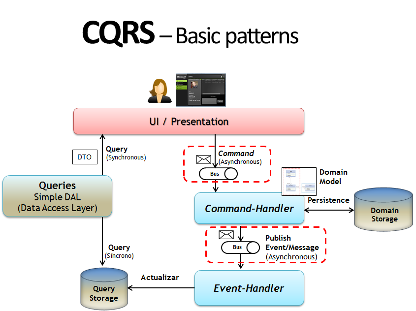

### Интеграционные паттерны
Всего пол сотни паттернов, которые можно разбить на категории\
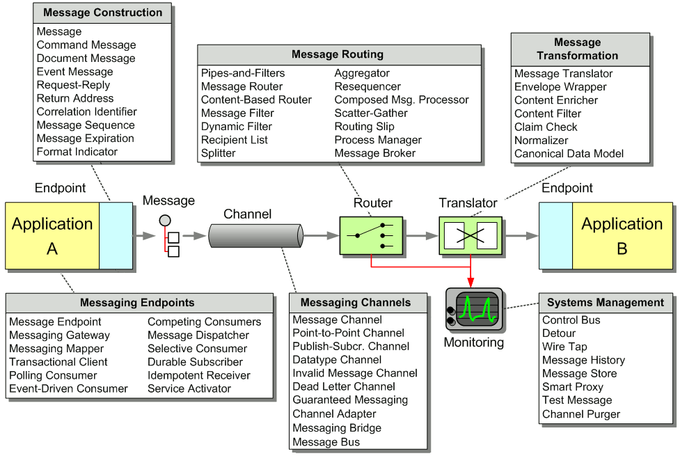
https://www.enterpriseintegrationpatterns.com/patterns/messaging/

Основные стили интеграции:
- File Transfer\
<small>(обмен файлами через FTP, NFS и т.д.)</small>
- Shared Database\
<small>(несколько компонентов/сервисов, которые используют одну БД)</small>
- Remote Procedure Invocatioin\
<small>(SOA, RPC)</small>
- -Messaging

#### Request-Reply
Запросы и ответы идут каждый **по своему** каналу.\

Канал для отправки запроса может быть как p2p, так и pubish/subscribe.\
Канал для отправки ответа, обычно, p2p

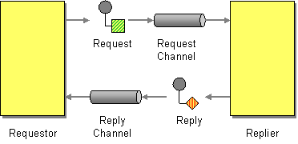

#### Garanteed Delivery
Обеспечивает гарантию доставки сообщения, даже если система сообщений упадет.\

Отправка сообщения не считается завершенной, пока сообщение не будет сохранено в хранилище\
Из хвранилища оно не удаляется до тех пор, пока не сохранилось на хранилище приемника.

Внедрение этого паттерна увеличивает число 9-ок у Availability, но ухудшается Performance.\
Уже реализован в некоторых брокерах сообщений.

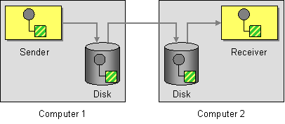

#### Aggregator
Агрегатор собирает и сохраняет связанные небольшие сообщения, пока не будет готов конечный набор результатов.\
Тогда Агрегатор отправляет одно сообщение выведенное из отдельных сообщений

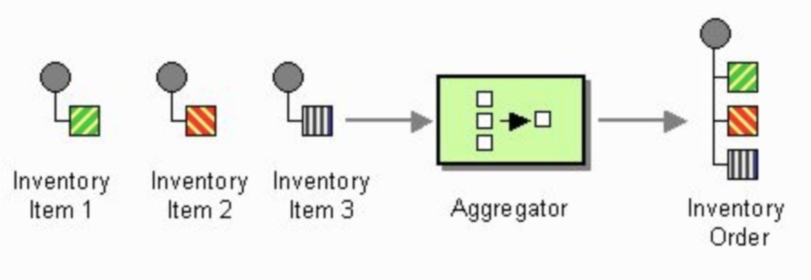

#### Message History
Предусматривает прикладывание истории сообщений к сообщению.\
Позволяет эффективно проанализировать и отладить поток сообщений.

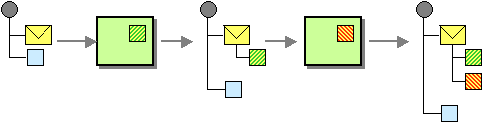

### Failt Tolerance Patterns
63 паттерна покрывают все стадии жизненного цикла ошибок.\
Эти стадии:
- Обнаружение ошибки
- Обработка ошибки
  - Восстановление
  - Смягчение
- Исправление ошибки

#### Redundancy / Избыточность
**Уровень:** Архитектура\
**Риск:** Из-за ошибок система (состоящая из многих компонентов) может стать недоступной.\
**Намеренье:** Сократить время между обнаружением ошибки и возобновлением нормальной работы.\
**Решение:** Добавить избыточность в систему\
<small>(на уровне приложения, данных, железа)</small>
- Пространственная\
<small>(несколько копий в разных местах)</small>
  - Active/Active
  - Active/Passive
  - N+1
- Временный\
<small>(как `try/catch`. Если обнаружили некорректное поведение системы, временно переключились на другой инстанс, к примеру)</small>
- Информационный\
<small>(Хранение избыточных данных (копий, контрольных сумм, кодов коррекции ошибок))</small>

#### Heartbeat / Сердцебиение
**Уровень:** Обнаружение\
**Риск:** Компоненты сервисной архитектуры могут стать недоступными\
**Намеренье:** Ошибки должны быть обнаружены как можно скорее, чтобы сократить [MTTR](2.%20ASRs%20and%20Quality%20Attributes.md#reliability--надежность)\
**Решение:**
- регулярго проверять состояние компонентов\
<small>(пульс, health-отчеты)</small>
- во время периодов загрузки выставляются разумные интервалы\
<small>(очень важно сократить ненужные накладные расходы на и так уже загруженную систему)</small>
- может быть реализованно, как от агента компонента в мониторинг, так и в виде запросов healthcheck_ов от системы мониторинга

#### Leaky Bucket Counter / Счетчик протечки ведра
**Уровень:** Обнаружение\
**Риск:** Предполагается, что система может распознавать и исправлять ошибки автоматически.\
Не все ошибки так критичны, чтобы первое же их обнаружение запускало весь процесс обработки ошибок.\
**Намеренье:** Нужно понимать, носит ли ошибка временный или периодический характер \
**Решение:**
- выставляем начальное значение счетчика при запуске системы
- увеличиваем, когда случилась интересующая нас ошибка
- уменьшаем, через определенный заранее период времени, но не ниже начального значения (которое задавали при старте системы)
- если счетчик переходит определенное пороговое значение, считаем ошибку постоянной и принимаем меры

#### Изоляция
- система не должна ложиться полностью
- систему следует разделять на части и изолировать их друг от друга
- следует недопускать каскадных падений
- Примеры:
  - Bulkheads / Переборки\
<small>(как на корабле, затапливается только один отсек)</small>
  - Loose Coupling / Слабая связь\
<small>(асинхронное взаимодействие, полная изоляция)</small>

#### Circuit Breaker / Предохранитель
Позволяет быстро упасть, а не ждать неизвестно чего.\
Он предотвращает каскадные сбои, временно блокируя запросы к проблемному сервису, чтобы дать ему время восстановиться и избежать перегрузки системы\
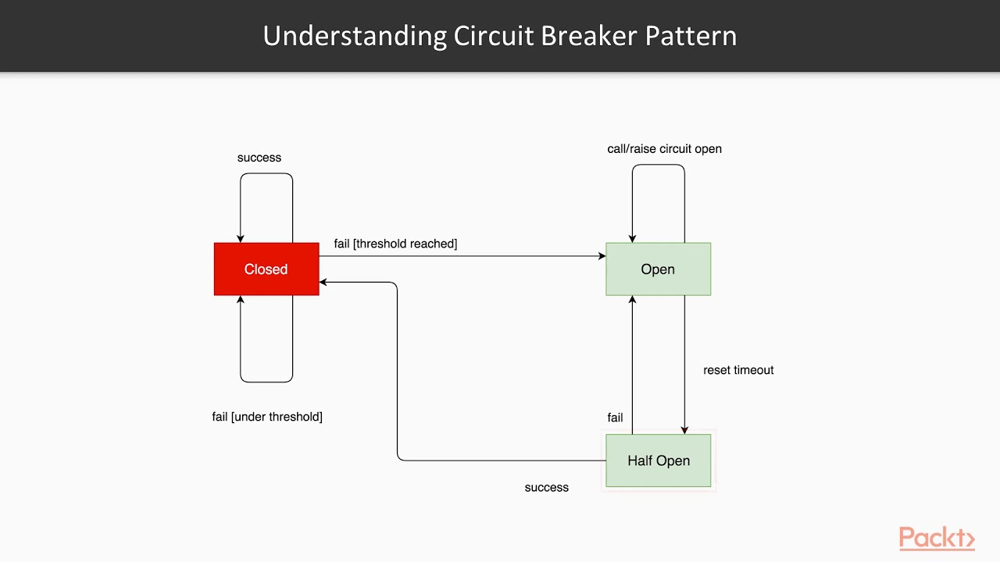
Тут,
- `Closed` - как бы замкнута цепь, ток пошел
- `Open` - разомкнута - тока нет

## Инфраструктура
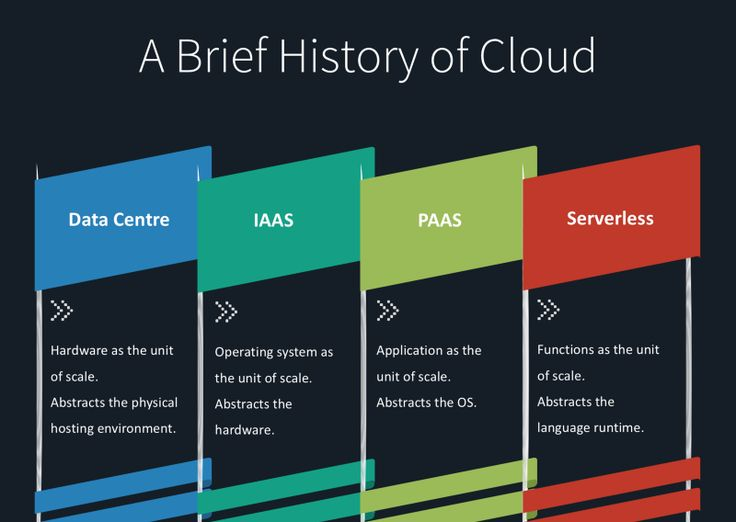

### IaaS
Вариант преджоставления облачной инфраструктуры - серверов, хранилищ, сетей и ОС, как услуги по запросу.\
Вместо покупки серверов, программных продуктов, пространства в ДЦ, сетеврого оборудования и пр., клиенты покупают ресурсы, полностью как сервисы outsource

### PaaS
Позволяет быстро и просто создавать web-приложения без сложностей с покупкой и поддержкой приложений и инфраструктуры для них.

### Serverless
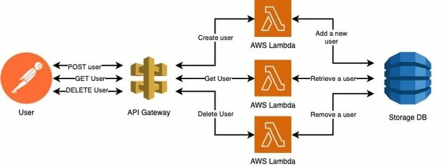

## Zero-Downtime Releases
### Сине-зеленое развертывание
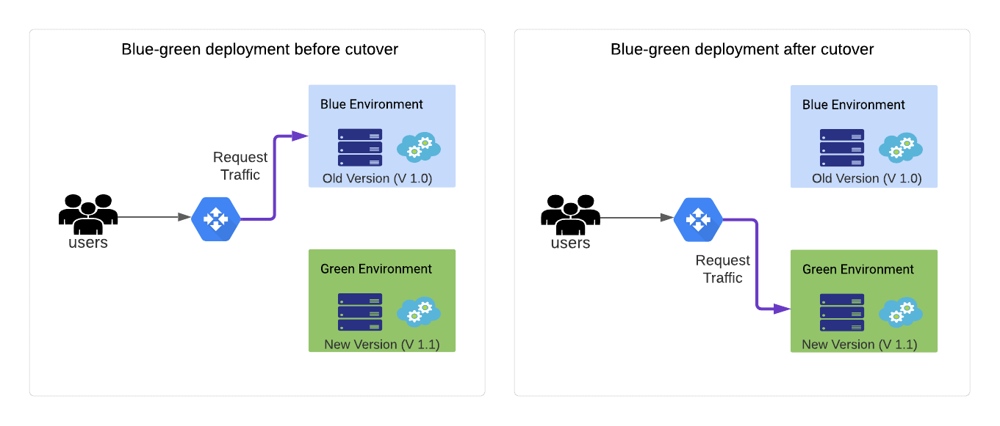
Преимущества:
- минимальный простой\
<small>(переключение обычно может занимать меньше секунды)</small>
- возможность быстрого отката назад\
<small>(если что то идет не так, переключаемся обратно на синюю среду с зеленой)</small>

Подсказки / Челенджи
- переключать приложение в read-only режим перед переключением, чтоб не потерять какие то данные
- найти способ дублировать транзакции в обе среды с новой версии приложения
- спроектировать приложение так, чтобы базы данных могли мигрировать независимо от процесса обновления

### Канареечный релиз
Идея в том, чтобы не всех пользователей сразу переключать на новую версию, а начать с небольшого числа для проверки.\
Если все хорошо, переводить и остальных на новую версию.\
А если что то идет не так, возвращать выбранных пользователей назад.\ 
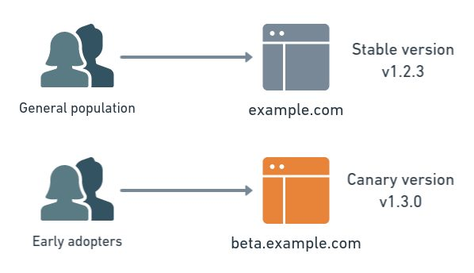