# Architecture Documentation
- чертеж системы и проекта\
<small>(набор гайдов)</small>
- обеспечивает базовый уровень реализации
- описывает, как функциональные требования и требования к качеству покрываются архитектурой
- помогает понять систему для анализа, ревью, поддержки

## Виды документации
- формальные документы
- статьи и руководства/гайды
- презентации
- модели и диаграммы

## Использование документации архитектуры
- Коммуникация\
<small>(Предоставляет исходные данные для коммуникации между stakeholder-ами (особенно между архитекторами и разработчиками))</small>
- Обучение\
<small>(Обучение и введение в курс новых людей в проекте)</small>
- Анализ\
<small>(Ревью и оценка архитекутры)</small>

## Плюсы от документации
- Документация архитектуры позволяет использовать правильный процесс проектирования архитектуры с  понятными выходными артефактами
- Готовая документация означает и готовое архитектурное решение
- Помогает делать и документировать архитектурные решения

## Стоимость документации
Не всегда документация нужна.\
Сама документация и ее количество должны быть обоснованы.\
Документации должно ровно столько, сколько требуется для поддержания эффективности и не больше.

$\sum_{затраты}(\sum_{с документацией}-\sum_{без документации}) > \sum_{стоиость ее создания и поддержки}$

## Основные атрибуты документации
- **Essential / Существенная**\
<small>(документация с достаточно хорошщей детализацией)</small>
- **Valueable / Ценная**\
<small>(тогда, когда она действительно нужна, а не когда мы хотим)</small>
- **Timely / Своевременна**\
<small>(должна создаваться just-in-time (JIT), когда она нужна)</small>

# Представления архитектуры / Architecture Views
Архитектура многомерна и слишком сложна, чтобы представить ее сразу всю.\
Представления являются отображением структуры, которые помогают управлять сложностью.

Можно представить, что есть человеческий организм - сложнейшая система.\
И есть представляения - опорно/двигательное, дыхательное, кровеносное.

## 4+1 View Model
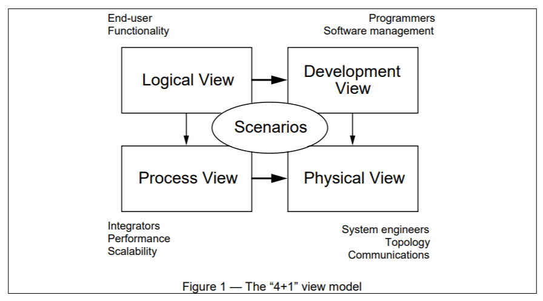
[wikipedia](https://en.wikipedia.org/wiki/4%2B1_architectural_view_model)\
Эти представления описывают систему с точки зрения различных stakeholder-ов, таких как конечные пользователи, разработчики и менеджеры проекта.

В модель входят следующие представления:
- Логическое представление\
<small>(Поддерживает функциональные требования)</small>
- Представление разработки\
<small>(Организация модулей пприложения)</small>
- Процессное представление\
<small>(Описывает как система ведет себя в работе, включая конкурентность, распределение и отказоустойчивость)</small>
- Физическое представление\
<small>(Доступность, надежность, производительность и масштабируемость)</small>

Дополнительно, выбранные use-case-ы или сценарии используются в качестве "+1" и клея, соединяющего прочие представления.

### Логическое представление
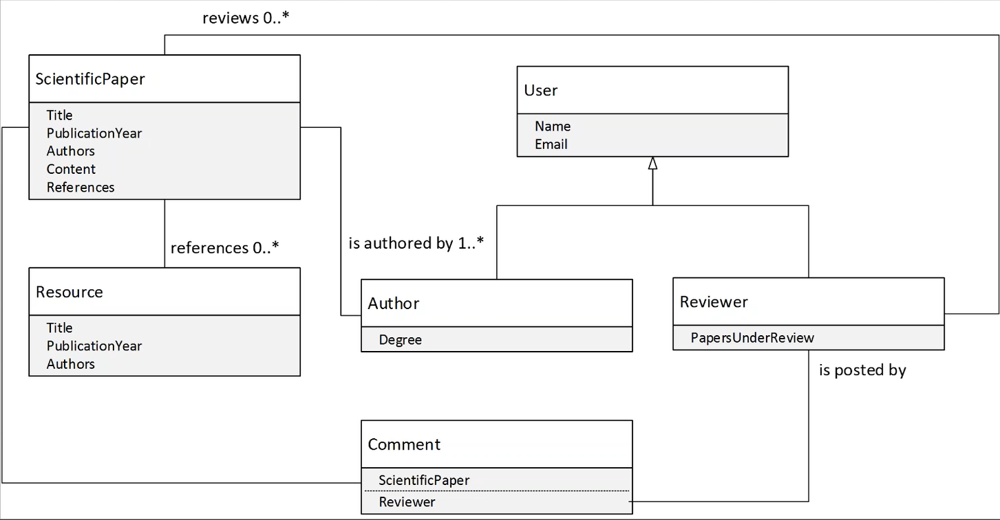

| Аспект        | Описание                            |
|---------------|-------------------------------------|
| Компоненты    | Классы                              |
| Connector-ы   | Ассоциация, наследование, вхождение |
| Stakeholder-ы | Конечный пользователь               |
| concern-ы     | Функциональность                    |

Могут применяться диаграммы классов и состояний из UML

### Процессное представление
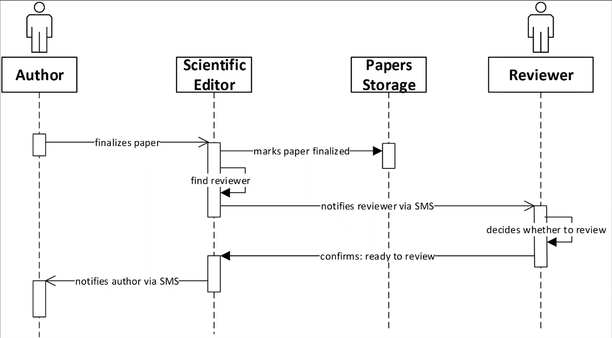

| Аспект        | Описание                                                              |
|---------------|-----------------------------------------------------------------------|
| Компоненты    | Задачи                                                                |
| Connector-ы   | RPC, Message, Broadcast                                               |
| Stakeholder-ы | Интеграторы, системные дизайнеры                                      |
| concern-ы     | Производительность, доступность, отказоустойчивость и интегрируемость |

Могут применяться диаграммы последовательностей и активностей из UML

### Представление разработки
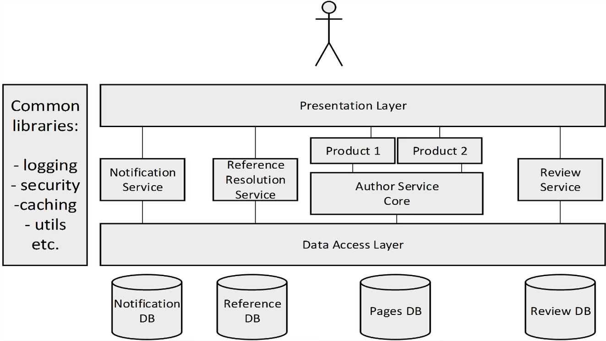

| Аспект        | Описание                                       |
|---------------|------------------------------------------------|
| Компоненты    | Модули и подсистемы                            |
| Connector-ы   | Зависимости                                    |
| Stakeholder-ы | Разработчики и менеджеры                       |
| concern-ы     | Организация, переиспользуемость, портативность |

Могут применяться диаграммы компонентов и пакетов из UML

### Физическое разработки
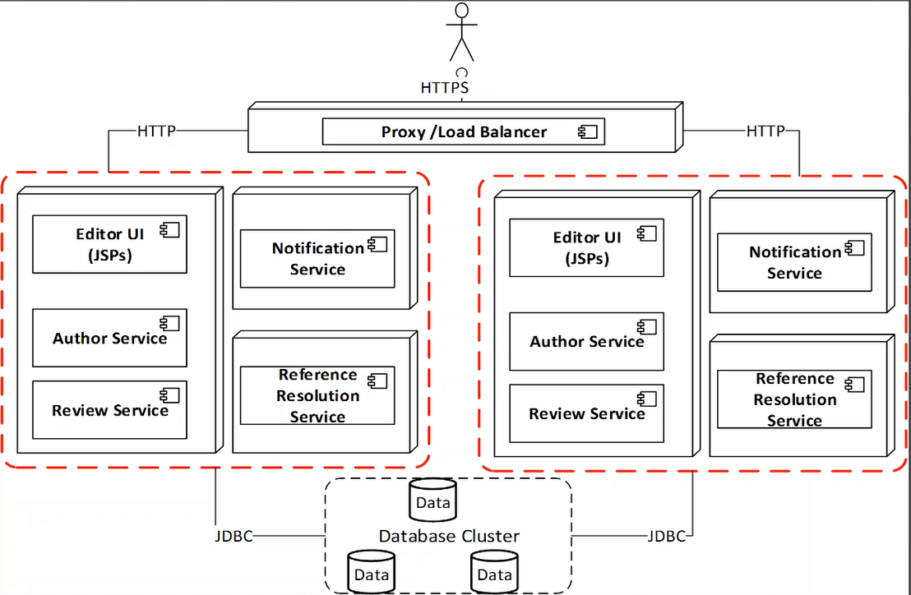

| Аспект        | Описание                                       |
|---------------|------------------------------------------------|
| Компоненты    | Узлы / Node-ы                                  |
| Connector-ы   | LAN, WAN  и пр.                                |
| Stakeholder-ы | Системные дизайнеры                            |
| concern-ы     | Производительность, доступность, отказоустойчивость |

Могут применяться диаграммы развертывания из UML

### Сценарии
| Аспект        | Описание                             |
|---------------|--------------------------------------|
| Компоненты    | Участники, Use Case-ы                |
| Connector-ы   |                                      |
| Stakeholder-ы | Разработчики и конечные пользователи |
| concern-ы     | Понятность                           |

Могут применяться диаграммы use-case-ов

### Типовая структура документа по модели 4+1
1. Scope
2. References
3. Architecture Representation
4. Architectural Goals & Constraints
5. `Logical Architecture`
6. `Process Architecture`
7. `Development Architecture`
8. `Physical Architecture`
9. `Scenarios`
10. Size and Performance
11. Quality
12. Appendices
    13. Acronyms and Abbreviations
    14. Definitions

### Проблемы модели 4+1
- Устарела\
<small>(ей уже более 20 лет)</small>
- Может быть переусложнена для agile-проектов маленького и среднего размера
- Фиксированное число представлений\
<small>(слишком мало для больших проектов и слишком много для маленьких)</small>

### Когда лучше использовать?
Когда модель является частью процесса и шаблоном в организации

## Siemens Architecture Views
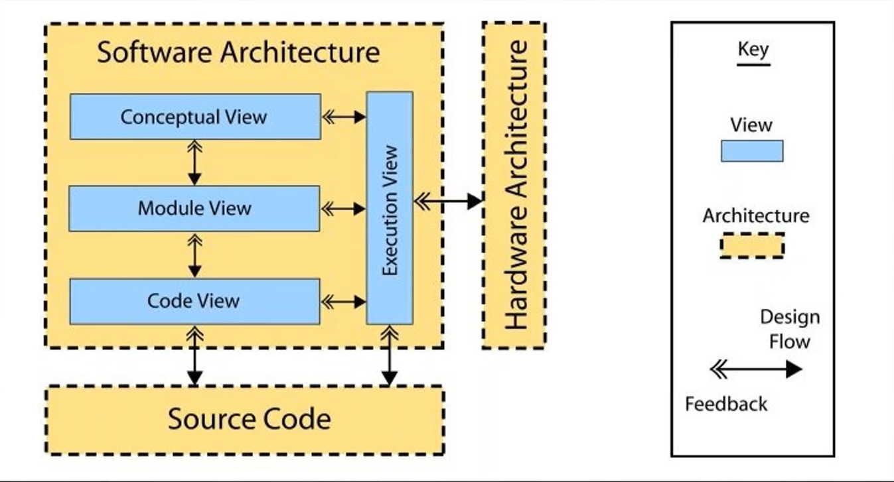

Похожа на 4+1.\
- `Conceptual View` похожа на `Logical View` из 4+1
- `Module View` похожа на `Development View` из 4+1
- `Execution View` похожа на `Process View` из 4+1

Siemens Architecture Views описывает не только представления, но и подход к построению и описанию архитектуры.

Описываемые представления являются в то же время фазами проектирования.

## Zachman Framework
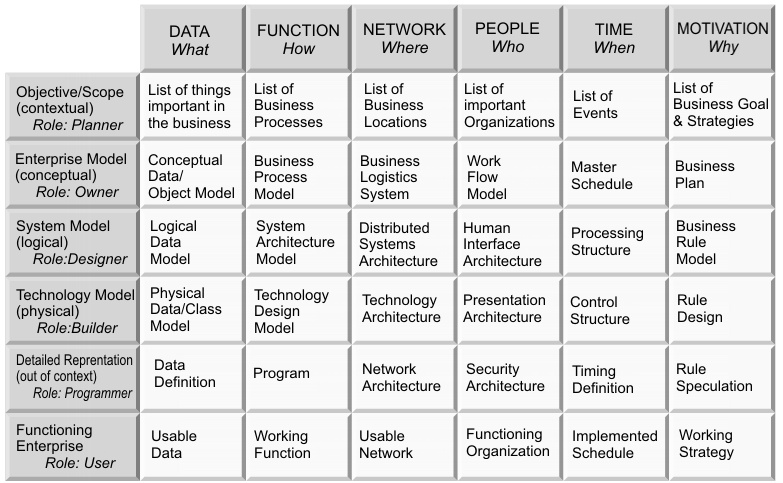

## Togaf Framework
Больше заточен для описания Enterprise Architecture.

Включает в себя:
- Business Architecture Models
  - Концептуальные
  - Логические
  - Физические
  - Перекрестные ссылки
- Data Architecture Models
  - Концептуальные
  - Логические
  - Физические
  - Перекрестные ссылки
- Application Architecture Models
  - Концептуальные
  - Логические
  - Физические
  - Перекрестные ссылки
- Technology   Models
  - Концептуальные
  - Логические
  - Физические
  - Перекрестные ссылки

## C4 Model
\
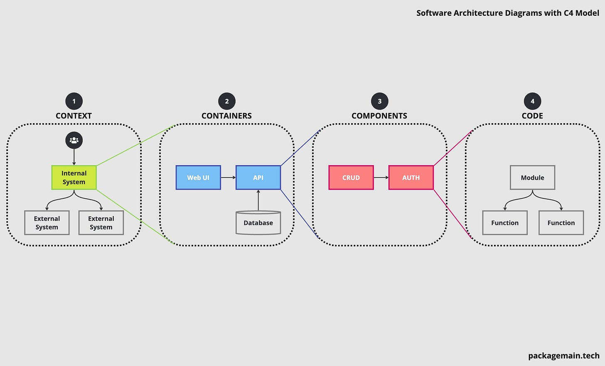

Обычно используется, как C3 (Context-Container-Component)\
В ней нет четко определенной нотации (виды стрелок, квадратиков и пр.)\
Не покрывает функционал (сценарии)\
Лучший вариант C4: Scenario, Context, Component, Deployment

### Context Diagram
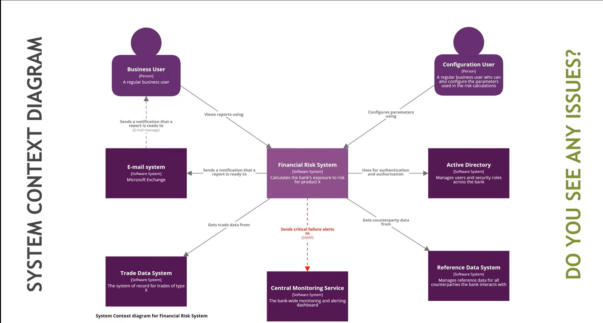

### Container Diagram
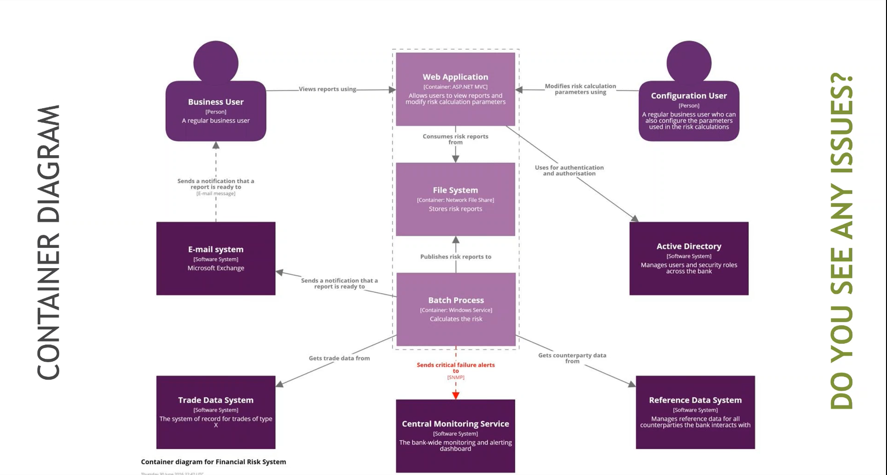

### Component Diagram
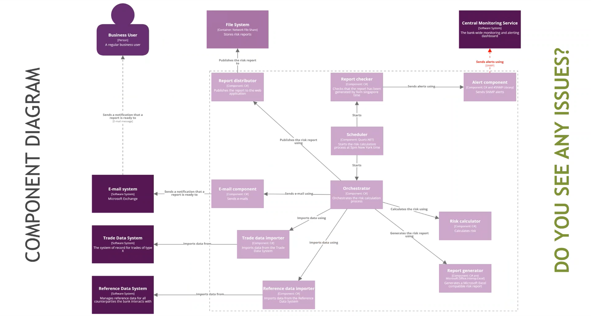

### Когда лучше подходит?
Для маленьких проектов и проектов среднего размера

## Шаблон для описания представлений
- Section 1. Primary Presentation\
<small>(Сама схема)</small>
- Section 2. Element Catalog\
<small>(Объясняет, что на схеме. Что такое синий квадратик или желтый кружочек)</small>
  - Section 2.A. Элементы и их свойства
  - Section 2.B. Отношения и их свойства
  - Section 2.C. Интерфейсы элементов
  - Section 2.D. Поведение элементов
- Section 3. Context Diagram\
<small>(Из C4)</small>
- Section 4. Variability Guide\
<small>(Если используются плагины, то все варианты их использования описываются тут)</small>
- Section 5. Rationale\
<small>(Тут описывается почему были приняты те или иные архитектурные решения)</small>