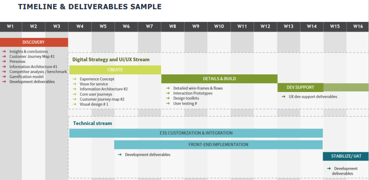
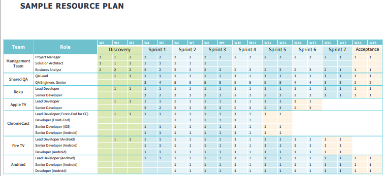

# Pre-Sale-ы

## Процесс Pre-Sale

## Overall Timeline
### RFI - Request for Information
Стандартный бизнес процесс, цель которого - собрать информацию (письменно) о возможностях различных поставщиков.\
Обычно, используется формат, позволяющий проводить сравнение
- Получение общей информации и возможностей вендора
- Используется для оценки вендоров и их возможностей
- Без конкретных деталей о решении и цене
- Используются различные формы:
  - excel
  - word
  - web-формы

Позволяет выбрать лучшего из лучших для выполнения заказа.

К примеру, сколько у вас java-разработчиков, какие у вас процессы и т.д.?

#### Процесс RFI
- Получен RFI
- Собираются ответы
- Отправляется RFI Response
- Отправляются ссылки, case studies и профили
- Проводится демонстрация\
<small>(чтобы показать нашу уверенность в себе в этой сфере)</small>

От получения PFI до отправки RFI Response обычно проходит **1 неделя**

#### Что поможет при подготовке ответов?
- Команда pre-sale-а
- Solution Practicies
- Центры компетенций
- Communuity
- Presales KB

### RFQ - Request for Quotation
Стандартный бизнес процесс, цель которого пригласить поставщиков на процесс торгов, чтобы делать ставки на конкретный товар или услугу
- Получение информации о цене работы
- Решение более-менее понятно (может включать детальное описание FR/NFR)

#### Процесс RFQ
- Запрос на RFQ получен
- Вопросы отправлены
- Q&A summary provided
- Отправлен RFQ Response
- Оценка RFQ
- Выбор вендора

Может предоставляться таблица, которую нужно заполнить.\
Можем ли это? Стоимость того. В итоге, автоматически считается стоимость

### RFP - Request for Proposal
Привлечение, которе часто проводится компанией или агентством во время процесса торгов с целью получить коммерческое предложение от потенциального поставщика.\
Оно отправляется на ранних стадиях цикла закупок либо на этапе предварительного исследования, либо на этапе закупки
- Предоставление подхода к решению
- Предоставление подхода к поставке
- Предоставление цены

#### Процесс RFP
- Запрос на RFP получен
- Намерение подать заявку / Подпись NDA
- Вопросы отправлены
- Q&A summary provided
- Отправка RFP Response
- Оценка RFP
- Обсуждения, переговоры, workshop-ы
- Окончательный выбор
- Подписание контракта

Подбробнее
- Kick-ff со stakeholder-ами
- BIg Picture: Scope, user scenarios, workflows, архитектура
- Questions, сессии Q&A с заказчиками и stakeholder-ами
- Список фич с точками интеграции
- Предположения (Limit scope)
- Оценки
- [Timeline](#timeline-пример) (фазы и milestone-ы)
- Описание архитектуры, подход к поставке
- Отправка

Может занимать месяц

#### Структура RFP
- Цели
- Scope/Объем
- Результаты
- [Timeline](#timeline-пример)
- [Resource Plan](#resource-plan-пример)
- Юридическая секция

##### Timeline. Пример

##### Resource Plan. Пример

#### Что входит в kick-off
- Составление команды
- Наладка процесса
  - составление расписания
  - заведение status calls
  - согласование обязанности (RACI)
- Предоставление доступа к материалам (yandex disk)
- Начало работы над вопросами и дизайном

## О чем полезно подумать?
- Не все интеграционные точки должны быть автоматизированны.\
Может, что то проще и дешевле делать вручную
- Портал для support-а?