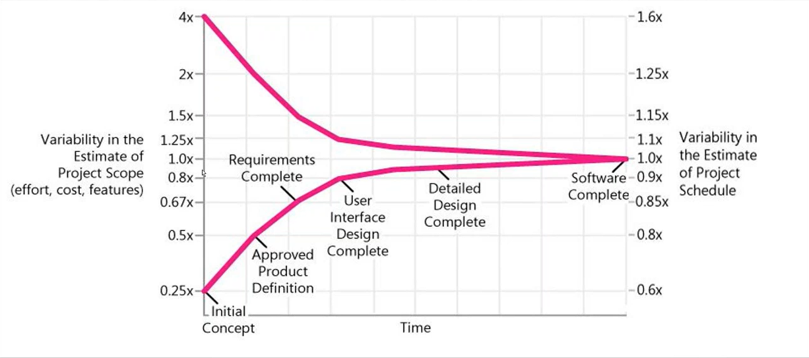

# Estimation

Помимо прочего, во время оценки приходится постоянно отвечать на вопросы (как сделать это? из чего состоит то?), делать предположение, декомпозировать и проектировать систему.

## Источники неуверенности
- Неполная, неточная или меняющаяся входная информация
  - о проекте
    - FR / NFR
    - ограничения и приоритеты
  - о возможностях организации, которая будет выполнять проект
    - персонал
    - процессы
    - производительность
  - ограничения, связанные с заказчиком
- Неточный процесс оценки
    - пропускаемые активности
    - неизвестная сфера бизнеса/технологии
    - субъективность и предвзятость
    - неправильная конвертация оценочного времени в project time
      - к примеру, если упущены звонки по пол дня
    - неправильная конвертация усилий в расписание
    - фактор размера/сложности проекта

### Один из вариантов устранения неуверенности
Попросить кого нибудь выполнить review работы. МОжет, из центра компетенций

## Конус неопределенности

Поначалу можно сильно недооценить или переоценить проект.\
Но по мере уточнения деталей и проработки аспектов, оценка становится все точнее.

## Измерения оценок
- man-days
- ideal man-days
  - не учитываются митинги и прочие отвлечения.
  - есть техники конвертации `ideal man days` в `man days`
- story points, t-shorts

### Важно помнить
Дюди не работают все 8 часов. Из-за перерывов, митингов и прочего.

### Когда и что использовать
Если есть неопределенность, не нужно использовать часы

## Техники и практики оценки
- [Count, Compute, Judge](#count-compute-judge)
- [WBS](#wbs---work-breakdown-structure-по-pmbok)
- [Bottom-Up](#bottom-up)
- Expert Judgment in Groups
- Analogy

Хорошо бы иметь пару независимых WBS и оценок для дальнейшего сравнения.\
Дальше как в Plan Pocker - можно начать обсуждение, если какие то оценки отличаются.

### Count, Compute, Judge
Если есть, к пример, 1000 фичей для оценки\
К примеру,
- делаем несколько корзин (Complex, Medium, Easy)
- раскидывает фичи по ним
- берем несколько из корзины, оцениваем и вычисляем по ним среднюю оценку для каждого бакета
- перемножаем и суммируем

### WBS - Work Breakdown Structure (по PMBok)
Бывают 2 типов
- Deliverabl-oriented\
<small>иерархическая структура вещенй, который проект породит для поставки</small>
- Task-oriented WBS\
<small>иерархическая структура, которая отталкивается от результата, требуемого для соблюдения договоренностей по проекту</small>

### Bottom-Up
Декомпозициуем
- deliverables
- задачи
- активности

Делаем индивидуальную экспертную оценку
- Интуитивная экспертная оценка, структурная экспертная оценка
- PERT

В зависимости от оценки времени разработки расчитываются активности других направлений
- 5-10% менеджмент
- 20-30-50% тестирование
- 5-15% фиксы багов
- 5-10-20% анализ
- дополнительные активности в разработке
  - 10% на создание юнит-тестов
  - 10-20% интеграционные тесты
  - 5% документация