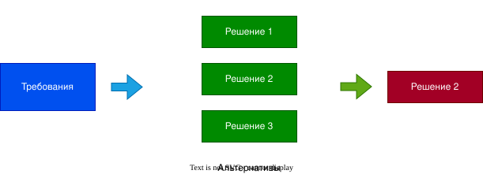
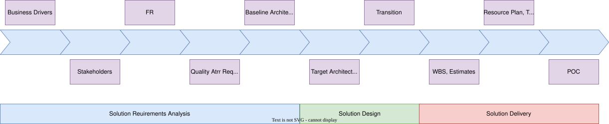
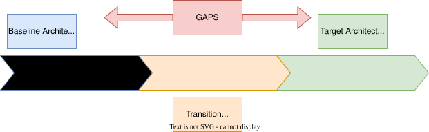
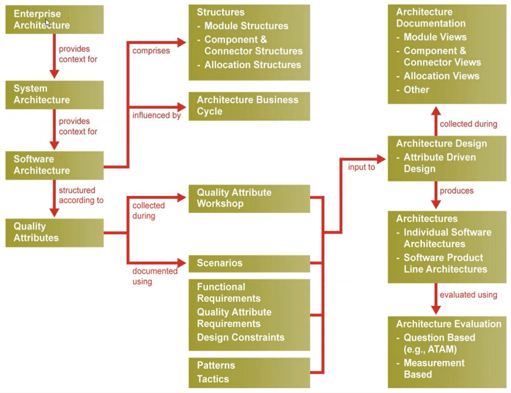
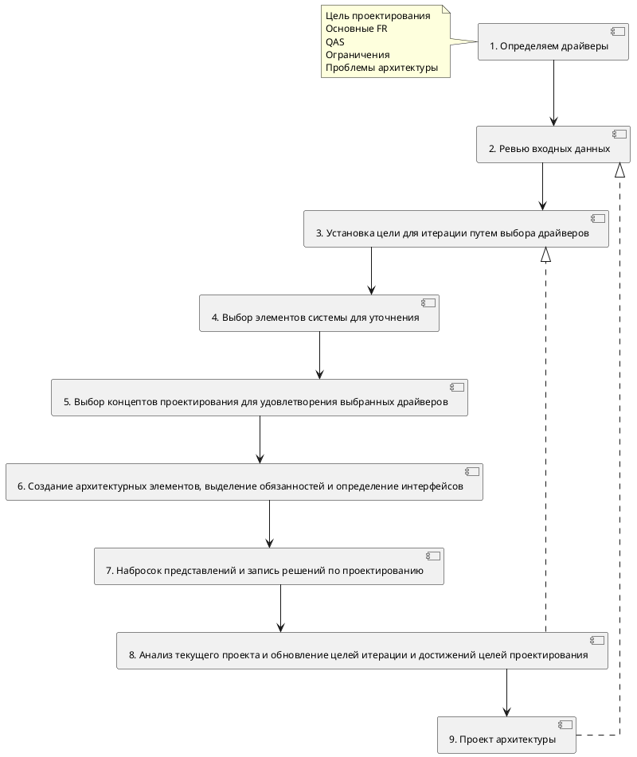

# Architecture Design
## На что похож верхне-уровневый процесс проектирования архитектуры
- Начинается процесс с Бизнес архитектуры, чтобы понимать
  - цели
  - потребности бизнеса
  - stakeholder-ов
  - требования stakeholder-ов
- Дальше работа с требованиями
  - FQ
  - NFR
- Определение Quality Attribute Requirements,включая
  - QAW
  - Scenarious
  - Measurable Metrics
- Проектирование решения, используя
  - тактики
  - стили/шаблоны
  - опыт
- Документирование решения, включая выбор
  - подходщих представлений
  - структуры документа
  - подхода к моделированию
  - нотаций

## На что похоже проектирование архитектуры
- Проектирование архитектуры - принятие решений/выборов, которые ведут к созданию архитектуры
  - Не останавливаемся на первом же варианте, продумываем альтернативы
- Требования обеспечивают контекст для принятия решений

## Design Checklist
- [ ] Подход к коммуникации
  - [ ] Определены элементы, которые должны и не должны коммуницировать
  - [ ] Определены свойства коммуникации
    - timeliness/своевременность
    - корректность
    - производительность
  - [ ] Определен сам подход к коммуникации
    - интерфейсы
    - протоколы
    - паттерны (sync/async, гарантированные/нет, stateful/stateless)
- [ ] Модель данных
  - [ ] Определена концептуальная модель и основные свойства
  - [ ] Определены потоки данных и миграции
  - [ ] Определены паттерны доступа
  - [ ] Определенытребования к хранилищу
    - key/value, blob, graph, relational...
    - длительность хранения
- [ ] Распределение обязанностей
  - [ ] Обязанности определены (функциональная декомпозиция)
  - [ ] Определено, как обязанности распределены по элементам (модулям, компонентам)
- [ ] Управление ресурсами
  - [ ] Определены ресурсы и их лимиты
    - ресурсы инфраструктуры - нагрузка
    - программные ресурсы - очереди, пулы
  - [ ] Определено, как ресурсы share-ятся
  - [ ] Понятная утилизация ресурсов
- [ ] Mapping Among Architectural Elements
  - [ ] Замаплены функции на компоненты и модули приложения
  - [ ] Замаплены модули на компоненты
  - [ ] Замаплены модели данных на хранилища данных
  - [ ] Замаплены компоненты на элементы инфраструктуры
- [ ] Выбор технологий
  - [ ] Выбраны технологии среди доступных
  - [ ] Выбраны инструменты
  - [ ] Есть понимание технологий
    - доступность ресурсов
    - опыт

## vNEXT - подход к проектированию архитектуры
Концепции SEI + прктики EPAM

- Анализ требований к решению
  - Определяем Business Drivers
  - Определяем Stakeholder-ов (заинтересованных лиц)
  - Определяем FR
  - Определяем QAR, описываем предположения, определяем ограничения
  - Если уже есть какая то архитектура, которая чем то не устраивает, нужно определить, какие у нее GAP-ы, чем именно она не устраивает
- Проектирование решения
  - Проектируем само решение
  - Проектируем то, как мы передадим систему (на prod и т.д.)
- Передача решения
  - Формирование WBS, оценок
  - Составления ресурсного плана, timeline-а и road map-а
  - Возможно, написание PoC-а

### Business Drivers
- Что движет бизнесом для построения системы
- Зачастую, не доступны бизнес цели, драйверы
- Stakeholder-ы не хотят делиться бизнес целями
- В том числе являются источником ограничений и влияют на построение архитектуры
- Требования, решения в более низкоуровневой архитектуре должны быть связаны (traceable) с бизнес-архитектурой

### Stakeholder-ы
- Stakeholder-ы имеют разные цели, представления и требования
- Нужно идентифицировать stakeholder-ов, вовлеченных в проектирование рещения (приоритезировать, понять их беспокойства, власть и представления)
- Собрать их требования и беспокойства

### Требования
- Собираем и анализируем требования
- Используем функциональные требования, как начальный ввод для проектирования решения
- Уточняем QAR (нефункциональные требования)
  - Определить ограничения и их гибкость
  - Определить и подтвердить предположения (покрыть пробелы и двусмысленность)
- Нужны ли все требования, ограничения, предположения? Нет. Нужно сосредоточиться только на ASR-ах

#### Quality Attribute Requirements
- QAR должны быть измеримы и тестируемы
- Используем сценарии, чтобы их определить
- Приоритезируем их (опираясь на бизнес ценности и влияние на архитектуру)

### Существующая архитектура

- Разбираемся в текущей архитектура
- Определяем GAP-ы
- Определяем целевую архитектуру и переходную архитектуру (если она нужна для перехода шаг за шагом)

### Проектирование решения
`Требования` + `Архитектура решения` = `Проект решения`

- Декомпозируем, выбираем элементы
- Определяем требования
- Просматриваем паттерны/тактики/технологии
- Применяем паттерны/тактики/технологии
- Документируем представления, описываем решение
- Возвращаемся в начало цикла (первый пункт списка), если надо

## Проектирование по SEI

### Attribute Driven Design 3.0 by SEI
- ADD основывается на QAR-ах
- Представляет собой процесс рекусривной декомпозиции, где на каждом шагу выбираются тактики и паттерны, удовлетворяющие QAS
- Проектирование выполняется вместе с итерациями реализации
- Фокусируется на QAR, выбираемых по прицнипу `Better ASR`
- Анализ и документирования являются частью процесса

На вход идут

- Паттерны, тактики
- Ограничения, FR, QAR
- Архитектура

На выходе получаем

- Декомпозиция архитектуры

#### Процесс ADD 3.0

