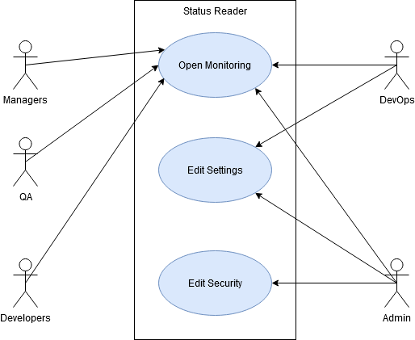

# Диаграмма вариантов использования
Эта диаграмма используется, что бы показать как люди взаимодействуют с системой. 
Большеориентированна на бизнес.
### Как рисовать
* Нарисуйте прямоугольник. Это будет граница системы.
* Определите, кто будет работать с системой.
* Добавьте варианты использования внутри системы с помощью овалов.
* Добавьте связи между участниками и вариантами использования.

 
[Источник](https://habr.com/ru/company/epam_systems/blog/538018/)