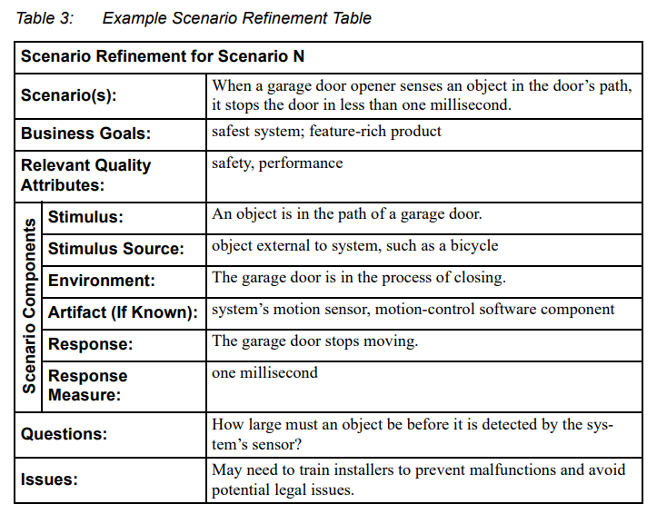

# ASRs and Quality Attributes
Понимая цели и scope со стороны бизнеса, а так же функциональные/нефункциональные требования, мы можем составить `Quality Attributes` для архитектуры.
Имечя их можно оценить архитектуру и определить, есть ли в ней проблемы.

### Нужно уделять достаточно внимания проработке Quality Attribute Requirements
Это нефункциональные требования, к примеру, логин пользователя должен происходить меньше чем за 1 секунду.\
Эти требования нужно включить в решение и предусмотреть метрики, которые бы показывали, соблюдаются ли эти требования. Как вирант, добавить их в инфраструктуру, CI/CD.

### Ограничения/Constraints тоже должны быть проработаны
Это особый вид требований, предусматривающий нулевую свободу.

Это могут быть:
- Бюджет и сроки
- Технологии
- Состав команд
- Организационные

Примеры:
- Должен быть использован ехнологийческий стек IBM
- В команде нет опытных разработчиков и она не может быть расширена

Стоит уточнять у заказчика, откуда взялись эти ограничения.\
Может, на самом деле, за ними стоит неосведомленность/заблуждения и прочее. К примеру, заказчик слышал что то про такую технологию и включил ее в ограничения.

## Architecture Significant Requirements (ASR)
Не все требования имеют влияние на архитектуру.\
**ASRs** - требования, которые имеют глубокий эффект на архитектуру; без учета таких требований, архитектура может быть совершенно другой.\

Нужно определить именно те требования, что будут влиять на построение архитектуры.

Зачастую ASR-ы принимают форму quality attribute requirement_ов (но не всегда).

_Значительность_ влятия на архитектуру определяется ценой переделок, если их не учесть (деньги, время, ресурсы, репутация).

К примеру:
- При загрузке контента на сайт, силами фронтенда его нужно сжимать и отправлять в храшилище.\
<small>(Значит, нужно придумывать, как это реализовать на стороне фронтенда.)</small>
- Система должна поддерживать интеграцию с системами ...
- Система должна быть способна к работе в облаке или при работе с мобильными клиентами
- Бизнес цель: выйти на глобальный глобальный через год

### Определение ASR, если еще не готовы FR / NFR
Если еще нет описанных функциональных и нефункциональных требований, можно собрать ключевые ASR-ы через:
- работу с бизнес-целями
- интервью stakeholder-ов
  - чек-листы, опросники
  - QA-сценарии
  - QAW-workshop-ы\
<small>(Quality Attribute Workshop)</small>

## Получение ASR-ов через интервью Stakeholder-ов
Лучший вариант - QAW Workshop

### Full QAW (by SEI)
[Quality Attribute Workshops (QAWs), Third Edition](https://s3-eu-west-1.amazonaws.com/pstorage-cmu-348901238291901/12069557/file.pdf)

Может занимать 1-2 дня.

В итоге должно получиться единое виденье заинтересованных сторон важных атрибутов качества продукта.

Шаги:
- Введение
- Бизнес презентация
- Презентация архитектурного плана
- Определение Acrhitectural Driver-ов
- Мозговой штурм сценариев
- Сбор сценариев
- Приоретизация сценариев
- Уточнение сценариев

### Mini-QAW (by IBM)
Может занимать день.

Шаги:
- Введение
- Короткий мозговой штурм сценариев
- Короткий сбор сценариев
- Короткая приоретизация сценариев
- После сессии, в формате offline: Уточнение сценариев

### Mini-QAW (by EPAM)
Предварительно:
- Проводится сессия с представителями заказчика для определения бизнес-цеолей, ограничений, ключевых сценариев

Шаги:
- Сформировать список Quality Attribute Scenarioes с представителями заказчика
  - Можно использовать стикеры, чтоб разместить всех их
  - Перефразировать сценарии по формулировке SEI
  - Агрегировать и почистить для формирования итогового списка специариев QA
- Приоретизация сценариев QA

### Nano-QAW (by EPAM)
Предварительно:
- Заранее предположить бизнес-цели, ключевые сценарии, ограничения и пр.
- Собраться с представителями бизнеса, чтобы подтвердить предположения, скорректировать и дополнить список\
<small>(~1 час)</small>
- Заранее готовится таблица с сортированными предположениями по QA и метриках QA

Шаги:
- Собирается встреча только с техническими представителями зказчика\
<small>(~2 часа)</small>
  - Объясняется почему QAW критически важен
  - Начинается встреча с подготовленного заранее списка, который правится/расширяется
- Обсуждение сформированного итогого списка с представителями бизнеса заказчика