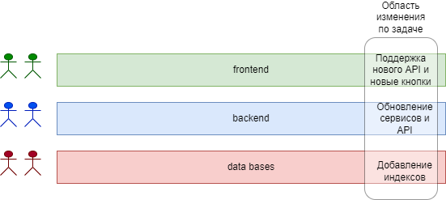
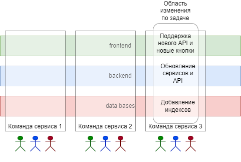

# Монолит
Говоря о монолите, речь идет о единице развертывания. 
Если все функциональные возможности в системе должны разворачиваться вместе - это монолит. 
Сюда можно отнести следующий монолиты:
* однопроцессный
* модульный
* распределенный

*Создание микросервисов. 2-е издание. Сэм Ньюмен., стр. 40*

## Когда использовать монолит
Многие ошибочно считают, что монолит - это нечто, чего нужно избегать. 
Для многих "монолит" - синоним "устаревшему", что не правильно. 
Монолитная архитектура - вполне обоснованное решение, стандартный и разумный выбор. 
А вот для микросервисов уже нужна обоснованная причина 
*Создание микросервисов. 2-е издание. Сэм Ньюмен., стр. 43*

# Микросервисы
**Микросервисы** - независмо выпускаемые сервисы, которые моделируются вокруг предметной области 
Мкросервис - особый тип SOA, хоть и с особым пониманием того, как проводятся границы сервисов. 
Появился благодаря накопленному опыту использования SOA 
*Создание микросервисов. 2-е издание. Сэм Ньюмен., стр. 28, 31*

### Назвисимость развертывания
Ключевым фктором является возможность независимого развертывания 
Его можно добиться, если сервисы слабо связаны, то есть можно менять один сервис не меняя что то еще 
*Создание микросервисов. 2-е издание. Сэм Ньюмен., стр. 28, 31*

### Инкапсуляция микросервисов
Снаружи микросервис рассматривается как черный ящик 
Он предоставляет наружу endpoint-ы (REST или другой протокол). 
Потребители получают доступ к функциональности через эти endpoint-ы 
В том числе, это означает, что обычно микросервисы не используют общую БД, а инкапсулируют свою. 
*Создание микросервисов. 2-е издание. Сэм Ньюмен., стр. 28*

### Концепция сокрытия информации
Микросервисы используют концепцию сокрытия информации, то есть:
* как можно больше информации сокрыто внутри
* как можно меньше информации открыто наружу

В том числе. так можно легко провести границу между легко и сложно меняемыми данными 
Таким образом, снижается вероятность того, что изенения внутри микросервиса повлияют на потребителя (внешнее API меняется редко) 
*Создание микросервисов. 2-е издание. Сэм Ньюмен., стр. 28*

## Микросервисы и DDD
DDD могут позволить структурировать код, чтобы лучше представлять реальную предметную область, в которой работает ПО 
DDD помогает определить границы сервисов 
*Создание микросервисов. 2-е издание. Сэм Ньюмен., стр. 32*

## Микросервисы со сквозными срезами
Обычно микросервисы делают со сквозным срезом бизнес-функциональности (контроллер, сервисы, БД...) 
Если отталкиваться от технической функциональности (сервисы доступа к БД, сервис бизнес логики), то часто будем сталкиваться с тем, что по задаче придется менять несколько сервисов 
*Создание микросервисов. 2-е издание. Сэм Ньюмен., стр. 32*

## Деление монолита на микросервисы
* переход должен быть постепенным, поэтапным. По мере увеличения сервиисов сложность возрастает
* максимально эффективно определить границы

*Создание микросервисов. 2-е издание. Сэм Ньюмен., стр. 35*

### Предостережение от бума новшеств вначале работы с микросервисами
Не стоит сразу использовать кучу новых технологий. 
Стоит начать с агрегации логов и дополнять технологический стек постепенно, чтоб не потонуть в проблемах 
*Создание микросервисов. 2-е издание. Сэм Ньюмен., стр. 44*

## Трехуровневая модель и разделение команд и сквозная
### Слоенный подход деления команд и функциональности
Так привычнее, но в ходе выполнения задач приходится вносить изменения разным командам, друг друга ждать и т.д. 

### Кросс-функциональные команды, разбитые по кросс функциональным микросервисам
 
*Создание микросервисов. 2-е издание. Сэм Ньюмен., стр. 37-38*

## Преимущества микросервисов
### Технологическая неоднородность
В системе, состоящеий из нескольких взаимодействующих микросервисов, разные микросервисы могут быть реализованы с использованием разных технологий для наилучшего решения своей конкретной задачи. 
Вместо того, чтоб искать стандартизированный подход. 
*Создание микросервисов. 2-е издание. Сэм Ньюмен., стр. 48*

### Надежность
**Переборка (bulkhead)** - Основная концепция повышения надежности. 
Вовремя обнаруженный упаший компонент можно изолировать, при этом сохранив остальную часть системы в работоспособносм состоянии (в идеале). 
Границы сервисов - потенциальные переборки. 
В монолите, если инстанс выходит из строя, то перестает работать весь функционал этого инстанса и остается надежда только на другие инстансы 
В микросервисах можно попытаться создать систему, которая будет способна справляться с полным отказом некоторых сервисов. 
*Создание микросервисов. 2-е издание. Сэм Ньюмен., стр. 49*

### Масштабирование
С массивным монолитом масштабировать придется все целиком. 
Имея сервисы поменьше, можно масштабировать только ту часть, которая является узким местом. 
*Создание микросервисов. 2-е издание. Сэм Ньюмен., стр. 49-50*

### Простота развертывания
Изменение одной строки в крупном монолите на миллион строк требует развертывания всего приложения. 
Из-за этого боятся что то лишний раз править, боясь проблем в деплое и после. 
А если есть изменения, то стараются их поднакопить, чтоб задеплоить в одном технологическое окно побольше и сократить down time. 
В микросервисах можно внести изменения в один сервис и его только задеплоить. 
*Создание микросервисов. 2-е издание. Сэм Ньюмен., стр. 51*

## Слабые места микросервисов
### Стоимость
- Скорее всего, придется запускать больше процессов, компьютеров, сетей, хранилищ и вспомогательного ПО (вероятно, за доп.лицензии)
- Любые изменения, вносимые в команду или организацию, замедляют процесс работы (пока люди перестраиваются, а другие задачи никуда не деваются).
- Микросервисы могут принести и прибыль, если использовать их для привлечения клиентов или для параллельной разработк доп.фичей 

*Создание микросервисов. 2-е издание. Сэм Ньюмен., стр. 53-54*

### Отчетность
Данные становятся размазанными по сервисам и их БД, что усложняет сбора отчетов/аналитики и прочего такого

*Создание микросервисов. 2-е издание. Сэм Ньюмен., стр. 54*

### Прочее
- Мониторинг
- Безопасность
- Тестирование
- Согласованность данных
- Время ожидания

*Создание микросервисов. 2-е издание. Сэм Ньюмен., стр. 55-57*

## Кому микросервисы не подойдут
Новым проектам, стартапам скорее всего не подойдут микросервисы.\
В процессе создания проекта с нуля, предметная область претерпевает значительные изменения.\
Когда проект чуть стабилизировался, можно уже выделять границы и микросервисы.

*Создание микросервисов. 2-е издание. Сэм Ньюмен., стр. 57*

## Что делает границы микросервисов качественными

### Сокрытие информации
Сокрытие информации - это концепция, разработанная Дэвидом Парнасом для поиска наиболее эффективного способа определения границ модулей.\
Подразумевает сокрытие как можно большего количества деталей за границей модуля (в частном случае, микросервиса).

*Создание микросервисов. 2-е издание. Сэм Ньюмен., стр. 62*

#### Преимущества, которые должны дать модули
- Ускорение разработки\
<small>Больше параллельной работы, разрабатывая модули независимо</small>
- Понятность\
<small>Каждый модуль рассматривать и понимать изолированно, что в итоге дает представление о работе системы в целом</small>
- Гибкость\
<small>Модули можно менять независимо, не требуя преобразования у других</small>

*Создание микросервисов. 2-е издание. Сэм Ньюмен., стр. 63*

### Связность (Cohesion)
**Определение:** Мера силы взаимосвяжанности элеменов сервиса; способ и степень, в которой задачи, выполняемые им, связаны друг с другом. Код, в который вносят изменения как в единое целое, остается единым целым.\
Требуется функциональность, сгруппированная таким образом, чтобы иметь возможность вносить изменения в как можно меньшем количестве мест.\
Если соответствующая функциональность распределена по всей системе, мы говорим, что связность слабая, тогда как в микросервисах стремимся к сильной связности.

*Создание микросервисов. 2-е издание. Сэм Ньюмен., стр. 64*

### Связанность (Coupling)
**Определение:** представляет собой степень взаимосвязи между сервисами. При создании систем необходимо стремиться к максимальной независимости сервисов, то есть их связанность должна быть минимальна.\
Изменения, вносимые в один сервис не требуют изменений в другом.\
Слабо связанный сервис имеет необходимый минимум сведений о сервисах, с которыми ему приходится сотрудничать. Это означает, что нам следует ограничить количество различных типов вызовов от одного сервиса к другому, потому что помимо потенциальной проблемы с производительностью интенсивное общение может привести к сильной связанности.

*Создание микросервисов. 2-е издание. Сэм Ньюмен., стр. 64*

### Cohesion и Coupling
Структура стабильна, если если связность сильная, а связанность слабая.

*Создание микросервисов. 2-е издание. Сэм Ньюмен., стр. 65*