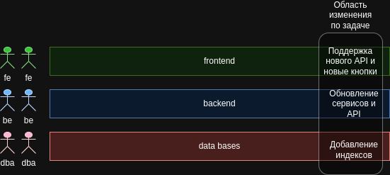
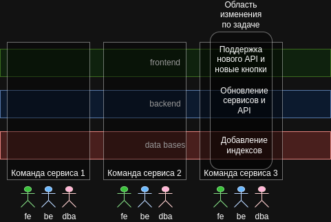

# Монолит
Говоря о монолите, речь идет о единице развертывания. 
Если все функциональные возможности в системе должны разворачиваться вместе - это монолит. 
Сюда можно отнести следующий монолиты:
* однопроцессный
* модульный
* распределенный

*Создание микросервисов. 2-е издание. Сэм Ньюмен., стр. 40*

## Когда использовать монолит
Многие ошибочно считают, что монолит - это нечто, чего нужно избегать. 
Для многих "монолит" - синоним "устаревшему", что не правильно. 
Монолитная архитектура - вполне обоснованное решение, стандартный и разумный выбор. 
А вот для микросервисов уже нужна обоснованная причина 
*Создание микросервисов. 2-е издание. Сэм Ньюмен., стр. 43*

# Микросервисы
**Микросервисы** - независмо выпускаемые сервисы, которые моделируются вокруг предметной области 
Мкросервис - особый тип SOA, хоть и с особым пониманием того, как проводятся границы сервисов. 
Появился благодаря накопленному опыту использования SOA 
*Создание микросервисов. 2-е издание. Сэм Ньюмен., стр. 28, 31*

### Назвисимость развертывания
Ключевым фктором является возможность независимого развертывания 
Его можно добиться, если сервисы слабо связаны, то есть можно менять один сервис не меняя что то еще 
*Создание микросервисов. 2-е издание. Сэм Ньюмен., стр. 28, 31*

### Инкапсуляция микросервисов
Снаружи микросервис рассматривается как черный ящик 
Он предоставляет наружу endpoint-ы (REST или другой протокол). 
Потребители получают доступ к функциональности через эти endpoint-ы 
В том числе, это означает, что обычно микросервисы не используют общую БД, а инкапсулируют свою. 
*Создание микросервисов. 2-е издание. Сэм Ньюмен., стр. 28*

### Концепция сокрытия информации
Микросервисы используют концепцию сокрытия информации, то есть:
* как можно больше информации сокрыто внутри
* как можно меньше информации открыто наружу

В том числе. так можно легко провести границу между легко и сложно меняемыми данными 
Таким образом, снижается вероятность того, что изенения внутри микросервиса повлияют на потребителя (внешнее API меняется редко) 
*Создание микросервисов. 2-е издание. Сэм Ньюмен., стр. 28*

### Технологическая неоднородность
В системе, состоящеий из нескольких взаимодействующих микросервисов, разные микросервисы могут быть реализованы с использованием разных технологий для наилучшего решения своей конкретной задачи. 
Вместо того, чтоб искать стандартизированный подход. 
*Создание микросервисов. 2-е издание. Сэм Ньюмен., стр. 48*

## Микросервисы и DDD
DDD могут позволить структурировать код, чтобы лучше представлять реальную предметную область, в которой работает ПО 
DDD помогает определить границы сервисов 
*Создание микросервисов. 2-е издание. Сэм Ньюмен., стр. 32*

## Микросервисы со сквозными срезами
Обычно микросервисы делают со сквозным срезом бизнес-функциональности (контроллер, сервисы, БД...) 
Если отталкиваться от технической функциональности (сервисы доступа к БД, сервис бизнес логики), то часто будем сталкиваться с тем, что по задаче придется менять несколько сервисов 
*Создание микросервисов. 2-е издание. Сэм Ньюмен., стр. 32*

## Деление монолита на микросервисы
* переход должен быть постепенным, поэтапным. По мере увеличения сервиисов сложность возрастает
* максимально эффективно определить границы

*Создание микросервисов. 2-е издание. Сэм Ньюмен., стр. 35*

### Предостережение от бума новшеств вначале работы с микросервисами
Не стоит сразу использовать кучу новых технологий. 
Стоит начать с агрегации логов и дополнять технологический стек постепенно, чтоб не потонуть в проблемах 
*Создание микросервисов. 2-е издание. Сэм Ньюмен., стр. 44*

## Трехуровневая модель и разделение команд и сквозная
### Слоенный подход деления команд и функциональности
Так привычнее, но в ходе выполнения задач приходится вносить изменения разным командам, друг друга ждать и т.д. 

### Кросс-функциональные команды, разбитые по кросс функциональным микросервисам
 
*Создание микросервисов. 2-е издание. Сэм Ньюмен., стр. 37-38*

