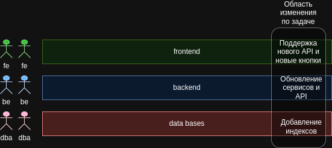
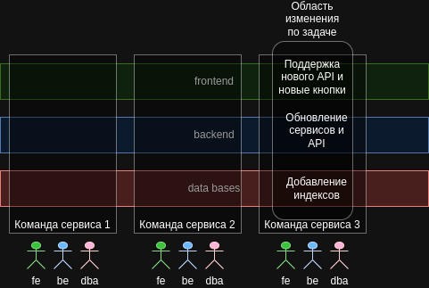

## Трехуровневая модель и разделение команд и сквозная
### Слоенный подход деления команд и функциональности
Так привычнее, но в ходе выполнения задач приходится вносить изменения разным командам, друг друга ждать и т.д. 

### Кросс-функциональные команды, разбитые по кросс функциональным микросервисам
 
*Создание микросервисов. 2-е издание. Сэм Ньюмен., стр. 37-38*