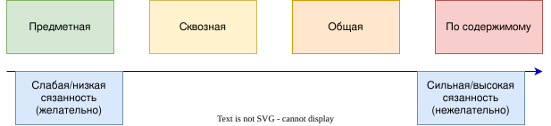
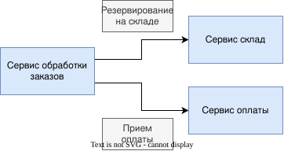

## Связность (Cohesion)
**Определение:** Мера силы взаимосвяжанности элеменов сервиса; способ и степень, в которой задачи, выполняемые им, связаны друг с другом. Код, в который вносят изменения как в единое целое, остается единым целым.\
Требуется функциональность, сгруппированная таким образом, чтобы иметь возможность вносить изменения в как можно меньшем количестве мест.\
Если соответствующая функциональность распределена по всей системе, мы говорим, что связность слабая, тогда как в микросервисах стремимся к сильной связности.

*Создание микросервисов. 2-е издание. Сэм Ньюмен., стр. 64*

## Связанность (Coupling)
**Определение:** представляет собой степень взаимосвязи между сервисами. При создании систем необходимо стремиться к максимальной независимости сервисов, то есть их связанность должна быть минимальна.\
Изменения, вносимые в один сервис не требуют изменений в другом.\
Слабо связанный сервис имеет необходимый минимум сведений о сервисах, с которыми ему приходится сотрудничать. Это означает, что нам следует ограничить количество различных типов вызовов от одного сервиса к другому, потому что помимо потенциальной проблемы с производительностью интенсивное общение может привести к сильной связанности.

*Создание микросервисов. 2-е издание. Сэм Ньюмен., стр. 64*

## Cohesion и Coupling
Структура стабильна, если если связность сильная, а связанность слабая.\
Связанность в системе будет неизбежно, но нужно ее уменьшить

*Создание микросервисов. 2-е издание. Сэм Ньюмен., стр. 65*

## Типы связанности

*Создание микросервисов. 2-е издание. Сэм Ньюмен., стр. 66*

### Предматная (доменная) связанность
Описывает ситуацию, в которой одному микросервису необходимо взаимодействовать с другими, посколько первому требуется использовать функциональность, предоставляемую вторым микросервисом.

Сервис обработки заказов в этой операции зависит от микросервисов Сервис склад и Сервис оплаты и связан с ними.\
Между самими сервисами Сервис склад и Сервис оплаты такой связи нет, они не взаимодействуют.\
Эта связь считается слабой, но и тут можно столкнуться со сложностями (слишком много логики централизована в одном сервисе или передача раздувающихся объемов данных).\
При построении такой связи не забываем о сокрытии информации.

*Создание микросервисов. 2-е издание. Сэм Ньюмен., стр. 67-68*
