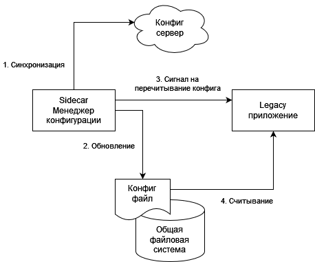
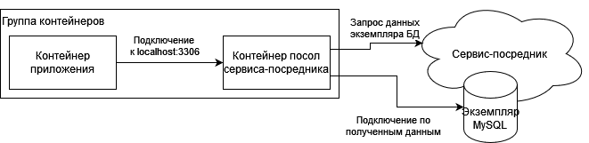
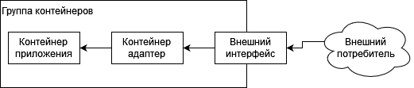

# Одноузловые паттерны проектирования
## Sidecar (прицеп)
Это одноузловой паттерн, состоящий из двух контейнеров.<br/>
Первый из них - *контейнер приложения*. Он содержит основную логику программы. Без этого контейнера приложения бы не существовало.<br/>
Помимо него предусмотрен еще *прицеп-контейнер* (sidecar). Роль прицепа - дополнить и улучшить контейнер приложения, часто таким образом, чтобы приложение не знало о его существовании.<br/>
Часто используется, чтобы добавить функциональности контейнеру, который было бы сложно улучшить другим способом.<br/>
<br/>
_Бёрнс Б., Распределенные системы. Паттерны проектирования. Стр. 34_

### Пример с добавлением HTTPS к старому компоненту, работающему на HTTP
<br/>
_Бёрнс Б., Распределенные системы. Паттерны проектирования. Стр. 36_

### Пример с чтением конфига из API и обновление конфиг-файла legacy-приложения
Прицеп запрашивает конфиг-сервер и при обнаружении отличий с текущим конфигом обновляет файл конфигурации и уведомляет legacy-приложение о необходимости перепрочитать конфиг<br/>
<br/>
_Бёрнс Б., Распределенные системы. Паттерны проектирования. Стр. 38_

### Пример с прицепом-мониторингом
Функциональность мониторинга (к примеру topz) можно развернуть в виде прицепа<br/>
_Бёрнс Б., Распределенные системы. Паттерны проектирования. Стр. 40_

### Вариант запуска контейнера-прицепа в том же пространстве идентификаторов
Нужно либо взять идентификатор контейнера после запуска
```shell
docker run -d <образ приложения>
```
Либо, выполнив `docker ps`<br/>
Далее нужно выполнить команду (если мы сохранили идентификатор в переменную среды `APP_ID`), на примере topz
```shell
docker run --pid=container:${APP_ID} \
  -p 8080:8080 \
  brendanburns/topz:db0fa58 /server -addr 0.0.0.0:8080
```
_Бёрнс Б., Распределенные системы. Паттерны проектирования. Стр. 41_

## Ambasador
Контейнер-посол выступает посредником во взаимодействии контейнера приложения с внешним миром.<br/>
Как и с sidecar, два контейнера составляют симбиоз<br/>
<br/>
_Бёрнс Б., Распределенные системы. Паттерны проектирования. Стр. 50_

### Пример амбасадора при шардировании
При шардировании, один из вариантов, выделить балансировщик в отдельный сервис, а можно включить как абмасодора в группу контейнеров.<br/>
Тогда, амбасадор на стороне клиента будет перенаправлять трафик к нужному шарду<br/>
Для основного приложение все выглядит, как обращение к единому хранилищу, в то время, как посол язвляется шардирующим прокси-контейнером<br/>
_Бёрнс Б., Распределенные системы. Паттерны проектирования. Стр. 52_

### Пример амбасадора для service-broker'а
Переносимое приложение должно иметь возможность найти подходящие сервисы/серверы.<br/>
Процесс поиска - **service-discovery**, а система, которая проводит поиск и стыковку - **service broker**<br/>
Таким образом, задача контейера-посла, как service broker'а, заключается в обследовании окружения, опосредованном подключении к конкретному экземпляру целевого сервиса.<br/>
<br/>
_Бёрнс Б., Распределенные системы. Паттерны проектирования. Стр. 58_

### Пример амбасадора для проведения экспериментов
Идея в дублировании запросов на рабочий сервис на новую, еще не введенную в эксплуатацию.<br/>
Ответы от рабочей версии возвращаются пользователям, а от экспериментальной - игнорируются.<br/>
Полезно для иммитирования рабочей нагрузки на экспериментальный сервис не рискуя повлиять на работу пользователей<br/>
_Бёрнс Б., Распределенные системы. Паттерны проектирования. Стр. 59_

## Adapter
В рамках паттерна **Adapter**, контейнер-адаптер модифицирует программный интерфейс приложения так, чтобы он соответствует заранее определенному интерфейсу<br/>
К примеру, можно реализовать унифицированный интерфейс мониторинга или агрегатора логов.<br/>
<br/>
_Бёрнс Б., Распределенные системы. Паттерны проектирования. Стр. 64-65_

### Пример адаптера для мониторинга
Контейнер-адаптер содержит инструменты, преобразующие интерфейс мониторинга, предоставляемого контейнером приложения, в интерфейс, ожидаемый системой общего мониторинга<br/>
К примеру, можно использовать [Prometheus](https://prometheus.io/) - аггрегатор данных мониторинга.<br/>
_Бёрнс Б., Распределенные системы. Паттерны проектирования. Стр. 66_