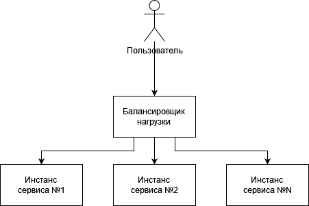
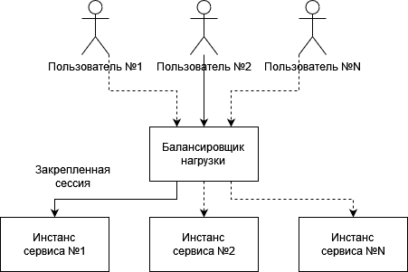
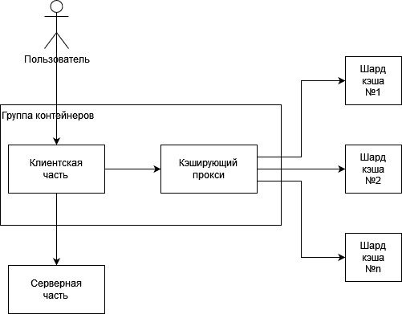
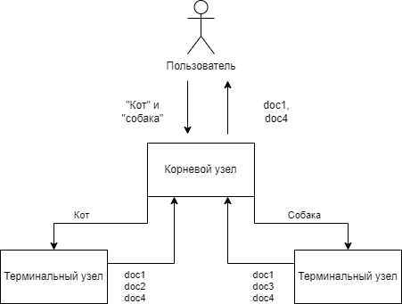
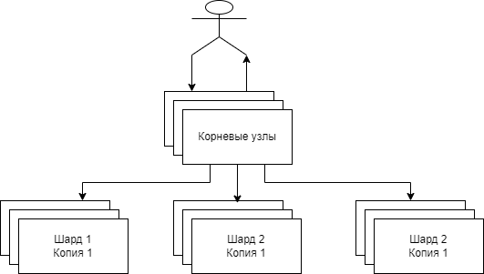

# Паттерны проектирования обслуживающих систем
## Реплицированные сервисы с распределением нагрузки
### Сервисы без внутреннего состояния
Сервисы без внутреннего состояния (stateless) не требуют для своей работы сохранения состояния. 
Системы не хранящие состояние, реплицируются для обеспечения избыточности и масштабируемости. 
Горизонтально масштабируемые системы поддерживают растущее количество пользователей путем добавления дополнительных копий сервиса 
При этом, балансировщик нагрузки не только равномерно распределяет нагрузку, но и предоставляет общее сетевое имя 
В кубернетес, балансировщик можно сделать с помощью объекта `Service` 
 
_Бёрнс Б., Распределенные системы. Паттерны проектирования. Стр. 82-83_

### Сервисы с закреплением сессии
Часто лучше обеспечить направление запроса конкретного пользователя определенному экземпляру сервиса 
Иногда это может быть обусловлено кешированием пользовательских данных 
Закрепление сессий обычно реализуется путем хеширования IP-адресов клиента и сервера  
 
_Бёрнс Б., Распределенные системы. Паттерны проектирования. Стр. 87-89_

### Кэширование
В простом виде, для http, кэширующий прокси представляет собой обычный HTTP-сервер, хранящий в памяти состояние запросов пользователей. 
Если два пользователя запросят одну и ту же web-страницу, только один запрос будет адресован приложению, а второй будет обслужен из памяти кэша. 
К примеру, если приложение выполняет сложную обработку, и визуализацию данных, нэш не помешает. 
Производительность кэша выражается в виде *коэффициента попадания запросов* - это доля запросов, ответ на которые содержится в кэше.  
Вариант релазиации - [varnish-cache](http://varnish-cache.org/) 
_Бёрнс Б., Распределенные системы. Паттерны проектирования. Стр. 90, 106_

## Шардированные сервисы
В отличие от реплицированных сервисов каждая *копия шардированного сервиса (шард)* может обслужить только часть запросов 
*Узаел балансировки нагрузки (корневой узел)* отвечает за изучение каждого запроса и перенаправление его соответствующему узлу (или узлам) для обработки 
Если репликация сервиса обычно используется для построения stateless-сервисов, то шардирование - для сервисов, хранящих состояние (stateful) 
_Бёрнс Б., Распределенные системы. Паттерны проектирования. Стр. 102_

### Пример шардирующего кэша
Это реализация кэша, стоящая между пользовательскими запросами и собственно распределенной реализацией кэша 
 
Поскольку конкретный пользователь или запрос всегда соответствуют одному и тому же шарду, в случае его отказа кэш-промахи будут приходить до тех пор, пока шард не будет восстановлен. 
Учитывая временность нахождения данных в кэше, такие кэш-промахи не являются проблемой сами по себе - система должна знать, где взять данные. Однако, на это время скорость будет снижена 
_Бёрнс Б., Распределенные системы. Паттерны проектирования. Стр. 105_

#### Шардированный и реплицированный кэш одновременно
Бывает, что система настолько зависима от кэша в плане нагрузки и задержек, что потеря даже одного шарда неприемлема 
Тогда можно применить шардирование с реплицированием шардов 
_Бёрнс Б., Распределенные системы. Паттерны проектирования. Стр. 107_

### Шардирующая функция
Задача шардирующей функции - определить соответствие между запросами и шардами 
`SHard = ShardingFunction(Req)` 
Шардирующая функция часто реализуется с помощью хэш-функции и оператора взятия остатка от деления 
К примеру, если рассмотреть реализацию ММОРПГ, мир такой игры слишком велик для хранения на одной машине. 
Мало вероятно, что игроки, находящиеся в этом мире далеко друг от друга будут взаимодействовать. Следовательно, игровой мир может быть шардирован. 
Ключем шардирующей функции может быть местоположение игрока. 
_Бёрнс Б., Распределенные системы. Паттерны проектирования. Стр. 114, 119_

#### Консистентная шардирующая функция
При увеличении количества шардов (и изменении шардирующей функции соответственно), увеличивается число промахов, так как запросы уходят не на те шарды 
Эту проблему может решить консистентная хэш-функция, которая гарантирует, что при количестве ключей `K` и увеличении количества шардов на `N`, не больше `K/N` запросов будет перенаправленно 
_Бёрнс Б., Распределенные системы. Паттерны проектирования. Стр. 117_

### Системы с горячим шардированием
К примеру, есть шардируованный кэш пользовательских фотографий 
Какая то фотография приобретает вирусную популярность, тогда на этот шард приходится очень много трафика и он становится горячим. 
В этот момент, этот шард можно машстабировать. 
_Бёрнс Б., Распределенные системы. Паттерны проектирования. Стр. 120_

## Scatter/Gather
Используется для масштабирования по времени. В частности, позволяет добиться параллелизма в обработке запросов, за счет чего можно обслуживать их намного быстрее, чем при последовательной обработке 
Scatter/Gather - древовидный паттер, в котором корневой узел распределяет запросы, а терминальные узлы - обрабатывают 
В отличии от реплицированных и шардированных систем, запросы в Scatter/Gather распределяются между всеми репликами сервиса 
Он весьма полезен, если обработка запроса подразумевает большое количество независимых действий 
При выборе количества терминальных узлов нужно быть аккуратным, так как корневой узел будет ждать ответ от всех и могут сыграть накладные расходы на передачу данных 
К тому же, Scatter/Gather подвержен синдрому отстающего, так как корневой ждет ответ от всех 
_Бёрнс Б., Распределенные системы. Паттерны проектирования. Стр. 122, 123, 130_

### Пример на поиске кошек и собак
К примеру, есть документы, в которх нужно найти документы, содержащие одновременно слова и "кошка", и "собака" 
Допустим, документы по этим словам проидексированы 
В этом случае, корневой узел выделяет термины в запросе (кошка и собака) и распределяет поиск по игдексам на две машины 
Получив ответ от обеих, делает пересечение множеств и возвращает пользователю ответ 
 
_Бёрнс Б., Распределенные системы. Паттерны проектирования. Стр. 125_

### Scatter/Gather с шардированием терминальных узлов
Применяется, если обрабатываемой информации (к примеру, документов) слишком много для обработки одной машины. 
В отличии от шардирования реплицированных систем, в Scatter/Gather запрос отправляется на все шарды, так как на каждом своя часть массива информации. 
_Бёрнс Б., Распределенные системы. Паттерны проектирования. Стр. 127_

### Масштабирование Scatter/Gather
Для обеспечения надежности, нужно не просто добавлять терминальные узлы, так как  в этом паттерне запрос обрабатывается всеми терминальными узлами. 
Каждый шард и корневой узел нужно реплицировать. 
 
_Бёрнс Б., Распределенные системы. Паттерны проектирования. Стр. 132_

## Функции, FaaS и событийно-ориентированная обработка
Есть класс приложений, который запускается ненадолго - для обработка одного запроса или для того, чтобы отреагировать на конкретное событие. 
Такой запросно- или событийно-ориентированный подход к проектированию приложений получил в последнее время распространение по мере появления и развития продукта FaaS (function-as-a-service) 
С недавних пор, FaaS начал работать и в оркестраторах 
Однако, притягивание его за уши для решения общих проблем может породить хрупкую архитектуру. 
_Бёрнс Б., Распределенные системы. Паттерны проектирования. Стр. 134, 135_

### Преимущества FaaS
* Подход существенно сокращает расстояние между исходным текстом и запущенных сервисом, так как за исключением текстов, нет необходимости разворачивать другие артефакты 
* Мастабирование и управление развернутым исходным кодом происходит автоматически. По мере необходимости создаются новые экземпляры
* Функции не хранят состояние, а значит любая система, построенная на базе функций является слабосвязанной и модульной

_Бёрнс Б., Распределенные системы. Паттерны проектирования. Стр. 136_

### Недостатки FaaS
* Слабая связанность помимо преимуществ пораждает и сложности для разработки
* Экземпляры функций не имеют собственной памяти. а следовательно требуют наличия общего хранилища для храненя состояния

_Бёрнс Б., Распределенные системы. Паттерны проектирования. Стр. 136_