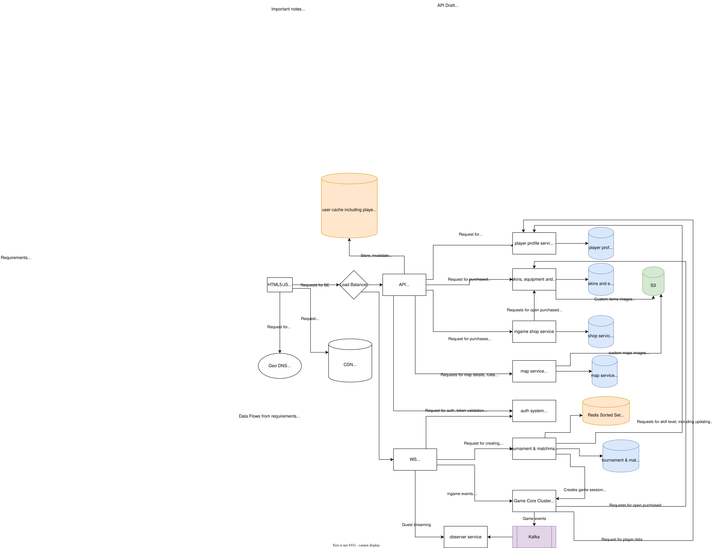

# World of Webcraft
## Вводные
An entertainment company wants a first-person shooter MMORPG game delivered through the browser

- Users: millions+ (they hope)
- Requirements:
  - users choose the map they want to play in, then duke it out with randomly-selected players of roughly equal skill
  - players can 'trick out' their characters with skills/equipment by sending the company money
  - usable from any 'modern' Web browser
  - full-immersion experience (sound, graphics, etc)
  - players can 'chat' (trash talk) to other players, but only those 'within range'
  - players can create invitation-only tournaments
  - guests can observe all the players without being seen/interact (ghosts)
  - players can create new maps, weapons, and rules
- Additional Context:
  - gaming performance is high priority, but scalability even more so
  - if this game is successful, the company plans to extract the good bits as a framework they can sell
  - biggest expense is the highly skilled artists creating the visual look and feel

## Data Flows from requirements
- пользователи выбирают карты для случайного матча
- пользователи могут создавать персональные матчи
- система подбирает игроков по умению
- игроки могут купить skin-ы и equipment
- игроки могут чатиться с ближайшими игроками
- пользователи могут присоединиться к матчу, как гости
- пользователи могу создавать свои карты, оружие и правила

## Ключевых решений
- Вынос статики в CDN — критично для браузера и текстур, что снизит нагрузку на сервер
- Выделение микросервисов в соответствии с границами
- Использование Redis как кеша для пользовательских профилей, сессий и инвентаря
- Game Core Cluster обрабатывает логику непосредственно игры (выстрелы, попадания, сообщения в чате с фильтрацией ближайших играков)
- Game Core Cluster состоит из нескольких Node-ов
- Во время игры, взаимодействие с Game Core Cluster происходит по WebSocket-у с сериализацией данных в двоичный формат для ускорения процессов
- Game Core Cluster сбрасывает обновления через Kafka в Observer Service, который обслуживает гостей-зрителей, что разгружает ядро и позволяет масштабироваться горизонтально
- Game Core реализует TTL сессии и возможность реконнекта, в случае проблем с интернетом (~10 секунд ожидание)
- Tournament & Matchmaking Service обслуживает задачи очереди на матчи, подбор игроков, запуск частных турниров с приглашениями
- Подбор игроков происходит в Tournament & Matchmaking Service через Redis, сортируя по умению и региону, что хорошо подходит для быстрого поиска пар
- В Map Service предусмотрена валидация пользовательских карт и правил
- В Skins, Equipment and Weapons Service предусмотрена валидация пользовательских оружий
- Для сервисов, работающих по WebSocket предусмотрен свой шлюз, чтобы не перегружать API Gateway миллионами долгоживущих сессий по WebSocket-у
- API Gateway или LB могут использовать Rate Limiter, если потребуется
- при удалении используем soft delete
- При покупке используем Transactional Outbox
- В Game Core предусмотрен движок подключаемых правил

## Почему выбраны технологии
- **WebSocket + бинарная сериализация**: для FPS критична задержка, JSON слишком жирный для 60 пакетов/сек
- **Kafka**: гарантирует доставку событий зрителям даже при пиковых нагрузках
- **Redis Sorted Set**: оптимален для поиска игроков по рейтингу (O(log N))
- **Postgres**: надежное ACID-хранилище для денежных операций (покупки)
- **MinIO/S3**: дешевое хранение больших бинарных файлов (карты, скины)

## Региональность
- Geo DNS направляет игроков в ближайший дата-центр
- В каждом регионе свой кластер Game Core + Matchmaking
- Redis и Postgres реплицируются между регионами (асинхронно)

## Anti-Cheat меры
- **Server Authoritative**: все решения (попадания, урон) принимает Game Core
- **Клиент** — только "зритель" (отправляет действия, получает результаты)
- **Валидация UGC**: карты и оружие проходят проверку перед публикацией
- **Rate Limiting**: защита от DDoS и брутфорса

## План по созданию фреймворка
- Game Core — **headless** (без графики), может работать как отдельный продукт
- **Плагинная система правил** (rules engine) — можно подключать свои логики
- **API для модов** — четкий контракт между Game Core и пользовательским кодом
- **Netcode Library** — выделенная библиотека для синхронизации состояния

## Схема

## Ориентировочное API
- GET/POST/PUT /profile/{id}

- GET /shop
- GET /shop/{item}
- POST /shop/{item}/purchase/{profileId}

- GET /matchmaking
- GET /matchmaking/[id]
- POST /matchmaking/private
- GET/POST /matchmaking/invitation

- GET /map
- GET /map/{id}
- POST /map/custom

- GET /equipment
- GET /equipment/{id}
- POST /equipment/custom

и пр.

## Ответ на интервью
Мы спроектировали систему как набор микросервисов с четким разделением ответственности.\
REST-трафик (профиль, магазин, карты) идет через API Gateway, WebSocket-трафик (игровые сессии) — через отдельный WS Gateway для масштабируемости.\
Tournament & Matchmaking Service использует Redis Sorted Set для подбора игроков по рейтингу и региону, затем через gRPC создает комнату на наименее загруженной ноде Game Core Cluster.\
Game Core — server-authoritative, все решения по попаданиям принимает сервер, клиент только отправляет действия.\
Чат обрабатывается внутри Game Core с проверкой радиуса.\
Для зрителей мы используем Observer Service + Kafka: Game Core публикует события в Kafka, Observer ретранслирует их зрителям.\
Пользовательский контент проходит валидацию в Map Service и Skins Service перед загрузкой в S3. Game Core — headless с подключаемой системой правил, что позволяет продавать его как фреймворк.\
Для реконнекта используем grace period 10 секунд.