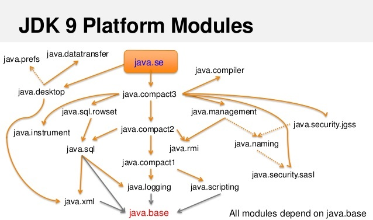

# Модули
Принципиально новая концепция, появившаяся в Java 9.\
Модуль как единица развертывания приложений и управления зависимостями имеет семантическое значение для среды выполнения.\
_Б.Эванс, Java для опытных разработчиков. Второе издание. стр. 65_

## Проблемы в Java до появления модулей
- Файлы JAR невидимы для среды выполнения.\
Фактически, они просто архивированные каталоги с файлами классов внутри
- Пакеты - просто пространства имен, которые группируют классы для управления доступом
- Зависимости определяются только на уровне классов
- Управление доступом в соечтании с рефлексией порождает открытую по сути систему без достаточного контроля

_Б.Эванс, Java для опытных разработчиков. Второе издание. стр. 65_

## Как все меняется с модулями
- Определяются зависимости между модулями и проблемы с расзрешением и компоновкой мообнаружить при компиляции или запуске
- Модули обеспечивают корректную инкапсуляцию
- Каждый модуль - полноценная единица развертывания с метаданными

_Б.Эванс, Java для опытных разработчиков. Второе издание. стр. 65_

## Основная идея
Основная идея состояла в том, чтобы модули можно было загружать и компоновать по отдельности, хотя на практике приложения могут зависеть от группы модулей, которые предоставляют смежную функциональность (средства инфо.беза, к примеру).\
_Б.Эванс, Java для опытных разработчиков. Второе издание. стр. 66_

## Цели Jigsaw
- модуляризовать исходный код платформы JDK
- сократить потребление памяти процессами
- ускорить запуск приложений
- сделать модули доступными как для JDK, так и для кода приложений
- впервые в истории Java, обеспечить полноценную строгую инкапсуляцию
- добавить в язык Java новые, ранее невозможные режимы управления доступом

_Б.Эванс, Java для опытных разработчиков. Второе издание. стр. 66_

## Цели, ориентированыые на платформу
- отказать от одного монолитного JAR файласреды выполнения `rt.jar`
- эффективно инкапсулировать и обезопасить внутреннюю структуру JDK
- обеспечить возможность вносить серьезные внутренние изменения, в том числе те, которые блокируют несанкционированное использование вне JDK
- внедрить модули, как "суперпакеты"

_Б.Эванс, Java для опытных разработчиков. Второе издание. стр. 66_

## JAR, JMOD, JIMAGE
Отказ от формата JAR для классов платформы может принести немало преимуществ, включая значительное ускорение процесса запуска.\
Модули предоставляют два новых формата, которые используются на разных этапах жизненного цикла
- `JMOD` во время компиляции/компоновки.\
Похож на `JAR`, но позволяет включить в него низкоуровневый код как чать единого файла.
- `JIMAGE` во время выполнения.\
Предоставляет образ среды выполнения Java.

_Б.Эванс, Java для опытных разработчиков. Второе издание. стр. 67_

## Модули и зависимости
Модульное приложение содержит достаточно метаданных, чтобы точный набор зависимостей был известен до запуска программы.\
Таким образом, можно загружать только то, что действительно нужно, что повышает эффективность.\
_Б.Эванс, Java для опытных разработчиков. Второе издание. стр. 67_

## Специальный образ и jlink
Можно определить специальный образ среды выполнения, который будет поставляться вместе с приложением и содержать полную саму Java и все, что нужно приложению для работы.\
Для этого используется `jlink`\
_Б.Эванс, Java для опытных разработчиков. Второе издание. стр. 67_

## Вывод информации с помощью jimage info
`jimage` выводит полную информацию об образе среды выполнения Java.\
```shell
> jimage info C:\"Program Files"\Java\jdk-17\lib\modules
 Major Version:  1
 Minor Version:  0
 Flags:          0
 Resource Count: 29192
 Table Length:   29192
 Offsets Size:   116768
 Redirects Size: 116768
 Locations Size: 602267
 Strings Size:   641811
 Index Size:     1477642
```
_Б.Эванс, Java для опытных разработчиков. Второе издание. стр. 67_

## Вывод списка модулей и их состава с помощью jimage list
```shell
> jimage: C:\Program Files\Java\jdk-17\lib\modules

Module: java.base
    META-INF/services/java.nio.file.spi.FileSystemProvider
    com/sun/crypto/provider/AESCipher$AES128_CBC_NoPadding.class
    com/sun/crypto/provider/AESCipher$AES128_CFB_NoPadding.class
    com/sun/crypto/provider/AESCipher$AES128_ECB_NoPadding.class
    com/sun/crypto/provider/AESCipher$AES128_OFB_NoPadding.class
    ...
Module: java.xml
    com/sun/java_cup/internal/runtime/Scanner.class
    com/sun/java_cup/internal/runtime/Symbol.class
    com/sun/java_cup/internal/runtime/lr_parser.class
    ...
...    
```
_Б.Эванс, Java для опытных разработчиков. Второе издание. стр. 67_

## Польза от отказа от rt.jar
Отказ от монолитного `rt.jar` позволяет ускорить запуск и оптимизировать среду только для тех компонентов, которые необходимы приложению.\
Новые форматы проектировались, как **непрозрачные** для разработчиков, и они зависят от реализации.\
Теперь нельзя просто распаковать `rt.jar` и получить библиотеку классов JDK.\
Это один из шагов, чтобы закрыть внутреннюю структуру платформы от программистов Java.\
_Б.Эванс, Java для опытных разработчиков. Второе издание. стр. 68_

## Проблема инкапсуляции в Java 8 и ранее
Вносить критические изменения во внутреннее устройство платформы мешал подход к управлению доступом, существовавший в Java 8.\
В Java определены только модификаторы `public`, `private`, `protected` и `package-private`, и они применяются лишь на уровне класса и ниже.\
К тому же, эти ограничения можно было обойти разными способами.\
Таким образом, доступ к "технической изнанке" мешал развивать платформу, не давая никаких преимуществ.\
Модульность помогла решить эту проблему.\
_Б.Эванс, Java для опытных разработчиков. Второе издание. стр. 68-69_

## Модули в STackTrace-е
[Пример](./examples/stack_trace_example/Main.java)
```java
var i = Integer.parseInt("Ошибка");
```
Приводит к
```shell
Exception in thread "main" java.lang.NumberFormatException: For input string: "Ошибка"
	at java.base/java.lang.NumberFormatException.forInputString(NumberFormatException.java:67)
	at java.base/java.lang.Integer.parseInt(Integer.java:662)
	at java.base/java.lang.Integer.parseInt(Integer.java:778)
	at knowledge.base.module.example/stack_trace_example.Main.main(Main.java:5)
```
Кадры стека обозначаются **именем модуля**, именем пакета, классом и номером строки.\
_Б.Эванс, Java для опытных разработчиков. Второе издание. стр. 69_

## Граф модулей
Краеугольным камнем всей модульности является **граф модулей** - представление того, как одни модули зависят от других.\
Модули явно выражают свои зависимости с помощью нового синтаксиса.\
Эти зависимости служат твердыми гарантиями, которыми могут пользоваться и компилятор, и среда выполнения.\
Кроме того, граф зависимостей стал ясным и отностельно простым в сравнении с почти тысячью пакетами в Java 8, сваленными в кучу.\
_Б.Эванс, Java для опытных разработчиков. Второе издание. стр. 69, 70_

### Циклические зависимости в графе модулей
Граф модулей должен быть направленным ациклическим графом (НАГ или DAG), а следовательно не может содержать циклических зависимостей.\
_Б.Эванс, Java для опытных разработчиков. Второе издание. стр. 69_

## Зависимость от jdk.base
Модуль `jdk.base` входит в набор зависимостей любого другого модуля.

_Б.Эванс, Java для опытных разработчиков. Второе издание. стр. 70_

## Управление доступом в модулях
Модули добавили в модель управления доступом Java новую концепцию - **экспортирование** пакетов.\
В Java 8 и ранее код любого пакета мог вызвать открытые методы любого открытого класса в любом пакете.\
Для этого появилось ключевое слово `exports` в `module-info`-файлах\
_Б.Эванс, Java для опытных разработчиков. Второе издание. стр. 72_

## Основы синтаксиса модулей
Модуль платформы Java определяется как концептуальная единица - набор пакетов и классов, которые объявляются и загружаются как единое целое.\
В каждом модуле должен быть объявлен **дескриптор модуля** - файл с названием `module-info.java`\
Он содержит:
- имя модуля
- зависимости модуля
- открытый API (экспортируемые пакеты)
- расширения доступа при рефлексии
- предоставляемые службы
- потребляемые службы

_Б.Эванс, Java для опытных разработчиков. Второе издание. стр. 73-74_

### Ключевое слово module
Ключевое слово `module` просто открывает область видимости объявления.\
_Б.Эванс, Java для опытных разработчиков. Второе издание. стр. 74_

#### Базовые правила и соглашения для имен модулей
- модули находятся в глобальном пространстве
- имена модулей должны быть уникальными
- используется стандартный формат `com.company.project`

_Б.Эванс, Java для опытных разработчиков. Второе издание. стр. 76_

### Ключевое слово exports
Ключевое слово `exports` ожидает аргумент с именем пакета.
Дескриптор модуля может содержать несколько строк `exports`.\
```java
module it_organizer.project {
    exports ru.akhitev.it_organizer.project.domain.model;
    exports ru.akhitev.it_organizer.project.domain.operation;
    exports ru.akhitev.it_organizer.project.domain.port;
    requires spring.context;
}
```
К примеру `exports ru.akhitev.it_organizer.project.domain.model;`, означает, что модуль `it_organizer.project` экспортирует пакет `ru.akhitev.it_organizer.project.domain.model`.\
А если какой пакет не экспортирован, то к нему за пределами модуля доступа нет.\
_Б.Эванс, Java для опытных разработчиков. Второе издание. стр. 75_

#### exports to
Для более избирательного экспорта, существует синтаксис `exports ... to ...`, который указывает, что только определенные внешние модули могут обращаться к указанному пакету из данного модуля.\
_Б.Эванс, Java для опытных разработчиков. Второе издание. стр. 75_

### Ключевое слово required
Ключевое слово `required` объявляет зависимость текущего модуля и всегда должно получать аргумент с именем **модуля** (не пакета).\
_Б.Эванс, Java для опытных разработчиков. Второе издание. стр. 75_

### requires transitive
Когда компоненту для правильной работы необходимы другие компоненты, а им, в свою очередь, могут потребоваться третьи, эти третьи все равно должны быть доступны и нам, несмотря на то, что они не упоминаются в наших зависимостях.\
Чтобы решить эту проблему добавлен простой синтаксис `requires transitive`\
Если модуль А зависит от другого модуля транзитивно, то любой код, который зависит от А, тоже получит его транзитивные зависимости.\
Хотя иногда без `requires transitive` не обойтись, лучше свести его использование к минимуму.\
_Б.Эванс, Java для опытных разработчиков. Второе издание. стр. 76-77_


## Во что собирается дескриптор модуля
При сборке дескриптор модуля будет собран в `module-info.class`, но он сильно отличается от обычных файлов классов.\
_Б.Эванс, Java для опытных разработчиков. Второе издание. стр. 73-74_

## Просмотр содержимого модуля
Просмотреть содержимое модуля можно с помощью команды
```shell
> jmod describe C:\"Program Files"\Java\jdk-17\jmods\java.base.jmod
java.base@17.0.12
exports java.io
exports java.lang
exports java.lang.annotation
exports java.lang.constant
exports java.lang.invoke
exports java.lang.module
...
```
_Б.Эванс, Java для опытных разработчиков. Второе издание. стр. 75_

## Загрузка модулей
### module path
Современные JVM используют загрузчик классов с поддержкой модулей, и классы JRE загружаются не так, как в Java 8.\
Один из ключевых понятий яляется **путь к модулям** (module path) - последовательность путей к модулям (каталогам, содержащим модули)\
_Б.Эванс, Java для опытных разработчиков. Второе издание. стр. 77_

### Модули и classpath
У системы модулей есть одна специально реализованная особенность: из модуля нельзя обращаться к `classpath`.\
Чтобы работать с немодуляризированными зависимостями, работает механизм автоматических модулей.\
_Б.Эванс, Java для опытных разработчиков. Второе издание. стр. 79_

### Типы модулей
Существуют 4 типа модулей, которые ведут себя по-разному при загрузке:
- платформенные (platform) модули
- прикладные (application) модули
- автоматические (automatic) модули
- анонимные (unnamed) модули

Зависимости, которые уже были модуляризированы, называются **прикладными** и размещаются в `module path`\
Немодуляризированные зависимости размещаются в традиционном `classpath` и внедряются в систему моделй через механизм миграции.\
_Б.Эванс, Java для опытных разработчиков. Второе издание. стр. 77_

#### Платформенные модули
К ним относятся модули самого модульного JDK.\
В Java 8 они входили бы в состав `rt.jar` и, возможно, входили бы во вспомогательные jar-ники вроде `tools.jar`.\
Список доступных платформенных модулей можно получить командой `java --list-modules`.\
Точный список модулей и их имен зависит от используемой версии Java. К примеру, в реализации GraalVM могут быть дополнительные модули относительно Oracle.\
Платформенные интенсивно используют механизм **избирательного экспорта**, когда некоторые пакеты экспортируются только в заданный список модулей.\
_Б.Эванс, Java для опытных разработчиков. Второе издание. стр. 78_

##### java.base
Самый важный платформенный модуль и содержит `java.lang`, `java.util`, `java.io` и другие базовые пакеты.\
_Б.Эванс, Java для опытных разработчиков. Второе издание. стр. 78_

#### Прикладные модули
Еще их называют **библиотечными модулями**.\
_Б.Эванс, Java для опытных разработчиков. Второе издание. стр. 78-79_

#### Автоматические модули
Немодуляризированный jar-файл перемещается в `module path` (и удаляется из `classpath`).\
После этого, jar-файл становится **автоматическим модулем**.\
Система моделй генерирует для него имя, которое основано на имени jar-файла.\
Автоматический модль экспортирует все свои пакеты и становится зависимым от всех моделй в `module path`.\
_Б.Эванс, Java для опытных разработчиков. Второе издание. стр. 79_

##### Задача имени автоматического модуля
Имя также можно задать явно, добавив запись `Automatic-Module-Name` в `MANIFEST.MF` в jar-файле.\
Это часто делается, как промежуточный шаг при миграции.\
Это позволяет зарезерировать имя.\
_Б.Эванс, Java для опытных разработчиков. Второе издание. стр. 79_

#### Анонимные модули
Все классы и jar-файлы из `classpath` добавляются в один модуль - **анонимный**.\
Это делается для обратной совместимости, но недостаток такого подхода заключается в том, что пока часть кода остается в анонимном модуле, вся система модулей работает не настолько эффективно, как могла бы.\
МОдульный код не может зависеть от анонимного модуля, так что на практике модули не могут зависеть ни от чего, что находится в `classpath`\
_Б.Эванс, Java для опытных разработчиков. Второе издание. стр. 79-80_

### Фундаментальные принципы модульного подхода к загрузке классов
- разрешение модулей выполняется на основании `module path`, а не традиционного `classpath`
- при запуске JVM обрабатывает граф модулей, который должен быть ацикличным
- один модуль находится в корне графа и он содержит `main`

_Б.Эванс, Java для опытных разработчиков. Второе издание. стр. 77_

## Параметры компиляции модулей
При компиляции модуля можно использовать параметры командной строки, которые управляют модульными аспектами компиляции и последующего выполнения.\
Чаще всего используются:
- `list-modules` - выводит список модулей
- `module-path` задает один или несколько каталогов, содержащих модули
- `add-reads` - добавляет дополнительную директиву `requires` в процесс разрешения
- `add-exports` - добавляет дополнительную директиву `exports`
- `add-opens` - включает рефлексивный доступ ко всем типам во время выполнения
- `add-modules` - добавляет список модулей в набор по умолчанию
- `illegal-access=permit|warn|deny` - изменяет правила рефлексивного доступа\
`permit` - разрешить, `warn` - предупреждать, а `deny` - запрещать.

К примеру, можно принудительно включить доступ к внутренней структуре модуля `jdk.internal.jvmstat`
```shell
javac -d out \
--add-exports jdk.internal.jvmstat/sub.jvmstat.monitor=wjid.discovery
...
```
Синтаксис требует предоставить имя модуля и пакет, доступ к которому требуется, а также указать модуль, к которому доступ предоставляется.\
_Б.Эванс, Java для опытных разработчиков. Второе издание. стр. 81, 83, 85_

## Запуск класса модуля
```shell
java --module-path mods -m my.module/my.module.Main
```
Если при компиляции добавлялся `export`, то и при выполнении его тоже добавим
```shell
java --module-path mods --add-exports jdk.internal.jvmstat/sub.jvmstat.monitor=wjid.discovery -m wjid.discovery/wjid.discovery.Discovery
```
_Б.Эванс, Java для опытных разработчиков. Второе издание. стр. 84_

## Модули и рефлексия
Система модулей изначально создавалась с тем намерением, чтобы со временем вся экосистема Java постепенно двигалась к полноценной инкапсуляции, в том числе для рефлексии.\
Планировалось, что с какого то момента `illegal-access` по умолчанию будет принимать значение `deny`, а в дальнейшем будет удален совсем.\
Но в одночасье такое сделать не получится, иначе посыпется много проектов.\
_Б.Эванс, Java для опытных разработчиков. Второе издание. стр. 85_

## Расщепленные пакеты
Типичная проблема, с которой сталкиваются разработчики в начале работы с модулями - **расщепление пакетов**, когда в двух и более разных jar-файлах содержаться классы, принадлежащие одному пакету.\
_Б.Эванс, Java для опытных разработчиков. Второе издание. стр. 87_

## Компактные профили
Появились в Java 8, как промежуточный этап на пути к модулям\
Это среды выполнения уменьшенного размера.\
Одна из основных задач - служить основой для серверных приложений или других сред, где нежелательно развертывать избыточную функциональность (swing, AWT и пр.)\ 
_Б.Эванс, Java для опытных разработчиков. Второе издание. стр. 88_

## Миграция на модули
- использование `jdeps` и компактных профилей
- обновление до Java 11+
- задача имени автоматического модуля в манифесте
- исключение из артефактов расщепленных пакетов
- создание **монолитного модуля**, который содержит весь код
- выделение отдельных модулей по мере необходимости

_Б.Эванс, Java для опытных разработчиков. Второе издание. стр. 87_

