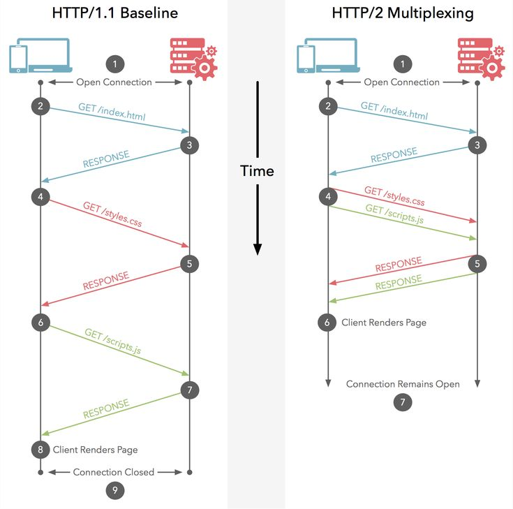

# HTTP/2
## Признаки устаревания HTTP/1.1 (1997)
- блокировка начала очереди\
протокол HTTP/1.1 требует, чтобы ответы возвращались в том же порядке, в каком поступали запросы, даже если несколько запросов используют один и тот же сокет.\
То есть, медленный ответ блокирует последующие запросы
- ограничение подключений к одному сайту
- затраты ресурсов на управляющие заголовки HTTP

_Б.Эванс, Java для опытных разработчиков. Второе издание. стр. 56_

## Попытка устранить недостатки в HTTP/2
- Протокол HTTP/2 с самого начала проектировался так, чтобы мультиплексировать запросы по одному и тому же подключению.\
Он поддерживает множественные потоки данных между клиентом и сервером.\

Клиент может даже по отдельности получать заголовки и тело одно и того же ответа
- HTTP/2 исправляет ситуацию с ограничением подключений: через каждое подключение можно фактически передавать сколько угодно запросов одновременно.\
Браузеры открывают только одно подключение к каждому домену, но могут параллельно выполнять множество запросов через это подключение.
- Чтобы решить проблему заголовков, в HTTP/2 введен новый двоичный формат заголовков

_Б.Эванс, Java для опытных разработчиков. Второе издание. стр. 56-58_

## Новые фишки в HTTP/2
- Работает только с шифрованием TLS (ранее известным, как SSL)
- HTTP/2 двоичный протокол.\
С другой стороны, с непрозрачным форматом сложнее работать
- Для поддержки HTTP/2 требуется обновить и балансировщики нагрузки, firewall-ы и средства отладки

_Б.Эванс, Java для опытных разработчиков. Второе издание. стр. 59_