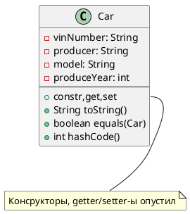
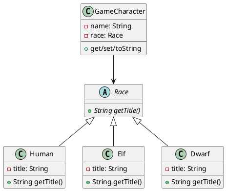

# Шпаргалка по основам
## Шаблон программы
```java
/** App - имя класса. Файл с этим классом внутри должен называться App.java */
public class App {
  
  /** Точка входа в программу. у метода main всегда одна и та же сигнатура */
  public static void main(String[] args) {
    // Тут пишем код
  }
}
```
После того, как сохранили файл, как `App.java`, компилируем и выполняем командами
```shell
javac FirstApp.java
```
```shell
java FirstApp
```
Можно объеденить:
* Для unix/linux/mac
```shell
javac FirstApp.java; java FirstApp
```
* Для windows
```shell
javac FirstApp.java & java FirstApp
```

## Зарезервированные слова
abstract	continue	for	new	switch<br/>
assert	default	goto	package	synchronized<br/>
boolean	do	if	private	this<br/>
break	double	implements	protected	throw<br/>
byte	else	import	public	throws<br/>
case	enum	instanceof	return	transient<br/>
catch	extends	int	short	try<br/>
char	final	interface	static	void<br/>
class	finally	long	strictfp	volatile<br/>
const	float	native	super	while

## Примитивные типы

| Тип     | Размер  | Default | min                         | max                        |
|---------|---------|---------|-----------------------------|----------------------------|
| byte    | 8 бит   | 0       | -128                        | 127                        |
| short   | 16 бит  | 0       | -32768                      | 32767                      |
| int     | 32 бита | 0       | -2_147_483_648              | 2_147_483_647              |
| long    | 64 бита | 0L      | -9_223_372_036_854_775_808L | 9_223_372_036_854_775_807L |
| float   | 32 бита | 0.0F    | 1.40239846e-45f             | 3.40282347e+38f            |
| double  | 64 бита | 0.0     | 4.9406564584124654E-324     | 1.79769313486231570e+308   |
| boolean | 1 бит   | false   |                             |                            |
| char    | 16 бит  | false   |                             |                            |

## Операции

| Операция                   | Синтаксис                                                | Комментарий                                  |
|----------------------------|----------------------------------------------------------|----------------------------------------------|
| Сложение                   | `a + b`                                                  |                                              |
| Вычитание                  | `a - b`                                                  |                                              |
| Умножение                  | `a * b`                                                  |                                              |
| Деление                    | `a / b`                                                  | Не забываем приводить к `float` или `double` |
| Остаток от деления         | `a % b`                                                  |                                              |
| Инкремент / Декремент      | `a++`; `a--`; `++a`; `--a`                               |                                              |
| Присваивание с вычислением | `a += b`; `a -= b`; `a *= b`; `a /= b`; `a %= b`; и т.д. |                                              |
| лог И                      | `a && b`                                                 |                                              |
| лог ИЛИ                    | `a \|\| b`                                               |                                           |                                             |
| лог НЕ                     | `!a`                                                     |                                              |
| Равно                      | `a == b`                                                 |                                              |
| Не равно                   | `a != b`                                                 |                                              |
| Больше                     | `a > b`                                                  |                                              |
| Больше или равно           | `a >= b`                                                 |                                              |
| Меньше                     | `a < b`                                                  |                                              |
| Меньше или равно           | `a <= b`                                                 |                                              |
| Конкатенация               | `"aaa" + "bbb"`                                          |                                              |
| Привидение типа            | `(нужныйТип) a`                                          |                                              |

### Полезные методы Math
* `Math.sqrt(a)` - корень из числа `a`
* `Math.pow(a, b)` - число `a` возводим в степень `b`
* `Math.random()` - случайное число типа `double`

## Полезные методы System
* `System.out.println(a)` / `System.out.print(a)` - выводим строку `a` в стандартный поток вывода (консоль по умолчанию) с переводом на новую строчку и без
* `System.err.println(a)` / `System.err.print(a)` - выводим строку `a` в стандартный поток вывода ошибок (консоль по умолчанию) с переводом на новую строчку и без

## Классы
Шаблон поведения объекта с заданными параметрами, определяющими состояние.<br/>
Поля - для хранения состояния<br/>
Методы - для определения поведения<br/>
Классы неявно наследуются от класса `Object`<br/>
Класс определяется, как<br/>
```java
[пакет, в котором лежит класс]
    
[импорты других классов]
    
[модификаторы] ИмяКласса {
  // Поля, конструкторы, методы
}
```

## Поля класса
Могут иметь значения по умолчанию.<br/>
Их принято писать вначале класса<br/>
Внутри класса можно обращаться просто по имени. Если есть вероятность конфликта имен, то нужно дописать вначале `this.`<br/>
Поля классов не принято выставлять наружу. Их закрывают и добавляет getter/setter-ы для получения и установки их значений<br/>
Поле задается как<br/>
`[модификаторы] тип имя;` или<br/>
`[модификаторы] тип имя = значение;`<br/>


## Конструктор класса
Вызывается, когда обращаемся к классу с ключевым словом `new`<br/>
Принято писать после полей класса и перед методами<br/>
Конструкторы могут вызывать друг друга через ключевое слово `this` и с нужными параметрами в скобках<br/>
Если в классе нет конструкторов, то Java создаст пустой конструктор по умолчанию<br/>
Конструктор определяется как<br/>
```java
[модификаторы] ИмяКласса(){
  // тело
}
```
или с параметрами
```java
[модификаторы] ИмяКласса(тип имяАргумента, тип имяДругогоАргумента){
  // тело
}
```

## Методы класса
Определяют поведение<br/>
Могу вызывать друг друга и могут иметь одинаковые имена, если имеют разный набор аргументов<br/>
Методы обязаны иметь возвращаемый тип. Если метод ничего не должен возвращать, пишем `void`<br/>
Метод определяется, как<br/>
```java
[модификаторы] возвращаемыйТип имяМетода(){
  // тело метода
}
```
или с параметрами
```java
[модификаторы] возвращаемыйТип имяМетода(тип имяАргумента, тип имяДругогоАргумента){
  // тело метода
}
```

### Перегрузка методов
В классе может быть несколько методов с одним и тем же именем, но разными параметрами.<br/>
Это называется перегрузкой метода

## Модификаторы доступа

| Модификатор     | Класс | Тот же пакет | Дочерний класс | Все |
|-----------------|-------|--------------|----------------|-----|
| `public`        | Да    | Да           | Да             | Да  |
| `protected`     | Да    | Да           | Да             | Нет |
| package-private | Да    | Да           | Нет            | Нет |
| `private`       | Да    | Нет          | Нет            | Нет |

## Модификатор final
Далет поле класса (и переменную) неизменяемой.<br/>
Значение поля `final` обязано должно быть задано в конструкторе или при определении<br/>

## Некоторые методы класса Object
### toString
Вызывается при преобразовании объекта в строку. При передачи в `System.out.println`, к примеру<br/>
По умолчанию, выводит строку вида `имяКласса@хэшКод`, где хэш-код берется от адреса в памяти (head)

### equals
Используется для сравнения объектов между собой<br/>
Сравнение через `==` для объектов будет сравнивать их адреса в памяти<br/>
При переопределении `equals`, должен быть переопределен и `hashCode`

### hashCode
Вычисляет числовой код объекта<br/>
Используется, к примеру, при определении бакета в `HashMap`

## Пример класса
```java
// Определение пакета
package lesson_2.car_example.ex_6;

// Определяем импорты вначале файла
import java.util.Objects;

// класс имеет доступ package-private
class Car {
  // вначале принято определять поля класса
  // final переменная инициализируется в конструкторе, но уже не может изменяться
  private final String vinNumber;
  private String producer;
  private String model;
  private int produceYear;

  // Конструктор, который вызывает другой конструктор с меньшим числом параметров
  public Car(String vinNumber, String producer, String model, int produceYear) {
    this(vinNumber, producer, model);
    this.produceYear = produceYear;
  }

  public Car(String vinNumber, String producer, String model) {
    this.vinNumber = vinNumber;
    this.producer = producer;
    this.model = model;
  }

  public String getVinNumber() {
    return vinNumber;
  }

  public String getProducer() {
    return producer;
  }

  public void setProducer(String producer) {
    this.producer = producer;
  }

  // ...
  // И прочие getter/setter-ы
  // ...

  /**
   * Переопределяем, чтобы иметь понятный вывод в консоле
   * 
   * @return Строковое представление объекта
   */
  @Override
  public String toString() {
    return String.format("Автомобиль (vin номер %s, производства %s, модель %s, %s года выпуска)",
        vinNumber, producer, model, produceYear);
  }

  /**
   * Определяем для сравнения по значениям полей
   * 
   * @param o объект, с которым будем сравнивать
   * @return равны объекты или не равны
   */
  @Override
  public boolean equals(Object o) {
    if (this == o) return true;
    if (o == null || getClass() != o.getClass()) return false;
    Car car = (Car) o;
    return produceYear == car.produceYear && Objects.equals(vinNumber, car.vinNumber) && Objects.equals(producer, car.producer) && Objects.equals(model, car.model);
  }

  /**
   * По контракту обязаны переопределить с тем же набором полей, которые учавствуют в сравнении по equals
   * 
   * @return Числовое представление объекта
   */
  @Override
  public int hashCode() {
    return Objects.hash(vinNumber, producer, model, produceYear);
  }
}
```

## Наследование
Чтобы наследовать один класс от другого, нужно использовать ключевое слово `extends` сразу после имени класса в определении

### Переопределение
Чтобы переопределить метод родительского класса, нужно сделать метод с той же сигнатурой в дочернем классе<br/>
Переопределенные методы нужно помечать аннотацией `@Override`

### Абстрактные классы
Чтобы сделать класс абстрактным, нужно в его определении использовать ключевое слово `abstract`<br/>
Нельзя создать экземпляр абстрактного класса<br/>
Абстрактные классы могут иметь абстрактные методы<br/>

### Абстрактный метод
В абстрактном классе может быть абстрактный метод, у которого определена сигнатура, но не определено тело.<br/>
Этот метод должен быть реализован в потомке, если потомок тоже не является абстрактным

## Пример наследования

Абстрактный класс `Race` с абстрактным методом `getTitle()` 
```java
public abstract class Race {
  public abstract String getTitle();
}
```
Наследник класса `Race` класс `Elf` с реализацией метода `getTitle()`
```java
public class Elf extends Race {
  private final String title = "Эльф";

  @Override
  public String getTitle() {
    return title;
  }
}
```
Класс, ожидающий на вход `Race`
```java
public class GameCharacter {
    private final Race race;
    private String name;

    public GameCharacter(Race race, String name) {
        this.race = race;
        this.name = name;
    }

    // getter/setter/toString
}
```
Использование одного из наследников `Race` вместо `Race`
```java
public class Game {
    public static void main(String[] args) {
        GameCharacter character = new GameCharacter(new Elf(), "Глорфиндеил");
        System.out.println(character);
    }
}
```