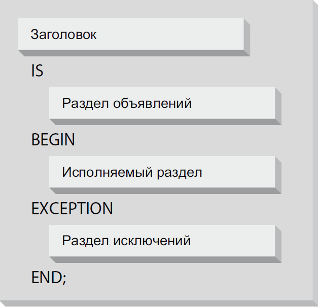

# Основы язык PL/SQL
## Структура блока PL/SQL
Как и в большинстве других процедурных языков,наименьшей единицей группировки кода является **блок**.<br/>
Он представляет соой фрагмент кода, определяющий границы выполнения и области видимости для объявлений переменных и обработки исключений.<br/>
PL/SQL позволяет создавать как _именованные_, так и _анонимный_ блоки, которые представляют собой пакеты, процедуры, функциии, триггеры или объектные типы.<br/>
Блок PL/SQL может содержать:

| Раздел | Описание | Обязателен? |
| --- | --- | --- |
| **Заголовок** | Используется только в именованных блоках и определяет способ вызова именованного блока или программы | Не обязателен |
| **Раздел объявлений** | Содержит описания переменных, курсоров и вложенных блоков, на которые имеются ссылки в исполняемом разделе и разделе исключений | Не обязателен |
| **Исполняемый раздел** | Команды, выполняемые ядром PL/SQL во время работы приложения | Обязателен |
| **Раздел исключений** | Обрабатывает исключения | Не обязателен |



Пример программы со всеми 4-мя блоками


_Фейерштейн С., Прибыл Б. Oracle PL/SQL. Для профессионалов. 6-е изд. Стр.75-76_

## Анонимные блоки
Анонимные блоки вообще не содержат раздела заголовка. Блок начинается ключевым словом `DECLARE` или `BEGIN`<br/>
Анонимный блок не может быть вызван из другого блока, поскольку он не имеет идентификатора.<br/>
Поскольку анонимные блоки могут содержать собственные разделы объявлений и исключений, разработчики часто используют вложение анонимных блоков для:
* ограничений обасти видимости идентификаторов
* для организации обработки исключений в более крупных программах

Простейший анонимный блок
```sql
SYS@//localhost/XEPDB1 > BEGIN
  2      DBMS_OUTPUT.PUT_LINE(SYSDATE);
  3  END;
  4  /
14-JAN-21

PL/SQL procedure successfully completed.

SYS@//localhost/XEPDB1 >
```
Анонимный блок с добавлением раздела объявления
```sql
DECLARE
    l_current_date VARCHAR2(9);
BEGIN
    l_current_date := SYSDATE;
    DBMS_OUTPUT.PUT_LINE('Anon block with declaration. Sys date = ' || l_current_date);
END;
/
```
Анонимный блок с разделом исключений
```sql
DECLARE
    l_current_date VARCHAR2(9);
BEGIN
    l_current_date := SYSDATE;
    DBMS_OUTPUT.PUT_LINE('Anon block with declaration and exception. Sys date = ' || l_current_date);
EXCEPTION
    WHEN VALUE_ERROR
    THEN
        DBMS_OUTPUT.PUT_LINE('Проблемы с местом для стандартного вывода даты');
END;
/
```
Все 3 в [примере](examples/anon_block.sql). Для запуска просто `SYS@//localhost/XEPDB1 > @anon_block`<br/>
_Фейерштейн С., Прибыл Б. Oracle PL/SQL. Для профессионалов. 6-е изд. Стр.76-78_

## Именованные блоки
Заголовок процедуры выглядит так
```sql
PROCEDURE [схема.]имя [ ( параметр [параметр ...] ) ]
    [AUTHID {DEFINED | CURRENT_USER}]
```
Заголовок функции выглядит так
```sql
FUNCTION [схема.]имя [ ( параметр [параметр ...] ) ]
    RETURN возвращаемый_тип
    [AUTHID {DEFINED | CURRENT_USER}]
    [DETERMINISTIC]
    [PARALLEL ENABLE ...]
    [PIPELINED [USING...] | AGGREGATE USING...]
```
Поскольку Oracle повзоляет вызывать функции из SQL, заголовок функции содержит большей необязательных компонентов, чем заголовок процедуры<br/>
_Фейерштейн С., Прибыл Б. Oracle PL/SQL. Для профессионалов. 6-е изд. Стр.78_

## Вложенные блоки
Как и Pascal, PL/SQL относится к _языкам с блочной структурой_, то есть блоки PL/SQL могут вкладываться в другие блоки.
```sql
CREATE OR REPLACE PROCEDURE calc_totals
IS
    l_year_total NUMBER;
BEGIN
    l_year_total := 5;
    DBMS_OUTPUT.PUT_LINE('Количество лет = ' || l_year_total);

    /* Начало вложенного блока */
    DECLARE
        l_month_total NUMBER;
    BEGIN
        l_month_total := l_year_total / 12;
        DBMS_OUTPUT.PUT_LINE('Количество месяцев = ' || l_month_total);
    END set_l_month_total;
    /* Конец вложенного блока */

END;
/

execute calc_totals
```
[Пример](examples/inner_block.sql)<br/>
Главное их преимущетво в том, что они ограничивают область видимости и действия синтаксических элементов<br/>
Может быть несколько уровней вложенности<br/>
_Фейерштейн С., Прибыл Б. Oracle PL/SQL. Для профессионалов. 6-е изд. Стр.78-79_

## Область действия
В PL/SQL переменные, исключения, модули и некоторые другие структуры являются локальными для блока, в котором они объявлены.<br/>
Когда выполнение блока будет завершено, все эти структуры становяться недоступными<br/>
_Фейерштейн С., Прибыл Б. Oracle PL/SQL. Для профессионалов. 6-е изд. Стр.79_

## Уточнение ссылок
По аналогии с запросом SQL (`select u.name from users u`), можно уточнять ссылки на переменные и прочее в PL/SQL<br/>
К примеру, если есть процедура `set_global`, то можно обратиться к ее переменной `set_global.l_count`. Аналогично с пакетами и прочим.
```sql
CREATE OR REPLACE PROCEDURE calc_totals
IS
    l_year_total NUMBER;
BEGIN
    l_year_total := 5;
    DBMS_OUTPUT.PUT_LINE('years count = ' || calc_totals.l_year_total);
    ...

    /* Начало вложенного блока */
    <<local_block>>
    DECLARE
        l_month_total NUMBER;
        ....
    BEGIN
        local_block.l_month_total := calc_totals.l_year_total / 12;
        DBMS_OUTPUT.PUT_LINE('Months count = ' || local_block.l_month_total);
        ...
    END set_l_month_total;
    /* Конец вложенного блока */

END;
```
[Пример](examples/inner_block_with_clarifications.sql)<br/>
_Фейерштейн С., Прибыл Б. Oracle PL/SQL. Для профессионалов. 6-е изд. Стр.80-81_

## Видимость
Локальные переменные перекрывают родительские
```sql
CREATE OR REPLACE PROCEDURE calc_totals
IS
    ...
    l_owner_block VARCHAR2(20);
BEGIN
    ...
    l_owner_block := 'PROCEDURE';

    /* Начало вложенного блока */
    <<local_block>>
    DECLARE
        ...
        l_owner_block VARCHAR2(20);
    BEGIN
        ...
        l_owner_block := 'LOCAL BLOCK';
        DBMS_OUTPUT.PUT_LINE('l_owner_block = ' || l_owner_block);
        DBMS_OUTPUT.PUT_LINE('calc_totals.l_owner_block = ' || calc_totals.l_owner_block);
    END set_l_month_total;
    /* Конец вложенного блока */

END;
```
Вывод
```
SYS@//localhost/XEPDB1 > @inner_block_with_clarifications.sql

Procedure created.

years count = 5
Months count = .4166666666666666666666666666666666666667
l_owner_block = LOCAL BLOCK
calc_totals.l_owner_block = PROCEDURE
```
[Пример](examples/inner_block_with_clarifications.sql)<br/>
В общем случае видимым идентификатором может быть:
* идентификатор, объевленный в текущем блоке
* идентификатор, объявленный в блоке, который включает текущий блок
* отдельный объект базы данных (таблица, представление...) или объект PL/SQL (процедура, функция), владельцем которого вы являетесь
* индексная переменная цикла (только внутри цикла)

_Фейерштейн С., Прибыл Б. Oracle PL/SQL. Для профессионалов. 6-е изд. Стр.82_

## Объявление переменной в пакете
```sql
CREATE OR REPLACE PACKAGE eso
IS
    resistance_cap NUMBER := 33;
END eso;
/

BEGIN
    DBMS_OUTPUT.PUT_LINE('resistance cap = ' || eso.resistance_cap);
END;
/
```
[Пример](examples/pkg_with_variable.sql)
Вывод
```
SYS@//localhost/XEPDB1 > @pkg_with_variable

Package created.

resistance cap = 33

PL/SQL procedure successfully completed.
```
_Фейерштейн С., Прибыл Б. Oracle PL/SQL. Для профессионалов. 6-е изд. Стр.83_

## Вложенные программы
Влаженная программа (_nested programs_) представляет собой процедуру или функцию, которая полностью размещается в разделе объявлений внешнего блока.<br/>
Вложенная программа может обращаться ко всем переменным и параметрам, объявленным ранее во внешнем блока.
```sql
CREATE OR REPLACE PROCEDURE calculate_bonus (good_calls IN NUMBER, averall_calls IN NUMBER)
IS
    bonus_low_border NUMBER := 95;
    good_calls_percentage NUMBER;

    PROCEDURE compute_percentage
    IS
    BEGIN
        good_calls_percentage := good_calls * 100 / averall_calls;
    END compute_percentage;
BEGIN
    compute_percentage;
    DBMS_OUTPUT.PUT_LINE('Percentage of good calls = ' || good_calls_percentage);
    IF good_calls_percentage >= bonus_low_border
    THEN
        DBMS_OUTPUT.PUT_LINE('Bonus accepted');
    ELSE
        DBMS_OUTPUT.PUT_LINE('No bonus');
    END IF;
END calculate_bonus;
/

EXECUTE calculate_bonus(94, 100);
```
[Пример](examples/nested.sql)<br/>
_Фейерштейн С., Прибыл Б. Oracle PL/SQL. Для профессионалов. 6-е изд. Стр.84_

## PL/SQL не учитывает рисгистр символов
_Фейерштейн С., Прибыл Б. Oracle PL/SQL. Для профессионалов. 6-е изд. Стр.85_

## Специальные символы
| Символ | Описание |
| --- | --- |
| `;` | Завершат объявления и команды |
| `%` | Индикатор атрибута (атрибут курсора или атрибут неявных объявлений, в качестве символа подстановки в условии `LIKE` |
| `_` | Обозначение подстановки одного символа в условии `LIKE` |
| `@` | Признак удаленного местоположения |
| `:` | Хост-переменная |
| `**` | Возведение в степень |
| `<>`, `!=`, `^=`, `~=` | Не равно |
| `||` | Конкатенация |
| `<<`, `>>` | Ограничители метки |
| `<=`, `>=` | Меньше или равно, больше или равно |
| `:=` | Присваивание |
| `=>` | ассоциация |
| `..` | Диапазон |
| `--` | Одностроный комментарий |
| `/* */` | Многострочный комментарий |

_Фейерштейн С., Прибыл Б. Oracle PL/SQL. Для профессионалов. 6-е изд. Стр.85_

## Идентификатор
Идентификатор - имя объекта данных PL/SQL, которым может быть
* константа или переменная
* исключение
* курсор
* имя процедуры, функции, пакета, объявленного типа, тригерра и прочих программ
* зарезервированное слово
* метка

_Фейерштейн С., Прибыл Б. Oracle PL/SQL. Для профессионалов. 6-е изд. Стр.85_

## Свойства идентификаторов
* длина = до **30** символов
* должны начинаться с буквы
* могут включать символы `$`, `_`, `#`
* не должны модержать пропусков
* не чувствительны к регистру
* не должны быть ключевыми словами
* не должны совпадать с именами объектов из специального свтроенного пакета `STANDARD`

_Фейерштейн С., Прибыл Б. Oracle PL/SQL. Для профессионалов. 6-е изд. Стр.86-87_

## Литералы
**Литералом** (literal) называется значение, с которым _не связан_ идентификатор.<br/>
Оно существует "само по себе". Примеры:

| Тип | Примеры |
| --- | --- |
| Числа | `415`, `21.6`, `3.14152654f`, `7D`, `NULL` |
| Строки | `'This is my sentence'`, `'01-OCT-1986'`, `q'!hello!'`, `NULL` |
| Временные интервалы | `INTERVAL '25-6' YEAR TO MONTH`, `INTERVAL '-18' MONTH`, `NULL` |
| Логические | `TRUE`, `FALSE`, `NULL` |

_Фейерштейн С., Прибыл Б. Oracle PL/SQL. Для профессионалов. 6-е изд. Стр.88-89_

## NULL
Переменные почти всех типов данных могут существовать в состоянии `NULL` (отсутствие значения). Кроме ассоциативных массивов, экземпляры которых всегда отличны от `NULL`<br/>
`NULL`-строка _обычно_ неотличима от литерала из нуля символов `''`
```sql
'' IS NULL
```
Это уловие равно `TRUE` как в SQL, так и в PL/SQL. Аналогично для переменной типа `VARCHAR2`
```sql
SYS@//localhost/XEPDB1 > DECLARE
  2      str VARCHAR2(1) := '';
  3  BEGIN
  4      IF str IS NULL
  5      THEN
  6          DBMS_OUTPUT.PUT_LINE('NULL');
  7      ELSE
  8          DBMS_OUTPUT.PUT_LINE('NOT NULL');
  9      END IF;
 10  END;
 11  /
NULL

PL/SQL procedure successfully completed.
```
### NULL и CHAR
Однако ля `CHAR` дело обстоит сложнее<br/>
Если создать переменную типа `CHAR(n)` и присвоить ей строку нулевой длинны, БД _дополняет пустую переменную пробелмами_, в результате чего она становится отличной от NULL
```sql
DECLARE
    str CHAR(2) := '';
BEGIN
    IF str IS NULL
    THEN
        DBMS_OUTPUT.PUT_LINE('NULL');
    ELSE
        DBMS_OUTPUT.PUT_LINE('NOT NULL');
    END IF;
END;
/
```
Вывод
```
NOT NULL
```
При замене условя `IF str IS NULL` на `IF str = ' '` результат положительный
### Преобразование NULL
БД пытается неявно преобразовать `NULL` к типу значения, необходимому для текущей операции.<br/>
Время от времени могут возникнуть необходимость в выполнении явных преобразований с использованием синтаксических конструкций вида `TO_NUMBER(NULL)` или `CAST(NULL AS NUMBER)`<br/>
_Фейерштейн С., Прибыл Б. Oracle PL/SQL. Для профессионалов. 6-е изд. Стр.89-90_

## Одинарные кавычки внутри строки
До выхода Oracle10g для включения одинарной кавычки, приходилось удваивать их.
```sql
BEGIN
    DBMS_OUTPUT.PUT_LINE('There''s no buiness like show business');
    DBMS_OUTPUT.PUT_LINE('"Hound of the Baskervilles"');
    DBMS_OUTPUT.PUT_LINE(''');
```
```
NOT NULL
```
При замене условя `IF str IS NULL` на `IF str = ' '` результат положительный
### Преобразование NULL
БД пытается неявно преобразовать `NULL` к типу значения, необходимому для текущей операции.<br/>
Время от времени могут возникнуть необходимость в выполнении явных преобразований с использованием синтаксических конструкций вида `TO_NUMBER(NULL)` или `CAST(NULL AS NUMBER)`<br/>
_Фейерштейн С., Прибыл Б. Oracle PL/SQL. Для профессионалов. 6-е изд. Стр.89-90_

## Одинарные кавычки внутри строки
До выхода Oracle10g для включения одинарной кавычки, приходилось удваивать их, но это приводит к увеличению кавыче.<br/>
Для спредоставления литерала из двух одиночных кавычек требуется целых **шесть** символов
```sql
BEGIN
    DBMS_OUTPUT.PUT_LINE('There''s no buiness like show business');
    DBMS_OUTPUT.PUT_LINE('"Hound of the Baskervilles"');
    DBMS_OUTPUT.PUT_LINE('''');
    DBMS_OUTPUT.PUT_LINE('''hello''');
    DBMS_OUTPUT.PUT_LINE('''''');
END;
/
```
Вывод
```
There's no buiness like show business
"Hound of the Baskervilles"
'
'hello'
''
```
Для упрощения в Oracle10g появились специальные ограничители - литерал начинается с символа `q`, а выражение в ограничителях заключается в одиночные кавычи
```sql
BEGIN
    DBMS_OUTPUT.PUT_LINE(q'( There's no buiness like show business)');
    DBMS_OUTPUT.PUT_LINE(q'{ "Hound of the Baskervilles" }');
    DBMS_OUTPUT.PUT_LINE(q'[ ' ]');
    DBMS_OUTPUT.PUT_LINE(q'!'hello'!');
    DBMS_OUTPUT.PUT_LINE(q'|''|');
END;
/
```
Вывод тот же<br/>
ВМожно использовать как простые ограничители (`!`, `|` и т.д.), так и _парные_: левые и правая круглые, фигурные и квадратные скобки<br/>
_Фейерштейн С., Прибыл Б. Oracle PL/SQL. Для профессионалов. 6-е изд. Стр.90-91_

## Числовые литералы
Числовые литералы могут быть целыми и действительными (дробными) числами.<br/>
Целые и действительные имеют разное внутреннее представление, и _перевод_ числа из одной формы в другую _требует ресурсов_.<br/>
Числа могут быть записаны в экспоненциальной форме (`3.05E19`)Бик.Ю
Начиная с Oracle Database 10g, вещественные числа могут быть представлены как типом `NUMBER`, так и стандартным типом _IEEE 754_ с плавающей точкой - `BINARY` (с суффиксом `F`, 32-разрядное) и `BINARY DOUBLE` (с суффиксом `D`, 64-разрядное)
_Фейерштейн С., Прибыл Б. Oracle PL/SQL. Для профессионалов. 6-е изд. Стр.91_

## Именованные константы вещественных чисел
| BINARY | BINARY DOUBLE | Описание |
| --- | --- | --- |
| `BINARY_FLOAT_NAN` | `BINARY_DOUBLE_NAN` | "не число":<br/>результат деления на `0` или недействительная операция |
| `BINARY_FLOAT_INFINITY` | `BINARY_DOUBLE_INFINITY` | ПОложительная бесконечность |
| `BINARY_FLOAT_MAX_NORMAL` | `BINARY_DOUBLE_MAX_NORMAL` | Абсолютное наибольшее число, которое может быть представлено |
| `BINARY_FLOAT_MIN_NORMAL` | `BINARY_DOUBLE_MIN_NORMAL` | Неименьшее нормальное число; порог значимости |
| `BINARY_FLOAT_MAX_SUBNORMAL` | `BINARY_DOUBLE_MAX_SUBNORMAL` | Наибольшее положительное число, меньшее порога потери значимости |
| `BINARY_FLOAT_MIN_SUBNORMAL` | `BINARY_DOUBLE_MIN_SUBNORMAL` | Абсолютное наименьшее число, которое может быть представлено |

_Фейерштейн С., Прибыл Б. Oracle PL/SQL. Для профессионалов. 6-е изд. Стр.91_

## Логические литералы
В PL/SQL определено два логических литерала: `TRUE`, `FALSE`
_Фейерштейн С., Прибыл Б. Oracle PL/SQL. Для профессионалов. 6-е изд. Стр.91-92_

## Точка с запятой, однострочность или разделение по строкам
Разделитель команд - символ `;`. Для удобства конструкции лучше делить на строки с отступами, но в принципе можно писать и в строку
```sql
IF condition THEN something; END IF;
```
_Фейерштейн С., Прибыл Б. Oracle PL/SQL. Для профессионалов. 6-е изд. Стр.92_

## Комментарии
Однострочный комментарий - `--`<br/>
Многострочный комментарий - `/* */`
```sql
/*
| Имя
| Автор
| История изменений
/*/
```
_Фейерштейн С., Прибыл Б. Oracle PL/SQL. Для профессионалов. 6-е изд. Стр.93_

## PRAGMA
`PRAGMA` (от греческого "действие" или "операция") означает директиву, которая передает некоторую управляющую информацию компилятору, но не преобразуется непосредственно в исполняемый код
```sql
PRAGMA директива;
```
Размещается обычно в разделе объявлений, но некоторые устанавливаются в строго определенных местах<br/>
Директивы:

| Директива | Описание |
| --- | --- |
| `AUTONOMOUS_TRANSACTION` | Сохранение или откат любых изменений, внесенных в БД в текущем блоке, без воздействия на главную или внешнюю транзакцию |
| `EXCEPTION_INIT` | Связать конркетный номер ошибки с идентификатором, объявленным в программе, как исключение |
| `RESTRICT_REFERENCES` | Уровень чистоты программного пакета (отсутствие действий, вызывающих побочные эффекты) |
| `SERIALLY_REUSABLE` | Данные уровни пакета не должны сохраняться между обращениями к ним |

```sql
DECLARE
    no_such_sequence EXCEPTION;
    PRAGMA EXCEPTION_INIT (no_such_sequence , -2289)
BEGIN
    ...
EXCEPTION
    WHEN no_such_sequence 
    THEN
        ...
END;
```
_Фейерштейн С., Прибыл Б. Oracle PL/SQL. Для профессионалов. 6-е изд. Стр.94_

## Метки
Метки предназначены для присваивания имени определенной части программы
```sql
<<идентификатор>>
```
Метка не имеет завершителя и располагается непосредственно перед фрагментом кода, имя которого она определяет.<br/>
С помощью метки можно задать имя анонимного блока
```sql
 ...

    /* Начало вложенного блока */
    <<local_block>>
    DECLARE
        l_month_total NUMBER;
        ....
    BEGIN
        local_block.l_month_total := calc_totals.l_year_total / 12;
        DBMS_OUTPUT.PUT_LINE('Months count = ' || local_block.l_month_total);
        ...
```
[Пример](examples/inner_block_with_clarifications.sql)<br/>
`END` может быть с имененм метки `END local_block;`
### Метки для уточнения ссылок
Метки можно использовать для уточнения ссылок на элементы внешнего блока
```sql
CREATE OR REPLACE PROCEDURE multiply
IS
    l_multiplier NUMBER := 0.9;
BEGIN
    <<outer_block>>
    DECLARE
        l_multiplier NUMBER := 0.8;
    BEGIN

        DECLARE
            l_multiplier NUMBER := 0.7;
        BEGIN
            DBMS_OUTPUT.PUT_LINE('nested multiplier = ' || l_multiplier);
            DBMS_OUTPUT.PUT_LINE('outer multiplier = ' || outer_block.l_multiplier);
            DBMS_OUTPUT.PUT_LINE('procedure multiplier = ' || multiply.l_multiplier);
        END;
    END outer_block;
    /* Конец вложенного блока */

END;
```
При выполнении вывод
```
nested multiplier = .7
outer multiplier = .8
procedure multiplier = .9
```
[Пример](examples/label.sql)
### Метки как точки перехода
Метки могут быть целевыми точками перехода для команд `GOTO`
```sql
BEGIN
    <<outer_loop>>
    LOOP
        DBMS_OUTPUT.PUT_LINE('Outer Iteration');
        LOOP
            DBMS_OUTPUT.PUT_LINE('Inner Iteration');
            EXIT outer_loop;
        END LOOP;
    END LOOP;
END;
/
```
Вывод
```
Outer Iteration
Inner Iteration
```
[Пример](examples/label_as_goto.sql)<br/>
Без метки `<<outer_loop>>` команда `EXIT` вышла бы только из текущего внутреннего цикла<br/>
_Фейерштейн С., Прибыл Б. Oracle PL/SQL. Для профессионалов. 6-е изд. Стр.94-95_
