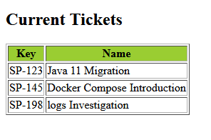

# Язык XSL(T)
* [Альтернатива скабкам (val | anotherval)](xsltParanthelessAlternative)

## XSL
**XSL** - E**X**tensible **S**tylesheet **L**anguage - язык стилей основанный на XML<br/>
_XSL_ определяет, как отображать элементы `XML`<br/>
[Источник](https://www.w3schools.com/xml/xsl_languages.asp)

## Состав XSL
* **XSLT** - язык для трансофрмации XML документов
* **XPath** - язык для навигации по XML документу
* **XQuery** - язык для запроса XML документа

[Источник](https://www.w3schools.com/xml/xsl_languages.asp)

## XSLT
**XSLT** используется для трансформации документа XML в другой XML документ или другой документ, который может быть отображен браузером, как _HTML_ или _XHTML_. Наиболее важная часть _XSL_<br/>
_XSLT_ трансформирует каждый элемент XML в (X)HTML<br/>
При помощи, _XSLT_ можно добавить элементы, атрибуты, сортировать, скрывать, элементы, проверять условия, и т.д.
[Источник](https://www.w3schools.com/xml/xsl_languages.asp)

## Пример
```xml
<?xml version="1.0" encoding="UTF-8"?>
<?xml-stylesheet type="text/xsl" href="ticket_catalog_list.xsl"?>
<tickets>
    <ticket>
        <key>SP-123</key>
        <name>Java 11 Migration</name>
    </ticket>
    ...
</tickets>
```
[Пример XML первого коммита](examples/data.xml)
```xsl
<?xml version="1.0" encoding="UTF-8"?>
<xsl:stylesheet version="2.0"
                xmlns:xsl="http://www.w3.org/1999/XSL/Transform">

    <xsl:template match="/">
        <html>
            <body>
                <h2>Current Tickets</h2>
                <table border="1">
                    <tr bgcolor="#9acd32">
                        <th>Key</th>
                        <th>Name</th>
                    </tr>
                    <xsl:for-each select="tickets/ticket">
                        <tr>
                            <td><xsl:value-of select="key"/></td>
                            <td><xsl:value-of select="name"/></td>
                        </tr>
                    </xsl:for-each>
                </table>
            </body>
        </html>
    </xsl:template>

</xsl:stylesheet>
```
[Пример XSL](examples/ticket_catalog_list.xsl)<br/>
За счет прилинковки xsl в xml `<?xml-stylesheet type="text/xsl" href="ticket_catalog_list.xsl"?>`, при открытии XML файла в браузере, документ будет отображен, как прописано в XSL<br/>
<br/>
[Источник](https://www.w3schools.com/xml/xsl_transformation.asp)

## <xsl:template>
`<xsl:template>` используется для построения template-ов.<br/>
Атрибут `match` используется для определения XML элемента. К примеру, `match="/"` указывает, что применить нужно ко всему документу.<br/>
[Источник](https://www.w3schools.com/xml/xsl_templates.asp)

## <xsl:value-of>
Элемент `<xsl:value-of>` может быть использован для извлечения значения элемента XML
```xml
<?xml version="1.0" encoding="UTF-8"?>
<?xml-stylesheet type="text/xsl" href="ticket_catalog_list.xsl"?>
<project>
    <id>1</id>
    <name>IT Organizer</name>
    ...
</project>
```
[Пример](examples/data.xml)
[Источник](https://www.w3schools.com/xml/xsl_value_of.asp)
```xsl
<?xml version="1.0" encoding="UTF-8"?>
<xsl:stylesheet version="2.0"
                xmlns:xsl="http://www.w3.org/1999/XSL/Transform">

    <xsl:template match="/">
        <html>
            <body>
                <h1><xsl:value-of select="project/name"/></h1>
                ...
            </body>
        </html>
    </xsl:template>

</xsl:stylesheet>
```
[Пример](examples/ticket_catalog_list.xsl)<br/>
[Источник](https://www.w3schools.com/xml/xsl_value_of.asp)

## <xsl:for-each>
Элемент `<xsl:for-each>` может использоваться для выбор всех элементов XML определенной ноды
```xsl
<?xml version="1.0" encoding="UTF-8"?>
<xsl:stylesheet version="2.0"
                xmlns:xsl="http://www.w3.org/1999/XSL/Transform">

    <xsl:template match="/">
        <html>
            <body>
                ...
                    <xsl:for-each select="tickets/ticket">
                        <tr>
                            <td><xsl:value-of select="key"/></td>
                            <td><xsl:value-of select="name"/></td>
                        </tr>
                    </xsl:for-each>
                </table>
            </body>
        </html>
    </xsl:template>
```
[Пример](examples/ticket_catalog_list.xsl)

### Фильтрация в <xsl:for-each>
**Допустимые операторы при фильтрации:**
* `=`  (equal)
* `!=` (not equal)
* `&lt;` less than
* `&gt;` greater than


```xml
...
<?xml version="1.0" encoding="UTF-8"?>
<?xml-stylesheet type="text/xsl" href="ticket_catalog_list.xsl"?>
<project>
    ...
    <tickets>
        <ticket>
            ...
            <priority>P2</priority>
        </ticket>
        <ticket>
            ...
            <priority>P1</priority>
        </ticket>
        <ticket>
            ...
            <priority>P3</priority>
        </ticket>
    </tickets>
</project>
...
```
[Пример](examples/data.xml)
```xsl
<?xml version="1.0" encoding="UTF-8"?>
<xsl:stylesheet version="2.0"
                xmlns:xsl="http://www.w3.org/1999/XSL/Transform">

    <xsl:template match="/">
        <html>
            <body>
                ...
                <h2>Blockers</h2>
                <table border="1">
                    ...
                    <xsl:for-each select="project/tickets/ticket[priority='P1']">
                        ...
                    </xsl:for-each>
                </table>
                <h2>Other Tickets</h2>
                <table border="1">
                    ...
                    <xsl:for-each select="project/tickets/ticket[priority='P2']|project/tickets/ticket[priority='P3']">
                        ...
                    </xsl:for-each>
                </table>
            </body>
        </html>
    </xsl:template>

</xsl:stylesheet>
```
[Пример](examples/ticket_catalog_list.xsl)<br/>

### <xsl:sort>
Элемент `<xsl:sort>` внутри `<xsl:for-each>` используется для сортировки
```xsl
<?xml version="1.0" encoding="UTF-8"?>
<xsl:stylesheet version="2.0"
                xmlns:xsl="http://www.w3.org/1999/XSL/Transform">

    <xsl:template match="/">
        <html>
            <body>
                ...
                <h2>Other Tickets</h2>
                <table border="1">
                    ...
                    <xsl:for-each select="project/tickets/ticket[priority='P2']|project/tickets/ticket[priority='P3']">
                        <xsl:sort select="priority"/>
                        ...
                    </xsl:for-each>
                </table>
            </body>
        </html>
    </xsl:template>

</xsl:stylesheet>
```
[Пример](examples/ticket_catalog_list.xsl)

[Источник](https://www.w3schools.com/xml/xsl_for_each.asp)

## <xsl:if>
`<xsl:if>` используется для проверки условий<br/>
```xml
<?xml version="1.0" encoding="UTF-8"?>
<?xml-stylesheet type="text/xsl" href="ticket_catalog_list.xsl"?>
<project>
    ...
    <tickets>
        <ticket>
            ...
            <due_date>03.03.2021</due_date>
        </ticket>
        <ticket>
            ...
        </ticket>
        <ticket>
            ...
        </ticket>
    </tickets>
</project>
```
[Пример](examples/data.xml)
```xsi
<?xml version="1.0" encoding="UTF-8"?>
<xsl:stylesheet version="2.0"
                xmlns:xsl="http://www.w3.org/1999/XSL/Transform">

    <xsl:template match="/">
        <html>
            <body>
                ...
                <table border="1">
                    ...
                    <xsl:for-each select="project/tickets/ticket[priority='P2']|project/tickets/ticket[priority='P3']">
                        <xsl:sort select="priority"/>
                        <tr>
                            ...
                            <td>
                                <xsl:if test="due_date != ''">
                                    <xsl:value-of select="due_date"/>
                                </xsl:if>
                            </td>
                        </tr>
                    </xsl:for-each>
                </table>
            </body>
        </html>
    </xsl:template>

</xsl:stylesheet>
```
[Пример](examples/ticket_catalog_list.xsl)<br/>
[Источник](https://www.w3schools.com/xml/xsl_if.asp)

## <xsl:choose>
Элемент `<xsl:choose>` используется для проверки нескольких условий.<br/>
В этом элементе есть аналог `else` из других языков - элемент `<xsl:otherwise>`
```xsl
<?xml version="1.0" encoding="UTF-8"?>
<xsl:stylesheet version="2.0"
                xmlns:xsl="http://www.w3.org/1999/XSL/Transform">

    <xsl:template match="/">
        <html>
            <body>
                ...
                <h2>Blockers</h2>
                <xsl:choose>
                    <xsl:when test="project/tickets/ticket[priority='P1'] != ''">
                        <table border="1">
                            ...
                        </table>
                    </xsl:when>
                    <xsl:otherwise>
                        No blockers
                    </xsl:otherwise>
                </xsl:choose>
                ...
            </body>
        </html>
    </xsl:template>

</xsl:stylesheet>
```
[Пример](examples/ticket_catalog_list.xsl)<br/>
Можно сделать проверку нескольких условий (аналог `switch` или `case` из других языков)
```xsl
...
      <xsl:choose>
        <xsl:when test="price &gt; 10">
          <td bgcolor="#ff00ff">
          <xsl:value-of select="artist"/></td>
        </xsl:when>
        <xsl:when test="price &gt; 9">
          <td bgcolor="#cccccc">
          <xsl:value-of select="artist"/></td>
        </xsl:when>
        <xsl:otherwise>
          <td><xsl:value-of select="artist"/></td>
        </xsl:otherwise>
      </xsl:choose>
...
```
[Источник](https://www.w3schools.com/xml/xsl_choose.asp)

## <xsl:apply-templates>
Элемент `<xsl:apply-templates>` применяет правила template-а к текущему элементу или дочерней node-е элемента<br/>
Если добавить атрибут `select`, будет обработан только дочерние элементы, указанные в значении атрибута `select`<br/>
Иными словами, при помощт `select`-ов можно определить, в каком порядке должны быть обработаны дочерние node-ы
```xsl
<?xml version="1.0" encoding="UTF-8"?>
<xsl:stylesheet version="2.0"
                xmlns:xsl="http://www.w3.org/1999/XSL/Transform">

    <xsl:template match="/">
        <html>
            <body>
                ...
                <xsl:choose>
                    <xsl:when test="project/tickets/ticket[priority='P1'] != ''">
                        <table border="1">
                            ...
                            <xsl:for-each select="project/tickets/ticket[priority='P1']">
                                <tr>
                                    <td><xsl:apply-templates select="key"/></td>
                                    <td><xsl:apply-templates select="name"/></td>
                                    <td><xsl:apply-templates select="due_date"/></td>
                                </tr>
                            </xsl:for-each>
                        </table>
                    </xsl:when>
                    ...
                </xsl:choose>
                <h2>Other Tickets</h2>
                <table border="1">
                    ...
                    <xsl:for-each select="project/tickets/ticket[priority='P2']|project/tickets/ticket[priority='P3']">
                        <xsl:sort select="priority"/>
                        <tr>
                            <td><xsl:apply-templates select="key"/></td>
                            <td><xsl:apply-templates select="name"/></td>
                            <td><xsl:apply-templates select="priority"/></td>
                            <td><xsl:apply-templates select="due_date"/></td>
                        </tr>
                    </xsl:for-each>
                </table>
            </body>
        </html>
    </xsl:template>

    <xsl:template match="key">
        <xsl:value-of select="."/>
    </xsl:template>

    <xsl:template match="name">
        <span style="font-weight: bold"><xsl:value-of select="."/></span>
    </xsl:template>

    <xsl:template match="priority">
        <span style="color:#ff0000"><xsl:value-of select="."/></span>
    </xsl:template>

    <xsl:template match="due_date">
        <xsl:if test=". != ''">
            <xsl:value-of select="."/>
        </xsl:if>
    </xsl:template>

</xsl:stylesheet>
```
[Пример](examples/ticket_catalog_list.xsl)<br/>
[Источник](https://www.w3schools.com/xml/xsl_apply_templates.asp)
