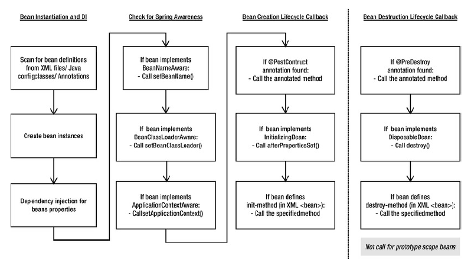

# Управление жизненным циклом компонентов Spring Beans
* [Методы инициализации компонентов Spring Bean](1.6.1.%20Методы%20инициализации%20компонентов%20Spring%20Bean/1.6.1.%20Методы%20инициализации%20компонентов%20Spring%20Bean.md)
* [Методы уничтожения компонентов Spring Bean](1.6.2.%20Методы%20уничтожения%20компонентов%20Spring%20Bean/1.6.2.%20Методы%20уничтожения%20компонентов%20Spring%20Bean.md)
* [Информирование компонента о его контексте](1.6.3.%20Информирование%20компонента%20о%20его%20контексте/1.6.3.%20Информирование%20компонента%20о%20его%20контексте.md)
* [Фабрики компонентов Spring Bean](1.6.4.%20Фабрики%20компонентов%20Spring%20Bean/1.6.4.%20Фабрики%20компонентов%20Spring%20Bean.md)

## Моменты инициализации и уничтожения компонентов
В контексте Spring событие после *инициализации* наступает втот момент, когда завершается установка всех значений свойств компонента Spring Beansи все проверки зависимостей, сконфигуррованные для выполнения.<br/>
Событие перед *уничтожением* наступает непосредственно перед тем, как Spring приступит к уничтожению экземпляра компонента Spring Beans.<br/>
Но *для прототипа* событие перед уничтожением не будет инициализированно в каркасе Spring<br/>
_Козмина Ю., Харроп Р., Шефер К., Хо К., Spring 5 для профессионалов. Стр. 196_

## Механизмы для обработки событий инициализации и уничтожения
В Spring предоставляются 3 механизма, которые можно применять в компоненте Spring Bean дл привязки к событиям инициализации и уничтожения. Они основаны на:<br/>
* интерфейсах
* методах
* аннотациях

Если применяется механизм, основанный на интерфейсах, то в компоненте реализуется интерфейс, характерный для инициализации или уничтожения<br/>
Если применяется механизм, основанный на методах, то в Spring  допускается указывать в конфигурации контекста имя метода, который должен быть вызван при инициализации (или при удалении).<br/>
Механизм, основанный на аннотациях предполагает применение аннотаций по спецификации JSR-250 для указания нужных методов<br/>
_Козмина Ю., Харроп Р., Шефер К., Хо К., Spring 5 для профессионалов. Стр. 196-197_

## Жизненный цикл компонентов Spring Beans

* сначала вызывается конструктор для создания компонента
* затем вызываются методы установки для внедрения зависимостей
* как только появляется компонент Spring Bean с внедренными зависимостями, делается запрос компонентов `BeanPostProcessor` из инфраструктуры предварительной инициализации, чтобы выяснить, требуется ли им вызвать что нибудь из данного компонента. Это специальные компоненты инфраструктуры Spring, выполняющие модификацию компонентов Spring Bean после их создания. Аннотация `@PostConstruct` регистрируется средствами `CommonAnnotationBeanPostProcessor`, и поэтому из данного компонента вызвается метод, снабженный этой аннотацией. Этот метод выполняется сразу же после построения компонента Spring Bean, но прежде вводе данного класса в действие и до фактической инициализации (до вызова `afterPropertiesSet()` и `init-method`)
* метод `afterPropertiesSet()`, определяемый в интерфейсе `InitilizingBean`, выполняется сразу после внедрения зависимостей. Этот метод вызвается из интерфейса `BeanFactory` после установки всех предоставляемых свойств компонента Spring Bean и удовлетворения требований интерфейсоув `BeanFactoryAware` и `ApplicationContextAware`
* Атрибут `init-method` вызывается в последнюю очередь, поскольку в нем фактически указан конкретный метод инициализации Spring bean

Из [примера](../examples/spring/src/main/java/ru/akhitev/kb/spring/life_cycle/order_of_init_methods)
```java
public class Captain implements InitializingBean, DisposableBean {
    public void init() {
        System.out.println("3. Use buff skills");
    }

    @Override
    public void afterPropertiesSet() throws Exception {
        System.out.println("2. Eat food with regeneration and stats buffs");
    }

    @PostConstruct
    public void initializing() {
        System.out.println("1. Check skills, set and weapon");
    }

    public void deconstruct() {
        System.out.println("3. Travel to a Bank");
    }


    @Override
    public void destroy() throws Exception {
        System.out.println("2. Roll valuable items from boss chest");
    }

    @PreDestroy
    private void deconstructing() {
        System.out.println("1. Wear lucky horseshoe");
    }
}
```
Вывод
```
1. Check skills, set and weapon
2. Eat food with regeneration and stats buffs
3. Use buff skills
=======
1. Wear lucky horseshoe
2. Roll valuable items from boss chest
3. Travel to a Bank
```
_Козмина Ю., Харроп Р., Шефер К., Хо К., Spring 5 для профессионалов. Стр. 198-199, 213_