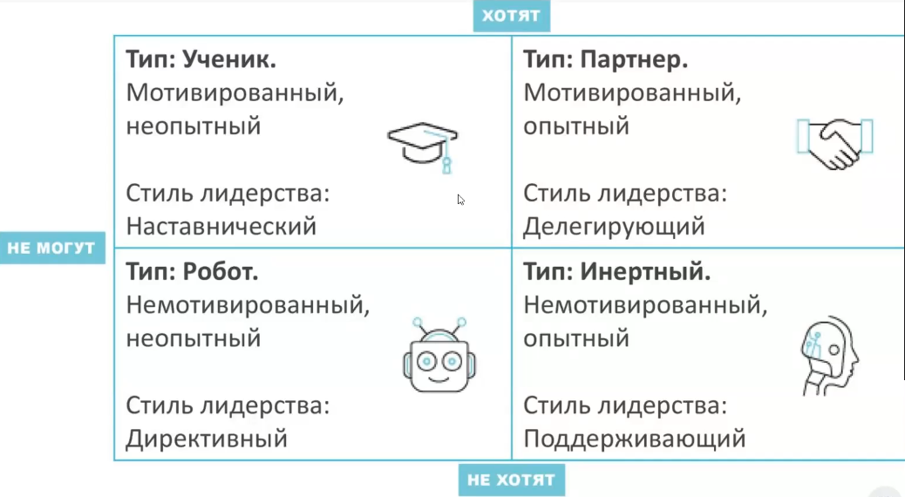
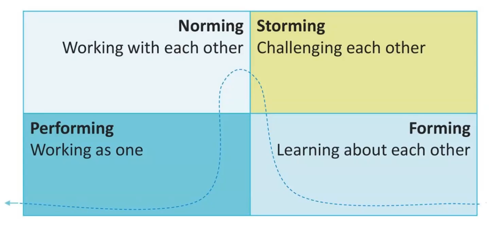

# Управление командой
## Компетенции лидера
1. Готовность взять на себя ответственность за коллектив
2. Готовность отвечать за коллективный результат даже в случае провала
3. Предпочтение общего результата личному
4. Позитивное отношение к людям
5. Обучаемость, стремление развиваться
6. Не боится сильных подчиненных
7. Умение и готовность вдохновлять
8. Умение слышать других
9. Готовность и способность учить других
10. Эксперт или отличный управленец
11. Умение организовать других
12. Собственная точка зрения
13. Готовность к непопулярным решениям
14. Стрессоустойчивость
15. Отсутствие стремления самоутверждаться за счет других

## Типы сотркудников

## Команда
Это группа людей с взаимодополняющими умениями, связанных единым замыслом, стремящихся к _общим целям_ и _разделяющих ответственность_ за результаты и достижения

## Действия руководителя при создании команды
1. Определение целей и задач
2. Определение количества и структуры
3. Определение норм и правил (к примеру, если отлучаешься на 40+ минут, пиши, плиз, в чатике)
4. Отбор подходящих людей (определить уровень)
5. Обсуждение выгод, преимуществ, мотивация (к примеру, будет возможность роста в команде)
6. Адаптация (хорошо, если с записью, чтоб ее потом посылать)
7. Обучение
8. Контроль (метрики)
9. Оптимизация
10. Поддержание командного духа
11. Ротация

## Жизненный цикл команды

### Forming
* Еще не команда, а совокупность отдельных индивидуумов
* Низкая приверженность интересам команды
* Люди осторожны в своих проявлениях и стремятся произвести впечатление друг на друга

### Storming
* Люди "открываются" и выявляются индивидуальные цели и ожидания
* Команда может отвергнуть признанного лидера
* Возможно возникновение межличностных конфликтов.
* Формируется готовность принять риск совместной работы

### Norming
* Установление норм и процедур работы
* Формирование приемлемого стиля руководства
* Распределение ролей и формирование моделей взаимодействия
* Развитие сотрудничества и взаимной поддержки
* Становление отношенй с внешней средой команды

### Performing
* Команда объединяется и может эффективно работать для достижения поставленной перед ней цели
* Взаимная поддержка и взаимопомощь
* Комфортная атмосфера стимулирует достижение новых высот
* Развитие, профессиональный и личностный рост членов команды

## Функции лидера в жизненном цикле команды
### Forming
* Планировать состав команды
* Подбирать сотрудников
* Знакомить членов команды друг с другом, если они незнакомы
* Создавать непринужденную и комфортную обстановку
* Прояснять цели, задачи, распределять ответственность и роли

### Storming
* Помогать команде успешно решать споры
* Обеспечивать обмен мнениями и конструктивное обсуждение проблем
* Воодушевлять команду на достижение намеченных целей

### Norming
* Обеспечивать формирование норм и механизмов, способствующих эффективной работе команды
* Согласовывать устремления каждого члена команды с общими целями и ценностями
* Способствовать сплочению команды

### Performing
* Регулярно измерять эффективность работы команды
* Предоставлять членам команды обратную связь
* Делегировать дополнительные полномочия членам команды
* Обсуждать с членами команды предложения по улучшению ее деятельности

## Делегирование
**Делегирование полномочий** - процесс передачи части функций руководителя другим управляющим или сотрудникам для достижения конкретных целей организации. 
Используется для улучшения и оптимизации рабочей силы руководителя.

### Разница между делегированием и assignment-ом
**Assignment** - способ управления, при котором происходит передача задачи, а также полномочий и ответственности на выполнение другим лицам 
**Делегирование** - способ эффективного управления, при котором происходит передача задачи и ее выполнения, НО НЕ полномочий и ответственности 
**УТОЧНИТЬ: не перепутанно ли**

### Цели делегирования
* освобождение времени делегирующего для решения задач, в которых сложнее или невозможно заменить
* повышение мотивации тех, кому полномочия делегированы
* повышение доверия в рабочем коллективе
* проверка сотрудников на исполнительность

### Типичные ошибки при делегировании
* только простые и рутинные задачи
* в последний момент, когда времени на выполнение остается слишком мало
* передается задача "вырванная из контекста" - сотрудник не понимает общей картины (зачем? что до? что после?)
* навязывается свой способ выполнения задачи, осуществляется мелочный контроль
* руководитель забывает о задаче
* руководитель слишком занят, чтобы ответить на вопросы, которые появляются в процессе выполнения
* руководитель забыл предоставить необходимые материалы или данные для выполнения
* предоставил полномочий, но не проинформировал об этом других сотрудников
* руководитель проявляет явное раздражение или неудовольствие, если у сотрудника что-то не получается
* руководитель вмешивается в процессе выполнения задачи и перехватывает инициативу
* руководитель выбрал для делегирования сотрудника, с которым дружеские отношения
* руководитель осуществляет контроль по итогам выполнения работы, отсутствует промежуточный контроль
* при хорошем исполнении задачи сотрудник не получает никакой обратной связи от руководителя
* задача делоегируется на постоянной основе, но это никак не учитывается в вознаграждении сотрудника
* делегирование одному и тому же сотруднику

## Постановка целей
Цель должна быть (SMART)
* Конкретной
* Измеримой
* Достижимой
* Актуальный
* Ограниченной по времени