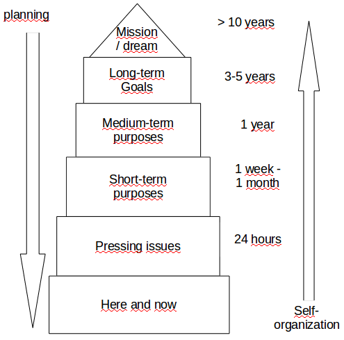
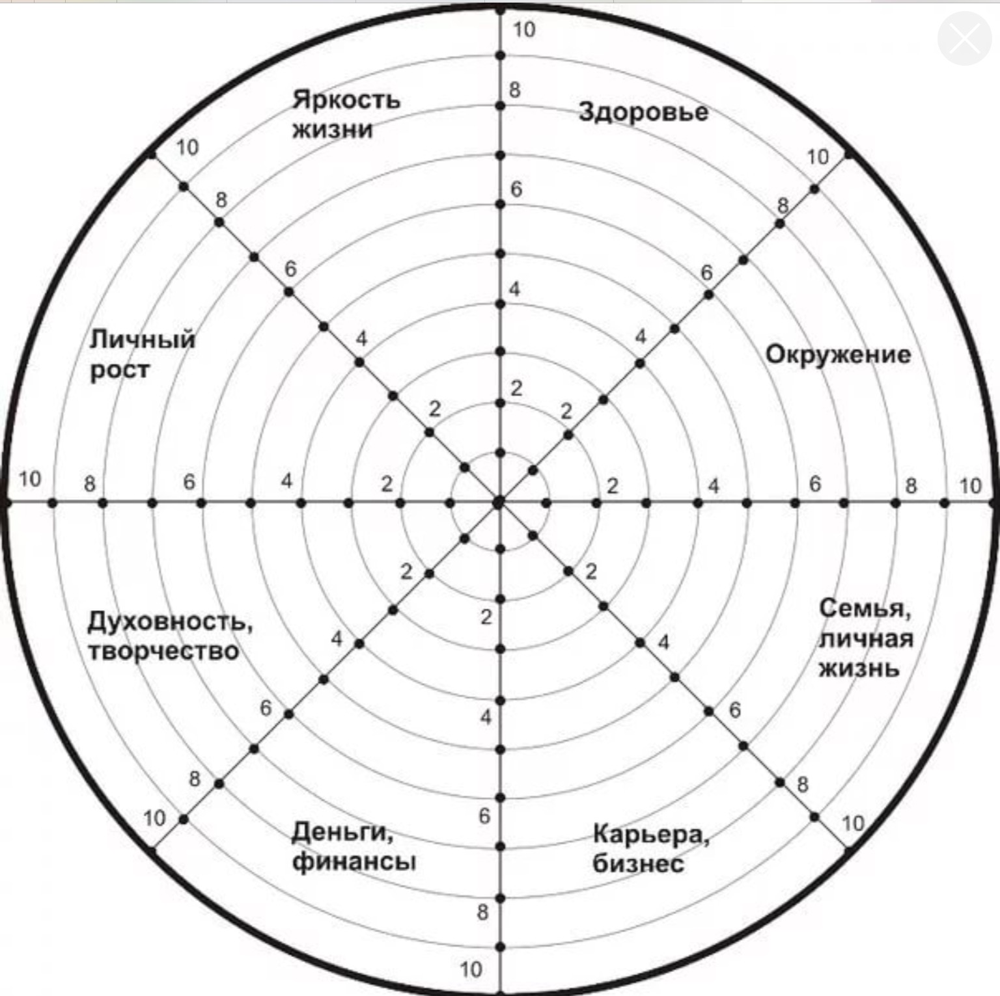

# Постановка целей
## Упражнение по соотношению целей и планирование дня
Взять листок А4 и сложить пополам по вертикали. Получится длинный узкий лист. 
На половине листа (так, чтобы сгиб был справа) нужно записать завтрашний (рабочий) день (спланировать его). 
Не уходить в сильную детализацию, но должно получиться хотя бы 10 пунктов. 
Примерное время выполнения — 5 минут. 
По окончанию, перевернуть лист 
Зафиксировать все цели, которые стоят передо мной на сегодняшний день. Не фокусироваться только на работе. Взять во внимание все сферы жизни. 
Примерное время выполнения — 5 минут. 
По окончанию, развернуть лист А4. 
Соединить ручкой цели и действия. 
Вероятно, не все цели будут подкреплены действиями. 
### Задаться вопросами:
* Сколько получилось не проработанных целей (не подкреплены действиями)?
* Задаться вопросом, насколько эти цели важны для меня?
* Это мои цели, или эти цели были навязаны и от того, в них не мотивации?
* Делаю ли какие то шаги, чтобы достигать цели или цель остается в форме лозунгов (какой то идеи)?
### Один из главных выводов, к которому должен прийти в результате упражнения:
* цели должны руководить той начинкой, которую выполняю каждый день;
* цели первичны;
* действия вторичны.

## Пирамида планирования
Этот инструмент рассказывает, как необходимо ставить перед собой цели. И как необходимо организовывать себя для того, чтобы потом эти цели достигать. 

### Основной закон пирамиды планирования:
цели более высокого порядка обусловливают цели более низкого порядка. 
Когда говорим про самоорганизцию себя, мы начинаем работать с начала пирамиды. 
Вначале важно научиться организовывать себя на уровне здесь и сейчас. После достижения успеха, можно переходить на более высокий уровень пирамиды. И так далее вплоть до вершины пирамиды. 

## Колесо баланса
Каждый из 8 сегментов представляет из себя некий важный сектор моей жизни. 
Нужно оценить реализацию этого сектора на сегодняшний день от 0 до 10. 
В результате получается диаграмма баланса, которая показывает удовлетворенность жизнью на сегодняшний момент. 
Нужно найти сектор, который реализован меньше все и подумать, какие цели можно перед собой поставить, чтобы увеличить удовлетворенность этим сектором. 
*Задача:* прописать для себя 1-2 цели. 

## SMART методика
Включает в себя критерии, которые нужно включать в цель при постановке цели: 
* Specific (конкретность). Конкретизировать, что вкладываем в каждое слово в цели.
* Measurable (измеримость). Как понять, что цель достигнута.
* Attainable (реалистичность). Насколько  реально возможно достигнуть цель.
* Relevant (востребованность). Насколько цель моя. Насколько мотивирован целью.
* Time-bound (ограниченность определенными временными рамками)
  Из психологии: если ставим цель, которую вряд ли можно достичь, в цели мало мотивации. 
  Упражнение: по smart ли цель? Сделать цель по smart 
  Studying English successfully. 
  S (-), M (-), A (+), R (+), T (-). 
  To pass English assessment at level C1 by September 25, 2016 
  S (+), M (+), A (+), R (+), T (+). 