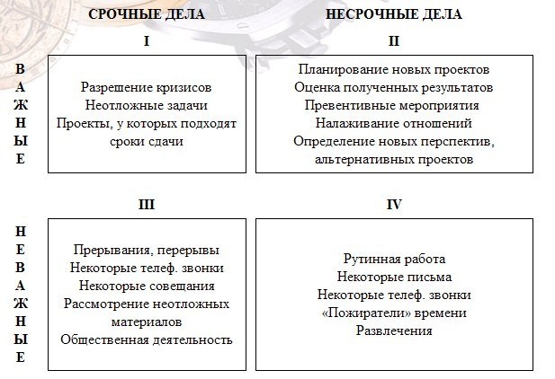

# Приоритеты
## ABCDE
`A` - задачи, невыполнение которых повлечет <u>серьезные последствия</u> 
`B` - важные задачи, невыполнение которых <u>повлечет последствия</u>, но <u>не такие весомые</u>, как в `A` 
`C` - задачи, невыполнение которых не повлечет вообще <u>никаких последствий</u> 
`D` - задачи, которые надо <u>делегировать</u> (не забываем о контроле) 
`E` - занимающее много времени, но <u>бесполезные</u>
либо отказываемся,
либо делаем в свободное от остальных время

## Принцип Pareto
**20%** наших усилий приносят **80%** результата. 
Нужно понять, какие задачи относятся к этим 20% в нашем случае

## Матрица Eisenhower-а
На схеме ниже, римскими цифрами указан порядок выполнения 
