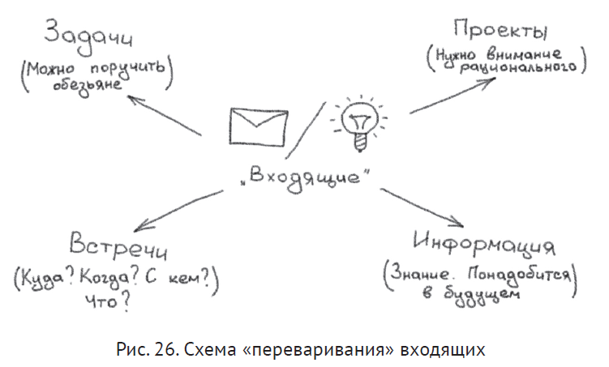

# Разбор входящих

Основные элементы ("питательные" элементы, если вернуться к анологии автора о "переваривании"):

- **Задачи**. четкие конкретные понятные действия, понятные обезьяне
- **Проекты** или **дела**. Большие куски, где надо еще подумать, прежде чем что то делать
- **Информация**. Знания, которые могут быть полезны при выполнении задачи или проектов
- **Встречи**.

*Дорофеев М. Джедайские техники. стр. 88*

## Переваривание не на один, как у Д.Аллена, а на несколько компонентов

В алгоритме Дэвида Аллена есть недостаток - схема предполагает, что каждое входящее превращаетсяв какой-то один нутриент, хотя на самом деле оно может содержать в себе две задачи, один проект, одну встречу и еще кусочек справочной информации.

*Дорофеев М. Джедайские техники. стр. 90*