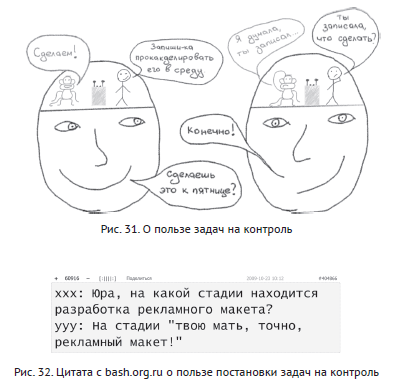

# Работа с поручениями
Если результат работы зависит от результатов людей с "дирявым стеком", старайтесь:

1. поручать им задачи явным образом (желательно email-ом)
2. ставить себе задачи "напомнить" таким исполнителям, "спросить, как дела", "узнать, нужна ли помощь"
3. не слишком часто выходить из себя из-за того, что редкая задача выполняется без напоминаний и вовремя

