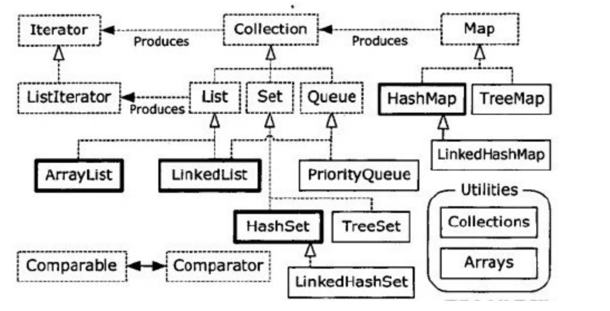

# Структуры данных
* [Массивы](10.1.%20Массивы/10.1.%20Массивы.md)
* [Коллекции](10.2.%20Коллекции/10.2.%20Коллекции.md)
* [Map](10.3.%20Map/10.3.%20Map.md)

## Generic в коллекциях и компиляция
Использование обобщенных типов предотвращает помещение неверного типа объекта в коллекцию на **стадии компиляции**<br/>
_Эккель Б. Философия Java. 4-е полное изд. Стр. 325_

## Сравнение `Arrays.asList()` и `Collections.addAll()`
`Arrays.asList(...)` принимает массив или список элементов, разделенных запятыми и преобразует их в объект `List`
```java
Collection<Integer> collection = new ArrayList<Integer>(Arrays.asList(1, 2, 3, 4));
Integer[] someArray = {9, 10, 11, 12};
List<integer> list = Arrays.asList(someArray);
```
`Collections.addAll(collection, ...)` получает объект `Collection` и массив (или список элементов, разделенных запятыми) и добавляет элементы в полученный объект `Collection`
```java
Collection<Integer> collection = ...;
Collections.addAll(collection, 11, 12, 13, 14);
Integer[] someArray = {9, 10, 8, 7};
Collections.addAll(collection, someArray);
```
* `Collections.addAll` работает **намного быстрее!**<br/>
* `Collections.addAll` работает с коллекцией, а `Arrays.asList` возвращает `List`
* `Arrays.asList` делает `List`, в основе которого массив, не поддерживающий **изменение размера**
* У `Arrays.asList` есть проблема каста, которой нет у `Collections.addAll`

#### Подробней о проблеме каста.<br/>
У Arrays.asList может возникнуть такая проблема
```java
class Snow {}
class Powder extends Snow {}
class Light extends Powder {}
class Heavy extends Powder {}
class Crusty extends Snow {}
class Slush extends Snow {}
...
List<Snow> snow1 = Arrays.asList(new Crusty(), new Slush(), new Powder()); //Ok
List<Snow> snow2 = Arrays.asList(new Light(), new Heavy()); //Exception
// требуется List<Snow>, а полечено List<Powder>
```
Решить проблему можно через явное указание типа
```java
List<Snow> snow3 = Arrays.<Snow>asList(new Light(), new Heavy());
```
В Collections.addAll нет такой проблемы
```java
List<Snow> snow4 = new ArrayList<Snow>();
Collections.addAll(snow4, new Light(), new Heavy());
```
_Эккель Б. Философия Java. 4-е полное изд. Стр. 329-330_

## Явное указание типа у `Arrays.asList`
```java
Arrays.<SomeClass>asList
```
_Эккель Б. Философия Java. 4-е полное изд. Стр. 330_

## Печатное представление массива и коллекций
Для создания печатного представления массива, необходимо использовать `Arrays.toString()`<br/>
Коллекции выводят в печатном виде без посторонней помощи<br/>
Пример вывода `Collection` и `Map`
```
[кошка, собака, лиса]
[кошка=Киса, собака=Линда, лиса=Хитрюга]
```
_Эккель Б. Философия Java. 4-е полное изд. Стр. 330_

## Массив и `Iterable`
Так работать не будет, так как массив не является `Iterable`, хоть его и можно перебрать в foreach
```java
static <T> void iterate(Iterable<T> iterable) {
    for (T t : iterable) {
        ...
    }
}

public static void main(String[] args) {
    String[] strings - {"A", "B", "C"};
    iterate(strings) // Ошибка!!!
}
```
Нужно преобразовать к `Iterable`, прежде чем передавать
```java
    iterate(Arrays.asList(strings));
```
_Эккель Б. Философия Java. 4-е полное изд. Стр. 358_

## Некоторые методы `Collections`
| Метод                                                                                                                                                                                                                                                                | Комментарий                                                                                                                                                                         |
|----------------------------------------------------------------------------------------------------------------------------------------------------------------------------------------------------------------------------------------------------------------------|-------------------------------------------------------------------------------------------------------------------------------------------------------------------------------------|
| `checkedCollection(Collection<T>, Class<T>)`<br/>`checkedList(List<T>,Class<T>)`<br/>`checkedSet(Set<T>,Class<T>)`<br/>`checkedSortedSet(SortedSet<T>,Class<T>)`<br/>`checkedMap(Map<K<V>,Class<K>,Class<V>)`<br/>`checkedSortedMap(SortedMap<K,V>,Class<K>,Class<V>)` | Обеспечивает динамическую безопасность типов.<br/>Используется, когда невозможно использование версии со статической проверкой (см *RTTI*)                                          |
| `max(Collection)`<br/>`min(Collection)`                                                                                                                                                                                                                              | Подходит, если используется естественное сравнение                                                                                                                                  |
| `max(Collection, Comparator)`<br/>`min(Collection, Comparator)`                                                                                                                                                                                                      | Если нужно сравнивать по особому                                                                                                                                                    |
| `indexOfSubList(List source, List target)`                                                                                                                                                                                                                           | Находит начальный индекс первого вхождения `target` и `source` или `-1`, если вхождений нет                                                                                         |
| `lastIndexOfSubList(List source, List target)`                                                                                                                                                                                                                       | Находит начальный индекс последнего вхождения `target` и `source` или `-1`, если вхождений нет                                                                                      |
| `replaceAll(List oldValues, List newValues)`                                                                                                                                                                                                                         | Заменяет все вхождения `oldValue` на newValue`                                                                                                                                      |
| `reverse(List)`                                                                                                                                                                                                                                                      | Переставляет элементы в обратном порядке                                                                                                                                            |
| `reverseOrder()`<br/>`reverseOrder(Comparator<T>)`                                                                                                                                                                                                                   | Возвращает `Comparator` для обратного порядка перебора коллекции.<br/>Для второго - заменяет порядок для переданного `Comparator`                                                   |
| `rotate(List, int distance)`                                                                                                                                                                                                                                         | Перемещает элементы вперед на расстояние `distance`.<br/>При этом элементы в конце коллекции перемещаются в ее начало.                                                              |
| `shuffle(List)`<br/>`shuffleList(List, Random)`                                                                                                                                                                                                                      | Переставляет члучайным образом элементы, используя внутренний или переданный генератор случайных чисел                                                                              |
| `sort(List<T>`<br/>`sort(List<T>, Comparator<? super T>)`                                                                                                                                                                                                            | Сортирует используя естественный порядок или переданный `Comparator`                                                                                                                |
| `copy(List<? super T> dest, List<? extends T> src)`                                                                                                                                                                                                                   | Копирует элементы из `src` в `dest`                                                                                                                                                 |
| `swap(List, int i, int j)`                                                                                                                                                                                                                                           | Меняет местами элементы `i` и `j` МЕСТАМИ В `list`<br/>Скорее всего, работает быстрее самописной реализации                                                                         |
| `fill(List<? super T>, T x)`                                                                                                                                                                                                                                         | Заменяет все элементы списка значением `x`                                                                                                                                          |
| `nCopies(int n, T x)`                                                                                                                                                                                                                                                 | Возвращает *неизменемый* `List<T>` размера `n`, все ссылки в котором указывают на `x`                                                                                               |
| `disjoint(Collection, Collection)`                                                                                                                                                                                                                                   | Возвращает `true` если коллекции не имеют общих элементов                                                                                                                           |
| `emptyList()`<br/>`emptuSet()`<br/>`emptyMap()`                                                                                                                                                                                                                      | Возвращает *неизменяемый* пустой экземпляр нужной колекции.<r/>Возвращается обобщение, поэтому полученная реализация коллекции параметризуется по нужному тиу                       |
| `singleton(T x)`<br/>`singletonList(T x)`<br/>`singletonMap(K key, V value)`                                                                                                                                                                                         | Возвращает *неизменяемый* экзепляр нужной коллекции с одним элементов, созданным на базе переданных аргументов                                                                      |
| `list(Enumiration<T> e)`                                                                                                                                                                                                                                              | Создает `rrayList<T>`, содержащий элементы в том порядке, в котором они возвращаются из `Enumiration` (предшественника `Iterator`).<br/>Использется для преобразования старого кода |

_Эккель Б. Философия Java. 4-е полное изд. Стр. 705-707_

## Получение неизменяемых коллекций и `Map` через `Collections.unmodifiable[List,Set...]`
Получив нужную структуру данных, кпримеру `List` через `Collections.unmodifiableList(List)`, его чтение допускается, но добавление или изменение элементов не разрешено<br/>
В противном случае будет выброшено `UnsupportedOperationException`
```java
    public static void main(String[] args) {
        List<String> list = new ArrayList<>();
        // Чем то заполняется
        List<String> unmodifiableList = Collections.unmodifiableList(list);
        unmodifiableList.add("d"); // или unmodifiableList.set(2, "d");
    }
```
Результат
```
Exception in thread "main" java.lang.UnsupportedOperationException
	at java.util.Collections$UnmodifiableCollection.add(Collections.java:1055)
	at ru.akhitev.kb.java6.collections.UnmodifiableCollection.main(UnmodifiableCollection.java:14)
```
_Эккель Б. Философия Java. 4-е полное изд. Стр. 710_

## Получение синхронизированной коллекции или карты через `Collections.synchronized[List,Set...]`
Используя, к примеру для `List`, метод `Collections.synchronizedList(someList)`, мы получим список, синхронизированный целиком.<br/>
_Эккель Б. Философия Java. 4-е полное изд. Стр. 711_

## Упрощенная схема коллекций
<br/>
_Эккель Б. Философия Java. 4-е полное изд. Стр. 362_

## Альтернативные полезные коллекции
_Apache Commons Collections_, ранее известный, как _Jakarta Commons_<br/>
[Описание Commons Collections](https://commons.apache.org/proper/commons-collections/)<br/>
[Commons Collections API (к примеру 4.4)](https://commons.apache.org/proper/commons-collections/javadocs/api-4.4/index.html)